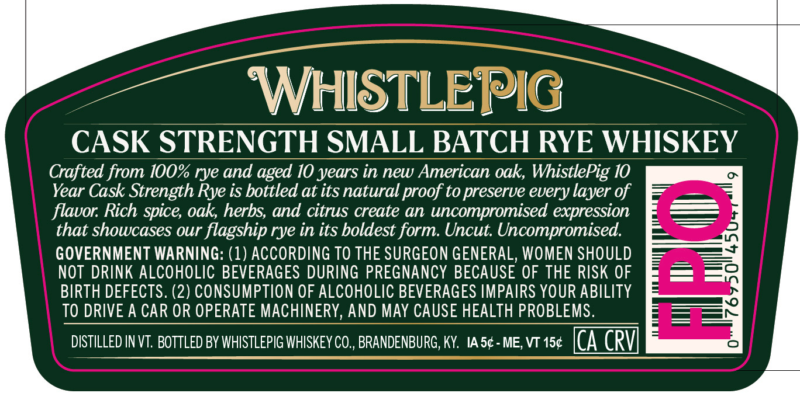
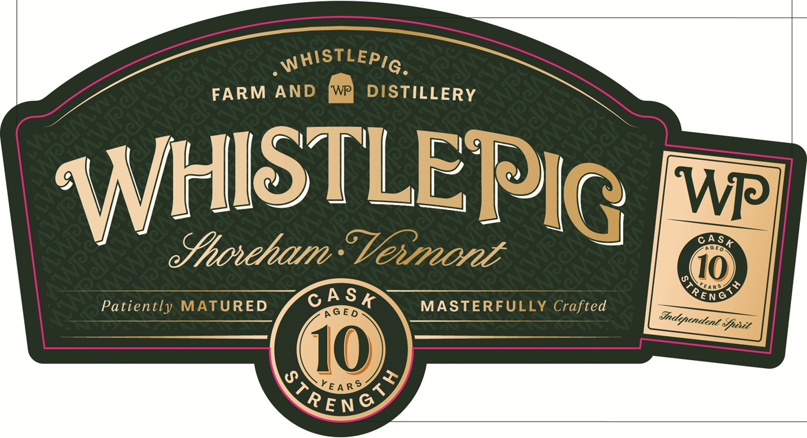
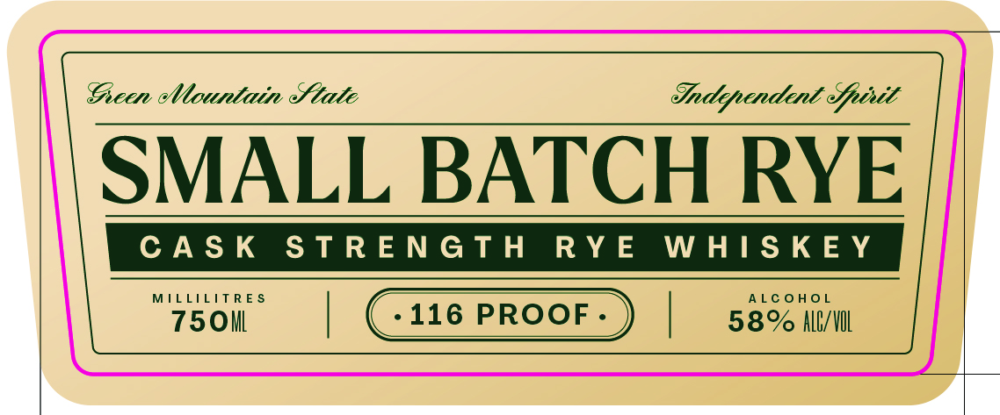
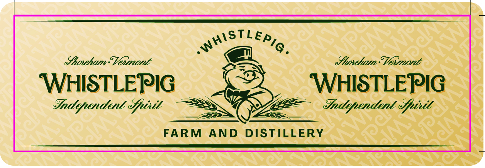

# TTB COLA Label Images - TTBID 26250001000195

**Brand Name:** WHISTLEPIG

**Issue Date:** 09/14/2026

**Origin Code:** 22

**Product Class/Type:** 142

**Source:** [TTB Public COLA Registry](https://ttbonline.gov/colasonline/viewColaDetails.do?action=publicFormDisplay&ttbid=26250001000195)

## Label Images

### Back Label

### Front Label

### Label 2

### Label 4

## Extracted Label Text

*Text extracted via OCR - may contain errors*

**Detected Age:** 10 Years

### Back Label

|

CASK cml! Lal rie ERS WHISKEY

Crafted from 100% rye and aged 10 years in new American oak, WhistlePig 10

Year Cask Strength Rye is bottled at its natural proof to preserve every layer of

flavor. Rich spice, oak, herbs, and citrus create an uncompromised expression

that showcases our flagship rye in its boldest form. Uncut. Uncompromised.

=

GOVERNMENT WARNING: (1) ACCORDING TO THE SURGEON GENERAL, WOMEN SHOULD

NOT DRINK ALCOHOLIC BEVERAGES DURING PREGNANCY BECAUSE OF THE RISK OF

BIRTH DEFECTS. (2) CONSUMPTION OF ALCOHOLIC BEVERAGES IMPAIRS YOUR ABILITY

=

TO DRIVE A CAR OR OPERATE MACHINERY, AND MAY CAUSE HEALTH PROBLEMS

DISTILLED IN VT. BOTTLED BY WHISTLEPIG WHISKEY CO., BRANDENBURG, KY. As¢-me,vt15¢ ICA CRV

### Front Label

WHISTLEPIG .
FARM
AND
WP
DISTILLERY
WHISTLEPIG
W
OASt
ehoteham." Venmont
Toe6
10
Rr4g,>
EnG
Patiently MATURED
A G E D
MASTERFULLY Crafted
epoit
10
YE A RS
Ketne/
A $ K
Jndependent

### Label 2

Gieen Mountain State

Sndipendint Gptit

SMALL BATCH RYE

MILLILITRES

ALCOHOL

750i

| Cate PRoor-) |

58% ALl/\OL

### Label 4

S
enoteham"Vexmont
ehoeham:" Vexmont
WHISTLEPIG
WHISTLEPIG
Independent efpixit
Endependent efpixit
FARM
AND
DISTILLERY
STLEPIG _
WHIS
