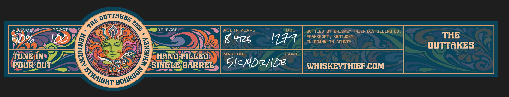
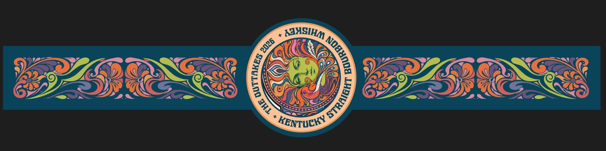
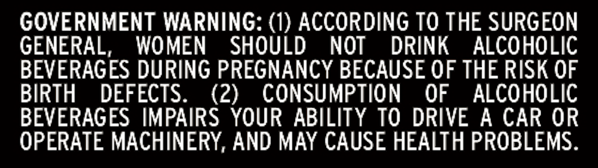

# TTB COLA Label Images - TTBID 26251001000044

**Brand Name:** WHISKEY THIEF DISTILLING CO.

**Fanciful Name:** TUNE IN POUR OUT

**Issue Date:** 09/14/2026

**Origin Code:** 22

**Product Class/Type:** 101

**Source:** [TTB Public COLA Registry](https://ttbonline.gov/colasonline/viewColaDetails.do?action=publicFormDisplay&ttbid=26251001000044)

## Label Images

### Label 1

### Label 2

### Label 3

### Label 4

## Extracted Label Text

*Text extracted via OCR - may contain errors*

*1 image(s) excluded: text did not meet readability threshold*

### Label 1

OUTTAKES
ALcNvOL
PRO
RELEASE
AGE IN YEARS
BBL
BOTTLED BY WHISKEY THIEF DISTILLING CO_
8 Y12s
I4a
FRANKFORT_
KENTUCKY
THE
IN FRANKLIN COUNTY
outTAKES
TUNEIINA
(
)
HaNd FILLED
MASHBILL
750ML
POUR OUT
KSINGGEBARREL
5lc/4rlDe
WHISKEYTHIEFCOM
THE
@
BOURBON _
STRAIGHT `

### Label 2

STRAIGHT
FROM
THE
BARREL
WHISKEY
THIEF
DISTILLING
co.

### Label 4

GOVERNMENT WARNING: (1) ACCORDING TO THE SURGEON

GENERAL, WOMEN SHOULD NOT DRINK ALCOHOLIC

BEVERAGES DURING PREGNANCY BECAUSE OF THE RISK OF

BIRTH DEFECTS.

(2) CONSUMPTION OF ALCOHOLIC

BEVERAGES IMPAIRS YOUR ABILITY TO DRIVE A CAR OR

OPERATE MACHINERY, AND MAY CAUSE HEALTH PROBLEMS.
