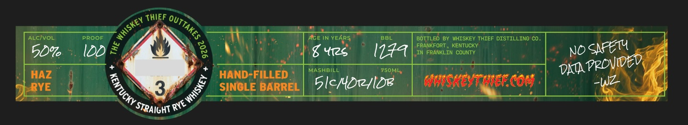

# TTB COLA Label Images - TTBID 26251001000046

**Brand Name:** WHISKEY THIEF DISTILLING CO.

**Fanciful Name:** HAZ

**Issue Date:** 09/14/2026

**Origin Code:** 22

**Product Class/Type:** 102

**Source:** [TTB Public COLA Registry](https://ttbonline.gov/colasonline/viewColaDetails.do?action=publicFormDisplay&ttbid=26251001000046)

## Label Images

### Label 1

### Label 2

### Label 3

### Label 4

## Extracted Label Text

*Text extracted via OCR - may contain errors*

*1 image(s) excluded: text did not meet readability threshold*

**Detected Proof:** 100

### Label 1

THIEF
ALcIvOL
PROOF
AGE IN YEARS
BBL
bottled By WhISKEY THIEF DISTILLING CO
50%
IdD =
8 Y12s
I144
ERAFRAORL
FRFORLINKCOUTKY
NOSAFETY
HAZ
HAND-FILLED
MASHBILL
750ML;
DAA-
RYE
3
SINGLE BARREL
5lc/Drlde
WasrestearCo5
'OUTTAKES
Whiskey
8
PpOVided
(
1
~Wz
'RYE
'STRAIGHT

### Label 2

STRAIGHT
FROM
THE
BARREL
WHISKEY
THIEF
DISTILLING
co.

### Label 4

GOVERNMENT WARNING: (1) ACCORDING TO THE SURGEON

GENERAL, WOMEN SHOULD NOT DRINK ALCOHOLIC

BEVERAGES DURING PREGNANCY BECAUSE OF THE RISK OF

BIRTH DEFECTS.

(2) CONSUMPTION OF ALCOHOLIC

BEVERAGES IMPAIRS YOUR ABILITY TO DRIVE A CAR OR

OPERATE MACHINERY, AND MAY CAUSE HEALTH PROBLEMS.
