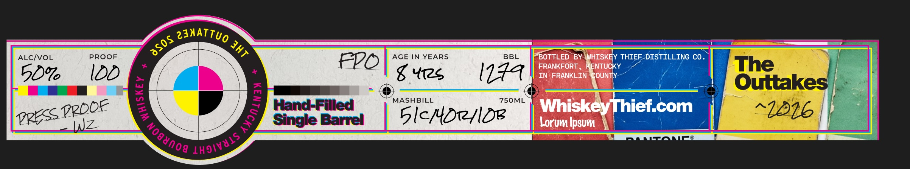
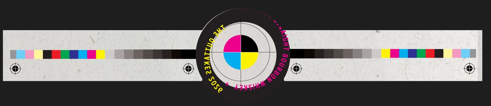

# TTB COLA Label Images - TTBID 26251001000055

**Brand Name:** WHISKEY THIEF DISTILLING CO.

**Fanciful Name:** PRESS

**Issue Date:** 09/14/2026

**Origin Code:** 22

**Product Class/Type:** 101

**Source:** [TTB Public COLA Registry](https://ttbonline.gov/colasonline/viewColaDetails.do?action=publicFormDisplay&ttbid=26251001000055)

## Label Images

### Label 1

### Label 2

### Label 3

### Label 4

## Extracted Label Text

*Text extracted via OCR - may contain errors*

*1 image(s) excluded: text did not meet readability threshold*

### Label 1

21nATTUO
ALcIvoL
PROOF
Fv
AGE IN YEARS
BBL
BOTTLED BY
WHISKE
THIEF DISTILLING CO _
FRANKFORT
ENTUCKY
The
50'6
IDD
8 412s
I44
IN FRANKLIN
COUNT
Outtakes
MASHBILL
750ML
Hand-Filled
Whiskey rhief_com
^1216
Inz
Single Barrel
51c/4D1lD
Lorum Ipsum
asos
JhT
1
1
PPOOE
Pprss
Noaunos `
IhgIvals

### Label 2

STRAIGHT
FROM
THE
BARREL
WHISKEY
THIEF
DISTILLING
co.

### Label 4

GOVERNMENT WARNING: (1) ACCORDING TO THE SURGEON

GENERAL, WOMEN SHOULD NOT DRINK ALCOHOLIC

BEVERAGES DURING PREGNANCY BECAUSE OF THE RISK OF

BIRTH DEFECTS.

(2) CONSUMPTION OF ALCOHOLIC

BEVERAGES IMPAIRS YOUR ABILITY TO DRIVE A CAR OR

OPERATE MACHINERY, AND MAY CAUSE HEALTH PROBLEMS.
