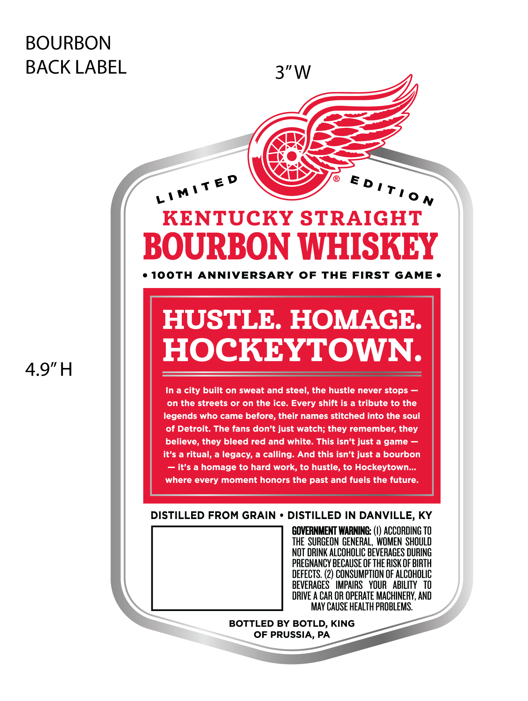
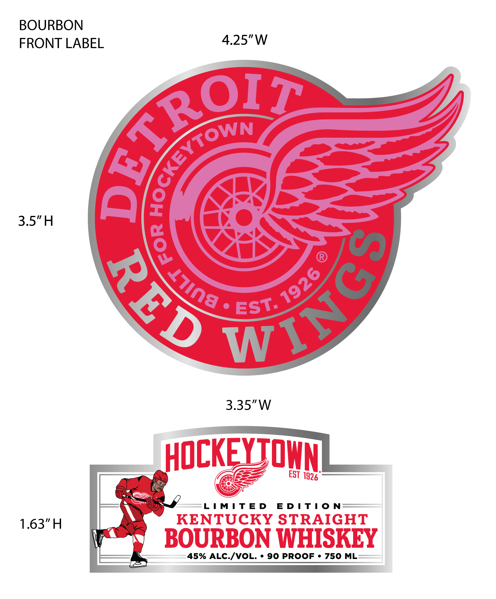

# TTB COLA Label Images - TTBID 26251001000175

**Brand Name:** DETROIT RED WINGS

**Issue Date:** 09/17/2026

**Origin Code:** 39

**Product Class/Type:** 101

**Source:** [TTB Public COLA Registry](https://ttbonline.gov/colasonline/viewColaDetails.do?action=publicFormDisplay&ttbid=26251001000175)

## Label Images

### Back Label

### Front Label

## Extracted Label Text

*Text extracted via OCR - may contain errors*

**Detected Proof:** 90

### Back Label

BOURBON
BACK LABEL
3"W
KENTUCKY STRAIGHT
BOURBON WHISKEY
10oth
ANNIVERSARY OF
THE
FIRST GAME
HUSTLE HOMAGE
HOCKEYTOWN
4.9"H
In a city built on sweat and steel, the hustle never stops
on the streets or on the ice. Every shift is a tribute to the
legends who came before, their names stitched into the soul
of Detroit. The fans don't just watch; they remember; they
believe, they bleed red and white. This isn't just a game
it's a ritual, a legacy, a calling: And this isn't just a bourbon
it's a homage to hard work; to hustle, to Hockeytown_.
where every moment honors the past and fuels the future.
DISTILLED FROM GRAIN
DISTILLED IN DANVILLE, KY
GOVERNMENT WARNING: (€) ACCORDING TO
THE  SURGEON GENERAL,  WOMEN  SHOULD
NOT DRINK ALCOHOLIC BEVERAGES DURING
PREGMANCY BECAUSE OF THE RISK €F BIRTH
DEFECTS. (2) CONSUMPTION OF ALCOHOLIC
BEVERAGES
IMPAIRS   YOUR   ABILITY   tO
DRIVE A CAR OR OPERATE MACHINERY, AND
MAY CAUSE HEALTH PROBLEMS:
BOTTLED BY BOTLD, KING
OF PRUSSIA, PA
LIMTTED
D ! Ti0 N

### Front Label

BOURBON
FRONT LABEL 4.25"W

3.5"H

EST 1996°

aly LIMITED EDITION=—

\ KENTUCKY STRAIGHT
4
LS 3

re BOURBON WHISKEY

45% ALC./VOL. « 90 PROOF « 750 ML=
