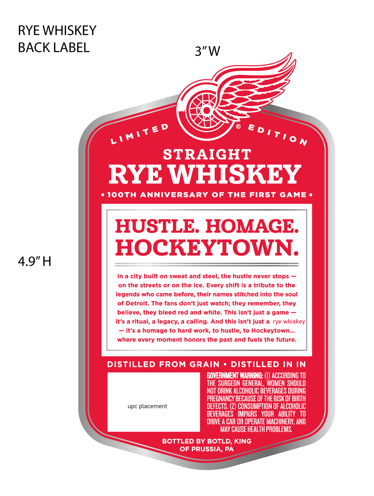
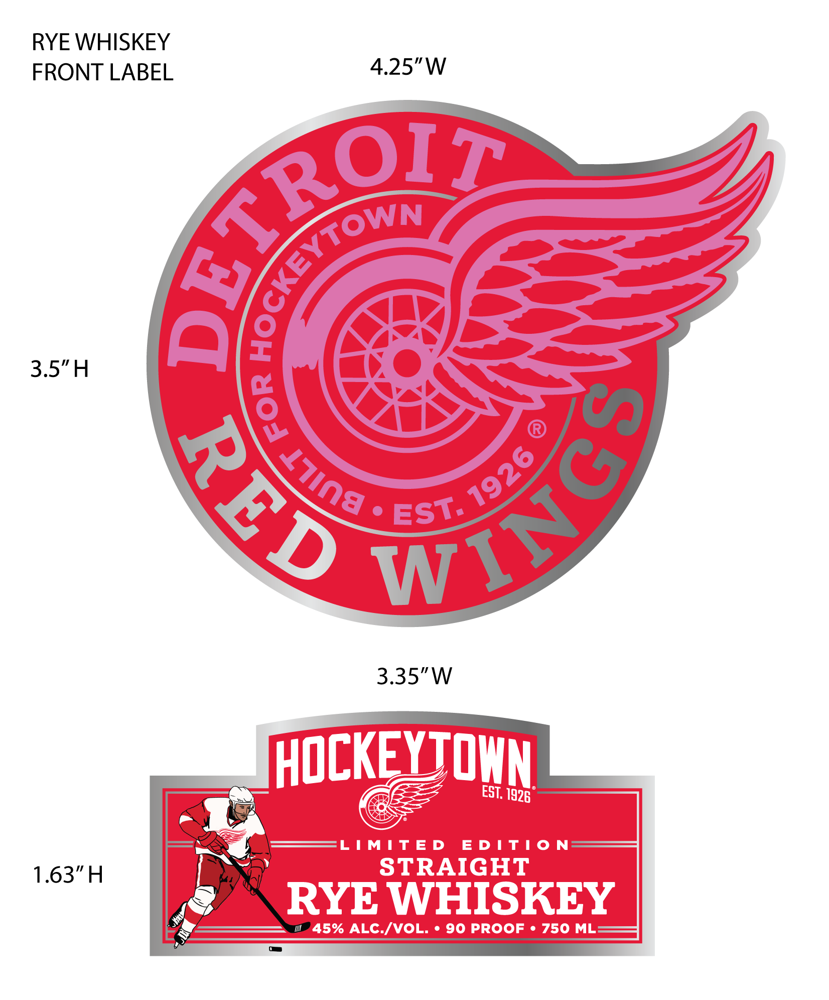

# TTB COLA Label Images - TTBID 26251001000177

**Brand Name:** DETROIT RED WINGS

**Issue Date:** 09/18/2026

**Origin Code:** 39

**Product Class/Type:** 102

**Source:** [TTB Public COLA Registry](https://ttbonline.gov/colasonline/viewColaDetails.do?action=publicFormDisplay&ttbid=26251001000177)

## Label Images

### Back Label

### Front Label

## Extracted Label Text

*Text extracted via OCR - may contain errors*

**Detected Proof:** 90

### Back Label

RYE WHISKEY
BACK LABEL
3"W
D
E
STRAIGHT
RYE WHISKEY
1ooTH
ANNIVERSARY
OF
THE
FIRST
GAME
HUSTLE. HOMAGE:
HOCKEYTOWN
4.9"H
In a city built on sweat and steel; the hustle never stops
on the streets or on the ice. Every shift is a tribute to the
legends who came before, their names stitched into the soul
of Detroit. The fans don't just watch; they remember;
believe, they bleed red and white
This isn't just a game
it's a ritual, a legacy; a
calling: And this isn't just a
rye whiskey]
it's a homage to hard work; to hustle; to Hockeytown .
where every moment honors the past and fuels the future:
DISTILLED FROM GRAIN
DISTILLED IN IN
GOVERNMENT WARNING:
ACCORDING TO
THE  SURGEON GENERAL, WOMEN  SHOULD
NOT DRINK ALCOHOLIC BEVERAGES DURING
PREGNANCY BECAUSE OF THE RISK OF BIRTH
upc placement
DEFECTS, (2) CONSUMPTION OF ALCOHOLIC
BEVERAGES   IMPAIRS   YOUR   ABILITY   TO
DRIVE A CAR OR OPERATE MACHINERY, AND
MAY CAUSE HEALTH PROBLEMS.
BOTTLED BY BOTLD, KING
OF PRUSSIA, PA
LIMiTE
D ! TI0 N
they

### Front Label

RYE WHISKEY
FRONT LABEL
4.25"W
3.5"H
Ca
3.35"W
HOCKeYIOwN
EST;
IMITED
EDTi0
N
1.63"H
STRAIGHT
RYE WHISKEY
45% ALC /VOL.
90 PROOF
750 ML
64RQ
YTOWN
{
8
3
WING
1926
J7in8
EST.
1926
