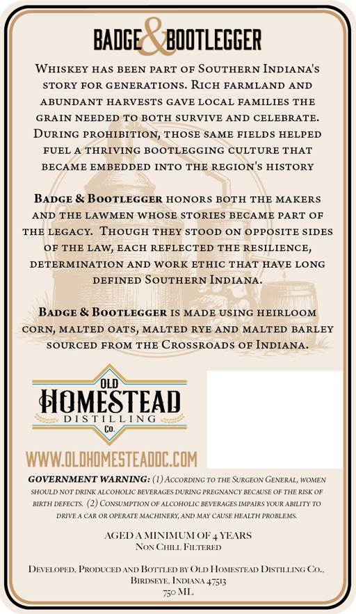
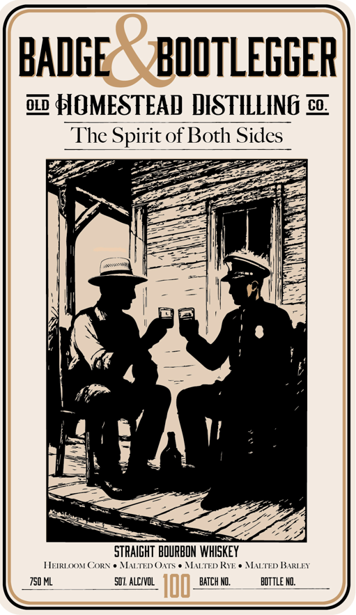
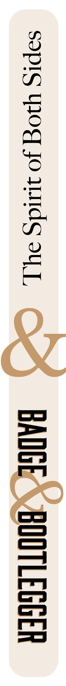

# TTB COLA Label Images - TTBID 26251001000188

**Brand Name:** OLD HOMESTEAD DISTILLING CO.

**Fanciful Name:** BADGE & BOOTLEGGER

**Issue Date:** 09/14/2026

**Origin Code:** 19

**Product Class/Type:** 101

**Source:** [TTB Public COLA Registry](https://ttbonline.gov/colasonline/viewColaDetails.do?action=publicFormDisplay&ttbid=26251001000188)

## Label Images

### Back Label

### Front Label

### Label 3

## Extracted Label Text

*Text extracted via OCR - may contain errors*

*1 image(s) excluded: text did not meet readability threshold*

### Back Label

BADGE
BOOTLEGGER
WHISKEY HAS BEEN PART OF
SoUTHERN INDIANA's
STORY FOR GENERATIONS
RICH FARMLAND AND
ABUNDANT HARVESTS GAVE LOCAL FAMILIES THE
GRAIN NEEDED
TO BOTH SURVIVE AND CELEBRATE_
DURING PROHIBITION, THOSE SAME FIELDS HELPED
FUEL
THRIVING BOOTLEGGING CULTURE THAT
BECAME EMBEDDED INTO THE REGION'$ HISTORY
BADGE & BooTLEGGER HONORS
BOTH THE
MAKERS
AND THE LAWMEN WHOSE STORIES BECAME PART OF
THE LEGACY:
THOUGH THEY STOOD ON OPPOSITE SIDES
OF THE LAW, EACH REFLECTED THE RESILIENCE,
DETERMINATION AND WORK ETHIC THAT HAVE LONG
DEFINED SOUTHERN INDIANA
BADGE & BooTLEGGER IS MADE USING HEIRLOOM
CORN, MALTED OATS,
MALTED RYE AND MALTED
BARLEY
SOURCED FROM THE CROSSROADS OF INDIANA.
HOMESTEAD
D [ S T [L LIN G
WWWLOLDHOMESTEADDC COM
GOVERNMENT WARNING: (1)AcCORDING TO THE SURGEON GENERAL, WOMEN
SHOULDNUI DHINA ALCOHOLIC BEVERIGES DURNG FREGMANC} BEC AUSE OF TA
RISK OF
BIRTH DEFECTS
CoNSUMPTION OF ALCOHOLIC BEVERAGES [MPAIRS YOUR ABILITY TO
DRIVTA CAR OR OPERATE MACHINERI , AND MAI CAUSE HEALTT PRORLEMS
AGED
MINIMUMOF_
YEARS
NOx CLL FLTERED
DEVELOPED PRODUCED
BoTTLED BY ( LD HOMESTEAD DISTILLING C
BRDSEIE INDLANA+7503
750 I.
AD

### Front Label

BADGE
BOOTLEGGER
o2 HOMESTEAD DISTILLING c
The Spirit of Both Sides
STRAIGHT BOURBON WHISKEY
HEIRLOOM CORN
MALTED (ATS
MTED KIE -
MATED BSARLEY
750 ML
50 L alcIvOL
IoO
BATCH NO,
bottle ND:
