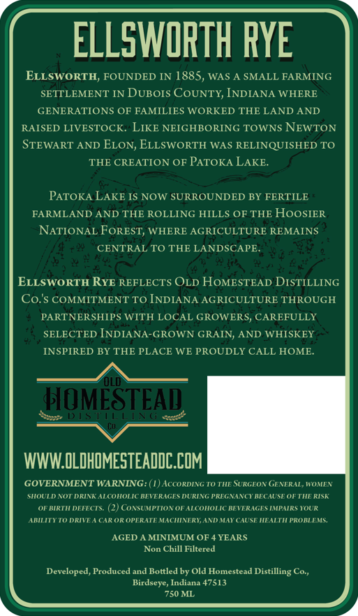
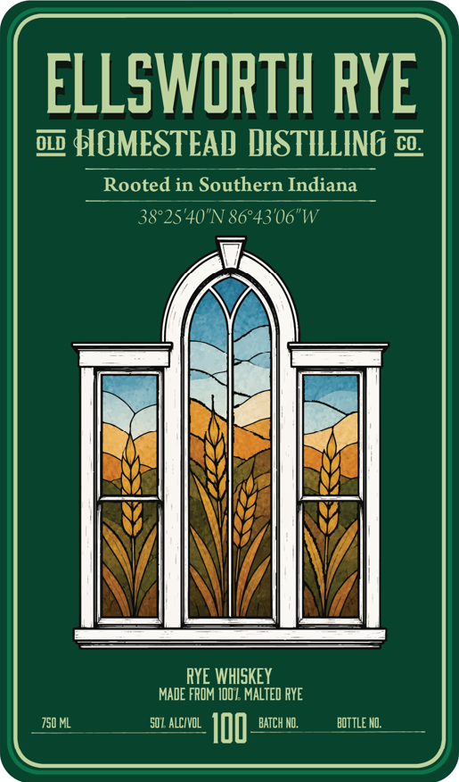

# TTB COLA Label Images - TTBID 26251001000195

**Brand Name:** OLD HOMESTEAD DISTILLING CO.

**Fanciful Name:** ELLSWORTH RYE

**Issue Date:** 09/14/2026

**Origin Code:** 19

**Product Class/Type:** 142

**Source:** [TTB Public COLA Registry](https://ttbonline.gov/colasonline/viewColaDetails.do?action=publicFormDisplay&ttbid=26251001000195)

## Label Images

### Back Label

### Front Label

### Label 3

## Extracted Label Text

*Text extracted via OCR - may contain errors*

### Back Label

ELLSWORTH RYE
ELLSWORTH, FOUNDED IN
885, WAS
SMALL FARMING
SETTLEMENT IN DUBOIs COUNTY, INDIANA WHERE
GENERATIONS OF FAMILIES WORKED THE LAND AND
RAISED LIVESTOCK. LIKE NEIGHBORING TOWNS NEWTON
STEWART AND ELON, ELLSWORTH WAS RELINQUISHED TO
THE CREATION OF PATOKA LAKE.
PATOKA LAKE IS NOW SURROUNDED BY FERTILE
FARMLAND AND THE ROLLING HILLS OF THE HooSIER
NATIONAL FoREST, WHERE AGRICULTURE REMAINS
CENTRAL TO THE LANDSCAPE.
ELLSWORTH RYE REFLECTS OLD HoMESTEAD DISTILLING
Co:$ COMMITMENT TO INDIANA AGRICULTURE THROUGH
PARTNER SHIPS WITH LOCAL GROWERS, CAREFULLY
SELECTED INDIANA-GROWN GRAIN; AND WHISKEY
INSPIRED BY THE PLACE WE PROUDLY CALL HOME
oLD
HOMESTEAD
WWW OLDHOMESTEADDC.COM
GOVERNMENT WARNING:
AcCoRDING TO THE SURGEOR GENTRAL, WTOMEN
SHOULD EOT DRINK ALCOHOLIC BEVERIGES DURIEG PREGHANCT BECAUSE OF THE RISK
OF BIRTH DETECTS
CoxSUMPTIONor ALCOHOLIC BETTRAGES MMPAIRS YOUR
AMILITTTODRIITAAAROR OF'TRATE MACHINTRI;ANDMAT CAUSE MLALTT PRORLEMS.
AGED A MINIMUM OF
YEARS
Non Chill Filtered
Developed, Produced and Bottled by Old Homnestead Distilling
Birdseye, Indiana 47513
750 ML
Co

### Front Label

ELLSWORTH RYE
OLD
HOMESTEAD DISTILLING co,
Rooted in Southern Indiana
38*25'40"N 86*43'06"W
RYE WhISKEY
MADE FROM IDO L MALTED RYE
750 ML
501 alcivol
I00
BATCh NO:
buTtle NO;

### Label 3

euepuy wioymnos uw paioon 3 ELLSWORTH RYE
