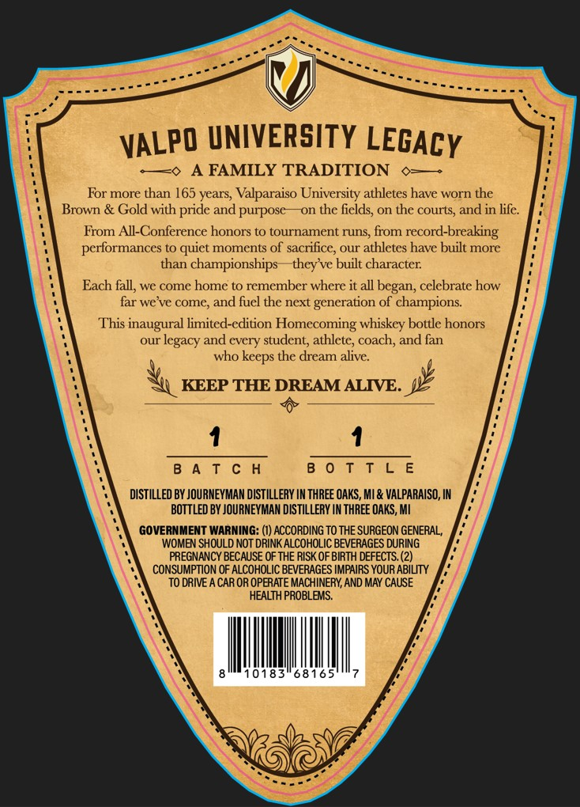
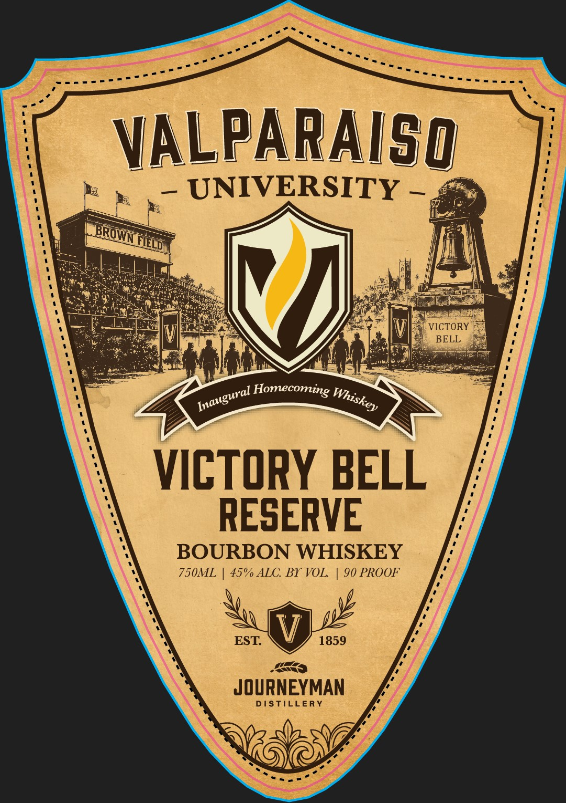

# TTB COLA Label Images - TTBID 26251001000276

**Brand Name:** JOURNEYMAN DISTILLERY

**Fanciful Name:** VALPARAISO UNIVERSITY VICTORY BELL RESERVE BOURBON WHISKEY

**Issue Date:** 09/15/2026

**Origin Code:** 06

**Product Class/Type:** 141

**Source:** [TTB Public COLA Registry](https://ttbonline.gov/colasonline/viewColaDetails.do?action=publicFormDisplay&ttbid=26251001000276)

## Label Images

### Back Label

### Front Label

## Extracted Label Text

*Text extracted via OCR - may contain errors*

**Detected Proof:** 90

### Back Label

TAN

Beemer

eee

errr

eee

<5

a

VALPO UNIVERSITY Legacy

Vin

-—o A FAMILY TRADITION o-—-

For more than 165 years, Valparaiso University athletes have worn the

Brown & Gold with pride and purpose—on the fields, on the courts, and in life

From All-Conference honors to tournament runs, from record-breaking

performances to quict moments of sacrifice, our athletes have built more

than championships

they've built character.

Each fall, we come home to remember where it all began, celebrate how

far we've come, and fuel the next generation of champions.

This inaugural limited-edition Homecoming whiskey bottle honors

our legacy and eve

student, athlete, coach, and fan

who keeps the dream alive

KEEP THE DREAM ALIVE.

1

1

BATCH

Onis tae

DISTILLED BY JOURNEYMAN DISTILLERY IN THREE OAKS, Ml & VALPARAISO, IN

BOTTLED BY JOURNEYMAN DISTILLERY IN THREE OAKS, Ml

GOVERNMENT WARNING: (I) ACCORDING TO THE SURGEON GENERAL,

WOMEN SHOULD NOT DRINK ALCOHOLIC BEVERAGES DURING

PREGNANCY BECAUSE OF THE RISK OF BIRTH DEFECTS. (2)

CONSUMPTION OF ALCOHOLIC BEVERAGES IMPAIRS YOUR ABILITY

TO DRIVE A CAR OR OPERATE MACHINERY, AND MAY CAUSE

HEALTH PROBLEMS.

ll

|

0183'6816

l

=

### Front Label

VALPARAISg
UNIVERSITY
VICTORY
BELL
Homecoming
VICTORY BELL
RESERVE
BOURBON WHISKEY
750ML
45% ALC Br VOL
90 PROOF
EST
1859
JOURNEYMAN
DISTILLERY
BROWN
FED
Inaugural_
Whiskey
