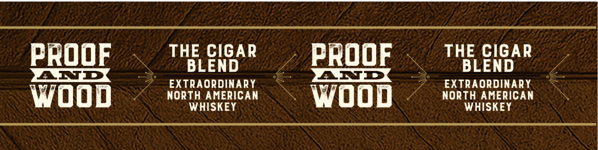
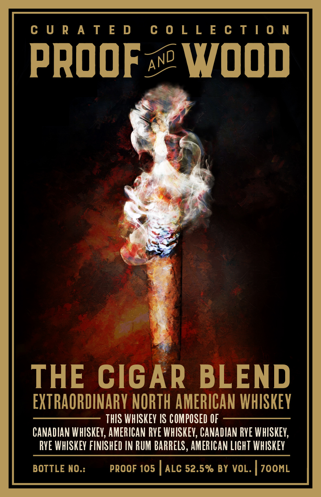

# TTB COLA Label Images - TTBID 26251001000286

**Brand Name:** PROOF AND WOOD

**Fanciful Name:** THE CIGAR BLEND

**Issue Date:** 09/17/2026

**Origin Code:** 22

**Product Class/Type:** 140

**Source:** [TTB Public COLA Registry](https://ttbonline.gov/colasonline/viewColaDetails.do?action=publicFormDisplay&ttbid=26251001000286)

## Label Images

### Back Label

### Front Label

## Extracted Label Text

*Text extracted via OCR - may contain errors*

**Detected Proof:** 105

### Back Label

PROOF
THE CIGAR
PROOF
THE CIGAR
BLEND
BLEND
LITR
LITIE
EXTRAORDINARY
EXTRAORDINARY
Wood
NORTH AMERICAN
woop
NORTH AMERICAN
WHISKEY
WHISKEY

### Front Label

CURATED COLLECTION

PROOF WOOD

THE CIGAR BLEND

EXTRAORDINARY NORTH AMERICAN WHISKEY

THIS WHISKEY IS COMPOSED OF
CANADIAN WHISKEY, AMERICAN RYE WHISKEY, CANADIAN RYE WHISKEY,
RYE WHISKEY FINISHED IN RUM BARRELS, AMERICAN LIGHT WHISKEY

BOTTLE NO.: PROOF 105 | ALC 52.5% BY VOL. | 7OOML
