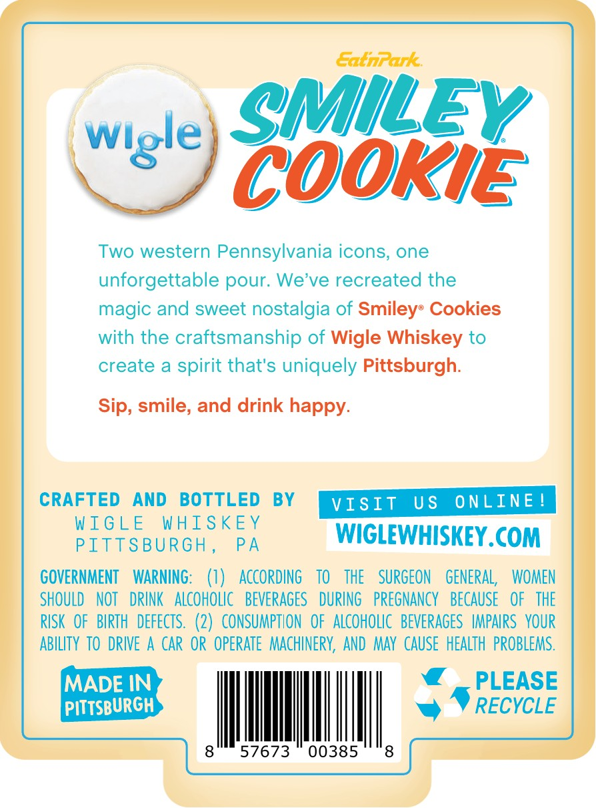
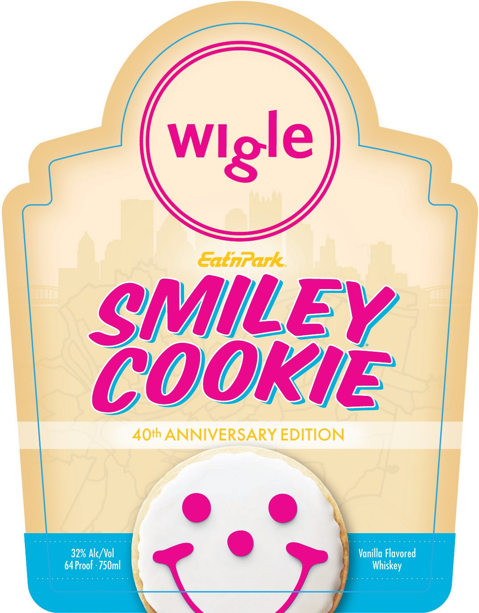

# TTB COLA Label Images - TTBID 26251001000327

**Brand Name:** WIGLE

**Issue Date:** 09/29/2026

**Origin Code:** 39

**Product Class/Type:** 149

**Source:** [TTB Public COLA Registry](https://ttbonline.gov/colasonline/viewColaDetails.do?action=publicFormDisplay&ttbid=26251001000327)

## Label Images

### Back Label

### Front Label

## Extracted Label Text

*Text extracted via OCR - may contain errors*

**Detected Proof:** 64

### Back Label

COOKIE

Two western Pennsylvania icons, one

vets) eMiley

unforgettable pour. We’ve recreated the
magic and sweet nostalgia of Smileys Cookies
with the craftsmanship of Wigle Whiskey to
create a spirit that's uniquely Pittsburgh.

Sip, smile, and drink happy.

CRAFTED AND BOTTLED BY

WIGLE WHISKEY
Mier suncH pn WIGLEWHISKEY.COM

GOVERNMENT WARNING: (1) ACCORDING TO THE SURGEON GENERAL WOMEN
SHOULD NOT DRINK ALCOHOLIC BEVERAGES DURING PREGNANCY BECAUSE OF THE
RISK OF BIRTH DEFECTS. (2) CONSUMPTION OF ALCOHOLIC BEVERAGES IMPAIRS YOUR
ABILITY TO DRIVE A CAR OR OPERATE MACHINERY, AND MAY CAUSE HEALTH PROBLEMS.

MADE IN @ _ PLEASE
PITTSBURGH
8

we PrRecvcLe
57673 00385 8

### Front Label

EatnPark:
SMILEy
COORIe
40th ANNIVERSARY EDITION
32% Alc/ Vol
Vanilla Flavored
64 Proof : 750ml
Wlgle
Whiskey
