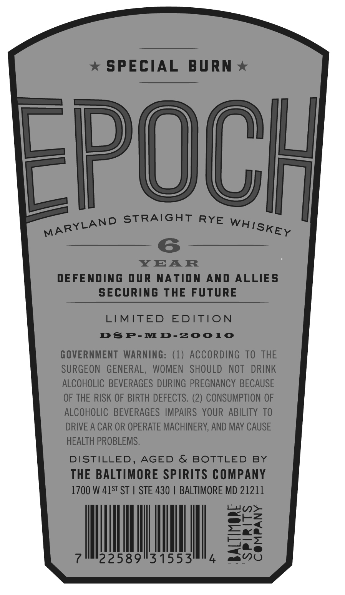
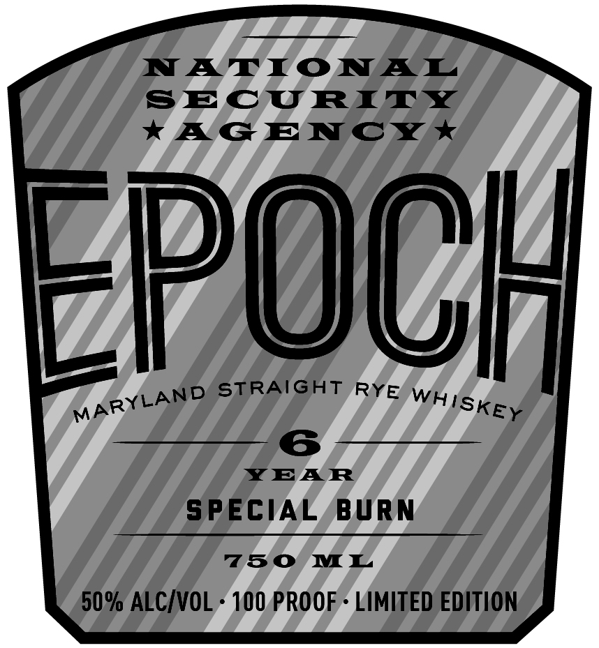
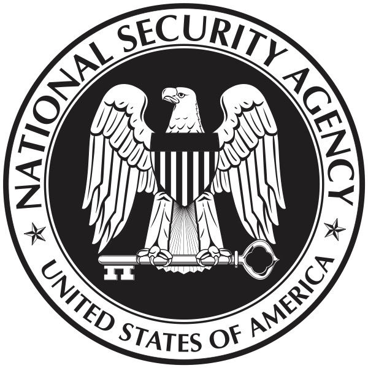

# TTB COLA Label Images - TTBID 26251001000338

**Brand Name:** EPOCH

**Issue Date:** 09/15/2026

**Origin Code:** 25

**Product Class/Type:** 102

**Source:** [TTB Public COLA Registry](https://ttbonline.gov/colasonline/viewColaDetails.do?action=publicFormDisplay&ttbid=26251001000338)

## Label Images

### Back Label

### Front Label

### Label 1

## Extracted Label Text

*Text extracted via OCR - may contain errors*

*1 image(s) excluded: text did not meet readability threshold*

**Detected Proof:** 100
**Detected Age:** 6 Years

### Back Label

SPECIAL
BURN
FPOCH
STRAIGHT RYE
6
YEAR
DEFENDING OUR
NATION
AND ALLIES
sEcURinG THE FUTURE
LIMITED
EDITION
DsP-MD-20010
GOVERNMENT  WARNING: (1) ACCORDING To THE
SURGEON   GENERAL,
WOMEN   SHOULD
NOT
DRINK
ALCOHOLIC BEVERAGES DURING  PREGNANCY BECAUSE
OF THE RISK OF BIRTH DEFECTS. (2) CONSUMPTION OF
ALCOHOLIC  BEVERAGES  IMPAIRS   YOUR ABILITY TO
DRIVE A CAR OR OPERATE MACHINERY; AND MAY CAUSE
HEALTH PROBLEMS.
DISTILLED, AGED
&
BOTTLED
BY
THE BALTIMORE SPIRITS COMPANY
1700 W 41ST ST
STE 430
BALTIMORE MD 21211
3
22589131553
1
MARYLAND
WhISKEY

### Front Label

NATIONAL
SECURITY
KG ENCX *
EpOCH
STRAIGHT
6
YEAR
SPECIAL
BURN
750
ML
50% ALCIVOL
100 PROOF
LIMITED EDITION
RYE
MARYLAND
WhISKEY
