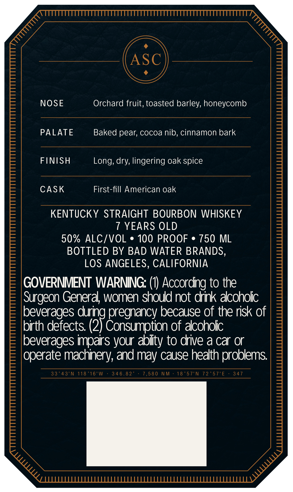
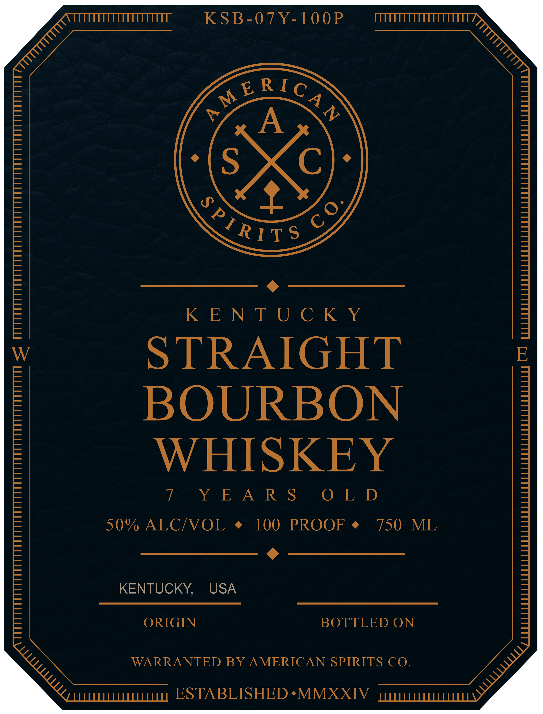

# TTB COLA Label Images - TTBID 26251001000531

**Brand Name:** AMERICAN SPIRITS CO.

**Issue Date:** 09/14/2026

**Origin Code:** 22

**Product Class/Type:** 101

**Source:** [TTB Public COLA Registry](https://ttbonline.gov/colasonline/viewColaDetails.do?action=publicFormDisplay&ttbid=26251001000531)

## Label Images

### Back Label

### Front Label

## Extracted Label Text

*Text extracted via OCR - may contain errors*

**Detected Proof:** 90
**Detected Age:** 7 Years

### Back Label

NOSE Orchard fruit, toasted barley, honeycomb
PALATE Baked pear, cocoa nib, cinnamon bark
FINISH Long, dry, lingering oak spice

CASK First-fill American oak

KENTUCKY STRAIGHT BOURBON WHISKEY
7 YEARS OLD
90% ALC/VOL * 100 PROOF © 750 ML

BOTTLED BY BAD WATER BRANDS,
LOS ANGELES, CALIFORNIA

GOVERNMENT WARNING: (1) According to the
surgeon General, women should not drink alcoholic
beverages during pregnancy because of the risk of
birth defects. (9F Consumotion of alcoholic
beverages impairs your ability to drive a car or
Operate machinery, and may cause health problems.

J Omerom Nt Ge Owe eta Oy Oe see feo OMN Mes Tos ot IN 14225 7 Ea 417,

### Front Label

KSB-07Y-100P

is RS

fRTITS

159 wield ad a gag

STRAIGHT

BOURBON

WHISKEY

eke ASKS

O LD

50% ALC/VOL ¢ 100 PROOF ¢ 750 ML

5

KENTUCKY, USA

ORIGIN

BOTTLED ON

WARRANTED BY AMERICAN SPIRITS CO

ESTABLISHED *MMXXIV
