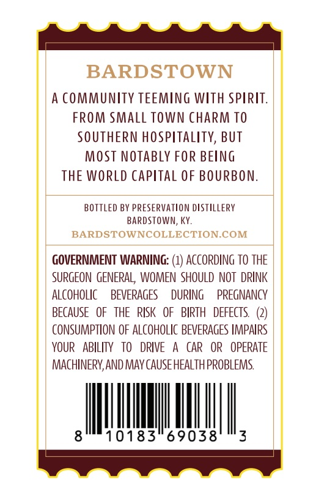
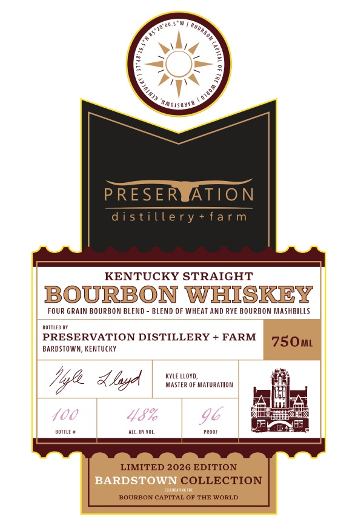

# TTB COLA Label Images - TTBID 26251001000534

**Brand Name:** BARDSTOWN COLLECTION

**Issue Date:** 09/15/2026

**Origin Code:** 22

**Product Class/Type:** 101

**Source:** [TTB Public COLA Registry](https://ttbonline.gov/colasonline/viewColaDetails.do?action=publicFormDisplay&ttbid=26251001000534)

## Label Images

### Back Label

### Label 1

## Extracted Label Text

*Text extracted via OCR - may contain errors*

### Back Label

BARDSTOWN
A CoMMUnTy TEEMING WITh SPIRIT.
FROM Small TOWN ChArm TO
SOUTHERN HOSPITality, BUT
MOST NOTAbly FOR BELNG
THE WORLD Capital OF BOURBON:
BOTTLED BY PRESERVATLON dSTILLERY
BardSToWn, Ky:
BARDSTOWNCOLLECTION.COM
GOVERNMENT WARNING: (1) ACCORDING TO THE
SURGEON  GENERAL  WOMEN  SHOULD NOT  DRINK
Alcoholic
BEVERAGES
DURING
PREGNANCY
BECAUSE   OF  THE   RISK
OF   BIRTH
DEFECTS
CONSUMPTION OF AlcohOlIC BEVERAGES IMPAIRS
YOUR   ABILITV
TO
DRIVE
CAR
OR   OPERATE
MachineRv,ANd MAY CAuSeHEALTH PROBLEMS
8
10183
69038
3

### Label 1

a

a

Simoisauite

sy

RESIE

ATION

iller

KENTUCKY STRAIGHT

BOURBON WHISKEY

FOUR GRAIN BOURBON BLEND - BLEND OF WHEAT AND RYE BOURBON MASHBILLS

nora ey

BARDSTOWN, KENTUCKY,

PRESERVATION DISTILLERY + FARM [75 Q)qq)

KYLE LLOYD,

Myf dlp

MASTER OF MATURATION

dl

worn

uc V0.

e008

LIMITED 2026 EDITION

COLLECTION

BOURBON CAPITAL OF THE WORLD
