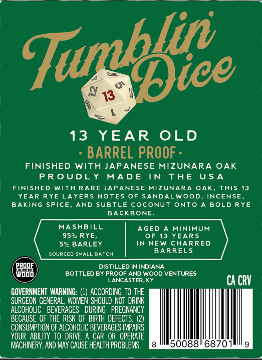
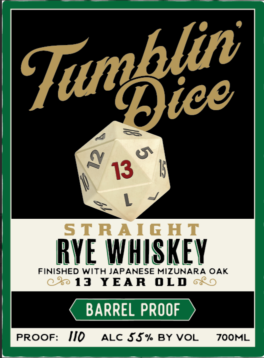

# TTB COLA Label Images - TTBID 26251001000548

**Brand Name:** TUMBLIN DICE

**Issue Date:** 09/15/2026

**Origin Code:** 22

**Product Class/Type:** 102

**Source:** [TTB Public COLA Registry](https://ttbonline.gov/colasonline/viewColaDetails.do?action=publicFormDisplay&ttbid=26251001000548)

## Label Images

### Back Label

### Front Label

## Extracted Label Text

*Text extracted via OCR - may contain errors*

**Detected Age:** 13 Years

### Back Label

13
13
YEAR
OLD
BARREL PROOF .
FINISHED
With JAPANESE MIZUNARA OAK
P R 0UDLY
MAD E
TN
TAE
U 5 A
FINISHED WITA RARE JAPANESE MIZUNARA
OAK, ThiS 13
YEAR RYE LAYERS NOTEs
0F SANDALWOOD, INCENSE,
BAKING SPICE,
AND
SUBTLE
COcONUT ONTO
4 BOLD RYE
BAcKBONE
MASHBILL
AGED
MINIMUM
959 RYE,
0F 13 YEARS
59 BARLEY
IN NEW CHARRED
BARRELS
sourced ShALLBatch
DISTILLED IN INDIANA
D000)
BOTTLED BY PROOF AND WOOD VENTURES
LANCASTER,KY
Ca CRV
GOVERNMENT WARNING; (1) ACCORDING To THE
SURGEON GENERAL , WOMEN ShOULD NOT  DRINK
ALCOHOLIC   BEVERAGES   DURING   PREGNANCY
BECAUSE OF THE RISK OF  BIRTH DEFECTS (2)
CONSUMPTION OF ALCOHOLIC BEVERAGES IMPAIPS
YOUR   ABILITY   tO  DRIVE
CAR  OR  OPERATE
MACHINERY, AND MAY CAUSE HEALTH PROBLEMS.
Turbfice

### Front Label

13
STRAIG HT
RYE WHISKEV
FINISHED WIth JAPANESE MIZUNARA OAK
90 13
YEAR
0LD
68 0
BARREL PROOF
PROOF:
Iio
ALC ss% BY VOL
ZOOML
Tumnblee |
