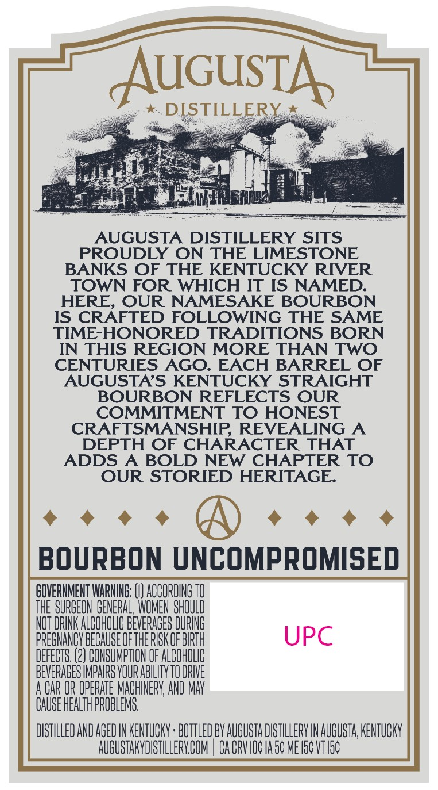
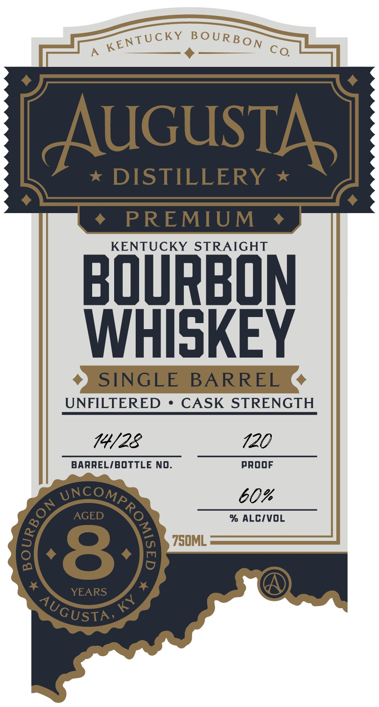

# TTB COLA Label Images - TTBID 26251001000609

**Brand Name:** AUGUSTA DISTILLERY

**Issue Date:** 09/15/2026

**Origin Code:** 22

**Product Class/Type:** 101

**Source:** [TTB Public COLA Registry](https://ttbonline.gov/colasonline/viewColaDetails.do?action=publicFormDisplay&ttbid=26251001000609)

## Label Images

### Back Label

### Front Label

### Label 3

## Extracted Label Text

*Text extracted via OCR - may contain errors*

*1 image(s) excluded: text did not meet readability threshold*

**Detected Proof:** 120
**Detected Age:** 8 Years

### Back Label

AUGUsTA
DISTILLERY
AUGUSTA DISTILLERY SITS
PROUDLY ON THE LIMESTONE
BANKS OF THE KENTUCKY RIVER
TOWN FOR
WHICH IT IS NAMED:
HERE
OUR NAMESAKE BOURBON
IS CRAFTED FOLLOWING THE SAME
TIME-HONORED TRADITIONS BORN
IN THIS REGION MORE THAN TWO
CENTURIES AGO:
EACH
BARREL OF
AUGUSTAS KENTUCKY STRAIGHT
BOURBON REFLECTS OUR
COMMITMENT TO HONEST
CRAFTSMANSHIP; REVEALING A
DEPTH OF CHARACTER THAT
ADDS A
BOLD NEW CHAPTER TO
OUR STORIED HERITAGE
BOURBON UNCOMPROMISED
GOVERNMENT WARNINE; (V) ACCORDING TO
THE SURGEON GENERAL_WOMEN ShQULD
NOT DRINK ALCOHOLIC BEVERAGES DURING
PREGNANCV BECAUSE OFThE RISK OF BHRTH
UPC
DEFECTS: (2) CONSUMPTION OF ALCOHOLIC
BEVERAGESIMPAIRS VOUR ABILITV TODRNVE
A CAR OR OPERATE MACHINERV; AND MAV
CAUSE HEALTH PROBLEMS:
DISTHLLED AND AGED IN KENTUCKY ' BOTTLED BV AUGUSTA DISTILLERV IN AuGUSTA; KENTuCKN
AUGUSTAKVDISTILLERYBOM
Ca CPVIOC IA5c ME I5c VT I5c

### Front Label

AuGUsTA
DISTILLERY
PREMIUM
KENTUCKY STRAIGHT
BOuRBON
WHISKEY
SINGLE
BARREL
UNFILTERED
CASK STRENGTH
14/22
120
BARRELIBOTTLE NO.
PROOF
60%
AGED
% ALCIVOL
750ML
8
YEARS
4
KENTUCKY
BOURBON
Co.
SNCOMPRo
{
8
AUGUSTN
