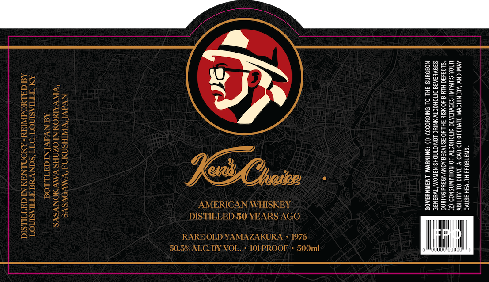

# TTB COLA Label Images - TTBID 26251001000638

**Brand Name:** KEN'S CHOICE

**Fanciful Name:** RARE OLD YAMAZAKURA

**Issue Date:** 09/28/2026

**Origin Code:** 22

**Product Class/Type:** 140

**Source:** [TTB Public COLA Registry](https://ttbonline.gov/colasonline/viewColaDetails.do?action=publicFormDisplay&ttbid=26251001000638)

## Label Images

### Label 1

## Extracted Label Text

*Text extracted via OCR - may contain errors*

### Label 1

a

32

Bess=

ZQ4s5z

Sz

gee

Sze

BS

a2a22

SEhoe

ZCESE

woz eS

2Z,

es

ani

ge

ac

22e8e

rhe

ao

2onee

e8eg2

BO oF

cages

522

aoe

Sa

ZS

S222

Zeee

a7e

Ss

rare)

sae

aon

use|

es

232

Sas

ial

oa

See

On

232e9

ss

Og

Zoe

2Se055

225

ZS>528

2

ae

ZS

S2u2

SSSESE

SEZEE=

eae

Za

gees

e23es

eS5ez

aO°9

OMS

Be2setu

Zze2>=

3a

23

ZG

AMERICAN WHISKEY

S8a2528

aez

GBS

DISTILLED SO YEARS AGO

a)

Ton

RARE OLD YAMAZAKURA * 1976

50.

ALC. BY VOL. * 101/PROOF’* 500ml

°

|

ti

ii

o0o'000u

|
