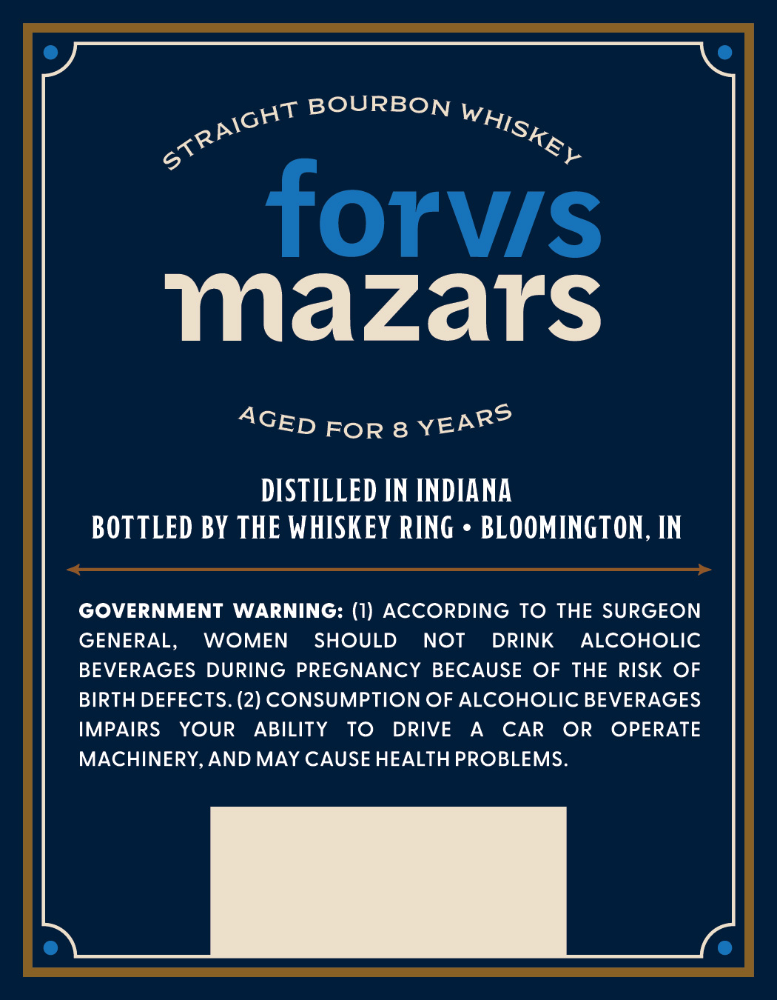
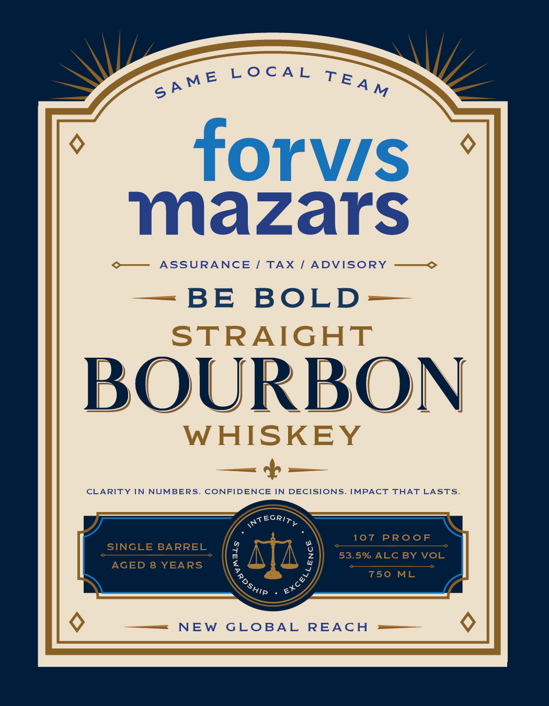

# TTB COLA Label Images - TTBID 26251001000644

**Brand Name:** FORVIS MAZARS

**Issue Date:** 09/15/2026

**Origin Code:** 19

**Product Class/Type:** 101

**Source:** [TTB Public COLA Registry](https://ttbonline.gov/colasonline/viewColaDetails.do?action=publicFormDisplay&ttbid=26251001000644)

## Label Images

### Back Label

### Front Label

## Extracted Label Text

*Text extracted via OCR - may contain errors*

**Detected Proof:** 107
**Detected Age:** 8 Years

### Back Label

BOURBON
forvs
mazars
FOR 8
DISTILLED IN INDIANA
BOTTLED BY THE WHISKEY RING
BLOOMINGTON , IN
GOVERNMENT WARNING: (1) ACCORDING
To THE SURGEON
GENERAL,
WOMEN
SHOULD
NOT
DRINK
ALCOHOLIC
BEVERAGES DURING PREGNANCY
BECAUSE OF THE RISK OF
BIRTH DEFECTS. (2) CONSUMPTION OF ALCOHOLIC BEVERAGES
IMPAIRS
YOUR
ABILITY
To
DRIVE
A
CAR
OR
OPERATE
MACHINERY,AND MAY CAUSE HEALTH PROBLEMS.
STRAIGHT
WHISKEY
YEARS
AGED

### Front Label

L0 CA L
forvis
mazars
AssURANCE
TAX
ADVISORY
BE
BOLD
STRAIGHT
BOURBON
WHISKEY
CLARITY
IN
NUMBERS
CONFIDENCE IN DECISIONS_
IMPACT THAT LASTS
RATEGRIT
107
PRoof
SINGLE BARREL
9
53.5% ALC BY VOL
AGED
8 YEARS
750
ML
NEW
GLOBAL
REAcH
SA ME
TEA M
3
EXCeL
ShIP
