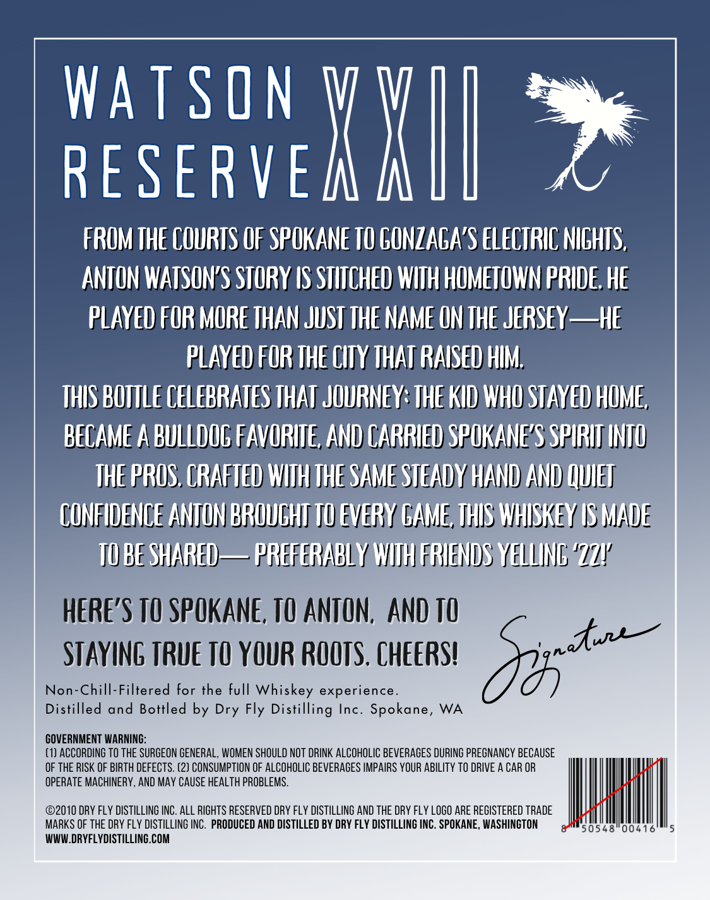
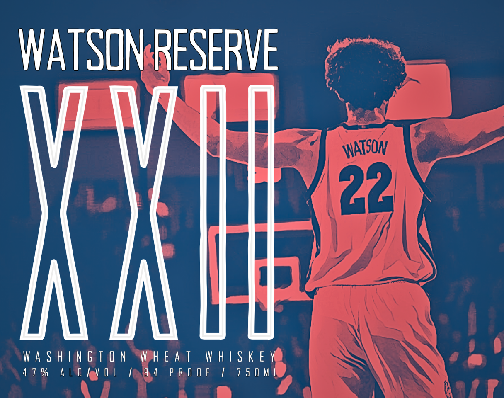

# TTB COLA Label Images - TTBID 26251001000659

**Brand Name:** WATSON RESERVE

**Issue Date:** 09/16/2026

**Origin Code:** 07

**Product Class/Type:** 140

**Source:** [TTB Public COLA Registry](https://ttbonline.gov/colasonline/viewColaDetails.do?action=publicFormDisplay&ttbid=26251001000659)

## Label Images

### Back Label

### Front Label

## Extracted Label Text

*Text extracted via OCR - may contain errors*

**Detected Proof:** 94

### Back Label

Watson
RESERVE
Kh
FROM THE COURTS OF SPOKANE TO CUNZAGAS ELECTRIC NICHTS,
ANTON WATSONS STORY IS STITCHED WITH HOMETOWN PRIDE. HE
PLAYED FOR MORE THAN JUST THE NAME ON THE JERSEY_he
PLayeD FOR THE CITY THAT RAISED HIM;
THIS BOTTLE CELEBRATES THAT JOURNEY: THE KID WHO STAYED HOME,
BECAME A BULLDOC FAVORITE, AND CARRIED SPOKANES SPIRHT INTU
THE PROS. CRAFTED WITH THE SAME STEADY HAND AND QUET
CONFHDENCE ANTON BROULHTI TU EVERY GAME, THIS WhSKeY LS MADE
TU BE SHARED
PREFERABLY WIIH FRIENDS YELLING ' LZV
here'S TO SPOKANE, TO ANTON, ANd TO
STAYING TRue TO YOUR ROOTS , ChEERS?
Sz *nu
Non-Chill-Filtered for the full Whiskey experience_
Distilled and Bottled by Dry Fly Distilling Inc. Spokane, WA
GOVERNMENT WARNING:
(1) ACCORDING TO ThE SURGEON GENERAL, WOMEN SHOULD NOT DRINK ALCOHOLIC BeVERAGES DURING PREGNANCY BECAUSE
OF THE RISK OF BIRTH DEFECTS. (2) CONSUMPTION OF ALCOHOLIC BEVERAGES IMPAIRS YOUR ABILITy TO DRIVE A CAR OR
opeRATE MACHINERY, AND MAy CAuSE HEALTH PROBLEMS.
02010 DRY FLY DISTILLING INC. ALL RIGHTS RESERVED DRY FLY dISTILLING AND thE DRY FLY LoGO ARE ReGISTERED TRADE
MARKS OF ThE DRY fLY dISTILLING INC.  PRODUCED AND DISTILLED BY DRY FLY DISTILLING INC . SPOKANE, WASHINGTON
50548
00416
WWW DRYFLYDISTILLING.COM

### Front Label

WATSONSRESERVE

WASHINGTON WHEAT WHISKEY
47% ALC VOL MO4 PROOF / 750ME
