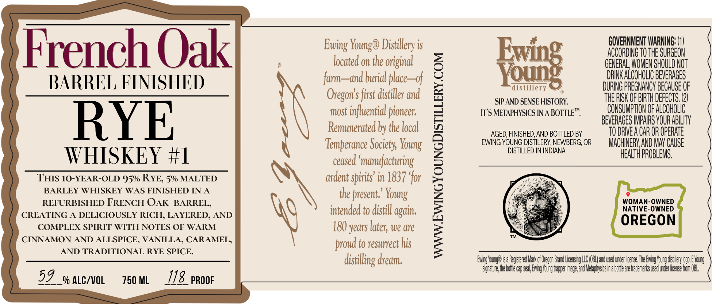
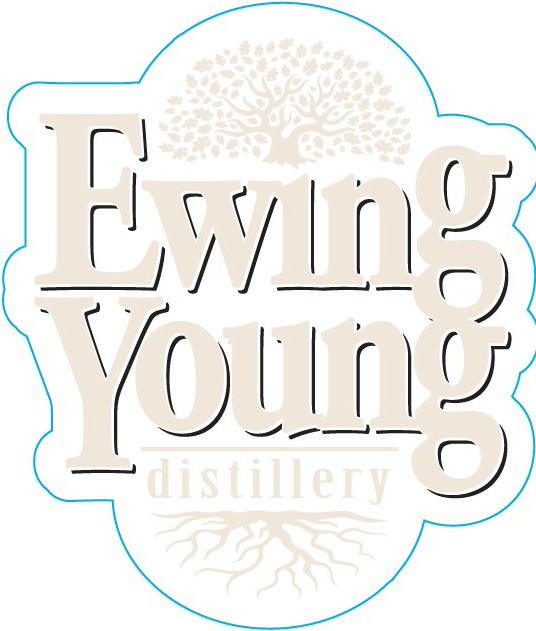

# TTB COLA Label Images - TTBID 26251001000791

**Brand Name:** EWING YOUNG

**Fanciful Name:** FRENCH OAK BARREL FINISHED RYE WHISKEY #1

**Issue Date:** 09/19/2026

**Origin Code:** 38

**Product Class/Type:** 142

**Source:** [TTB Public COLA Registry](https://ttbonline.gov/colasonline/viewColaDetails.do?action=publicFormDisplay&ttbid=26251001000791)

## Label Images

### Label 1

### Label 3

## Extracted Label Text

*Text extracted via OCR - may contain errors*

*1 image(s) excluded: text did not meet readability threshold*

### Label 1

French Oak
Distillery is
GWUESMENO HESHHGOH
located on the original
E
GENERAL, WOMEN SHOULD NOT
BARREL FINISHED
far
and burial place
of
DRINK ALCOHOLIC BEVERAGES
DURING PREGNANCY BECAUSE OF
Oregon' s first distiller and
SIP AND SENSE HISTORY.
tHE RISK OF BIRTH DEFECTS, (2)
most influential pioneer;
IT'S METAPHYSICS IN A BOTTLET
CONSUMPTHON OF ALCOHOLIC
RYE
Remunerated by the local
AGED, FINISHED, AND BOTTLED BY
BEEUGESHCARGROHRAbLTY
Temperance Society `
EWING YOUNG DISTILERY, NEWBERG, OR
MACHINERV AND MaV CAUSE
WHISKEY #I
"
ceased 'manufacturing
L
DISTILLED IN INDIANA
HEALTH PROBLEMS,
THIS 10-YEAR-OLD 95% RYE; 5% MALTED
ardent spirits' in 1837 'for
BARLEY WHISKEY WAS FINISHED IN A
the present;'
REFURBISHED FRENCH OAK BARREL,
WOMAN-OWNED
intended to distill
NATIVE-OWNED
CREATING
DELICIOUSLY RICH, LAYERED, AND
COMPLEX SPIRIT WITH NOTES OF WARM
180 years
we Ure
OREGON
TM
CINNAMON AND ALLSPICE, VANILLA, CARAMEL;
proud to resurrect his
AND TRADITIONAL RYE SPICE.
dredm;
Eving Vounge isa Registered Mark of Oregon Brand LicensigLLC OBLand used under lcerse The Eving Young distlery logo E Young
Sgnature the boiecav sea} Exing Young travper imzge and Metaphyscs ina botle are tademarks used under lcense fom OBL
59
Y ALC/VOL
750 ML
118_PRooF
Young€
Ewing `
Young
Young
again,
later; "
distilling '
