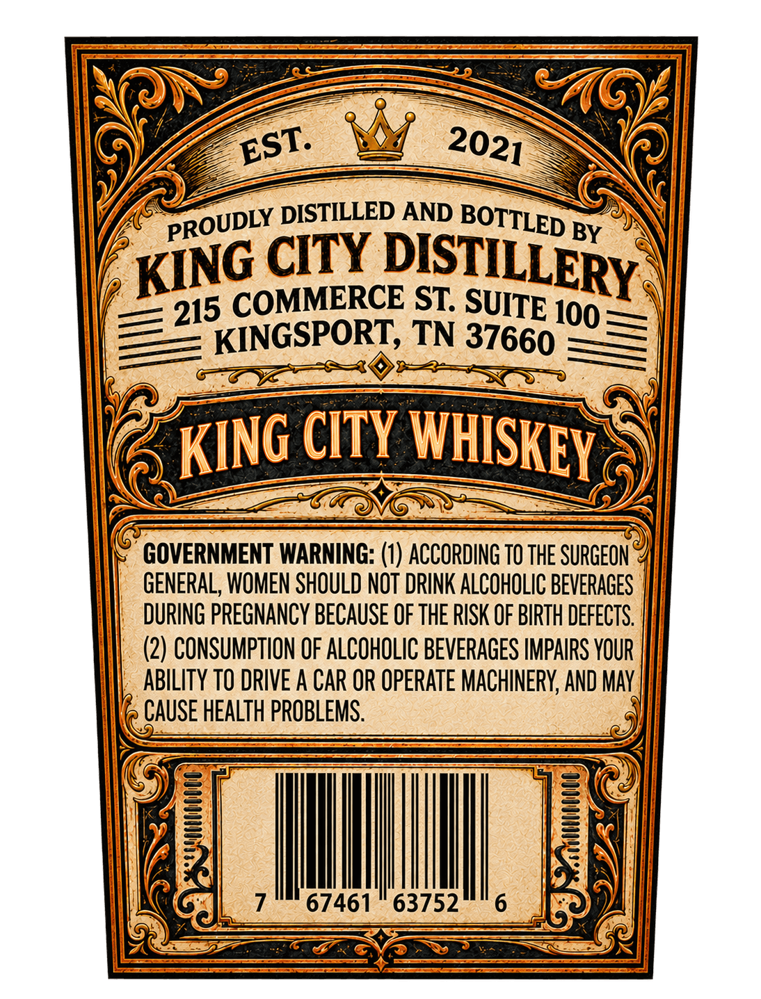
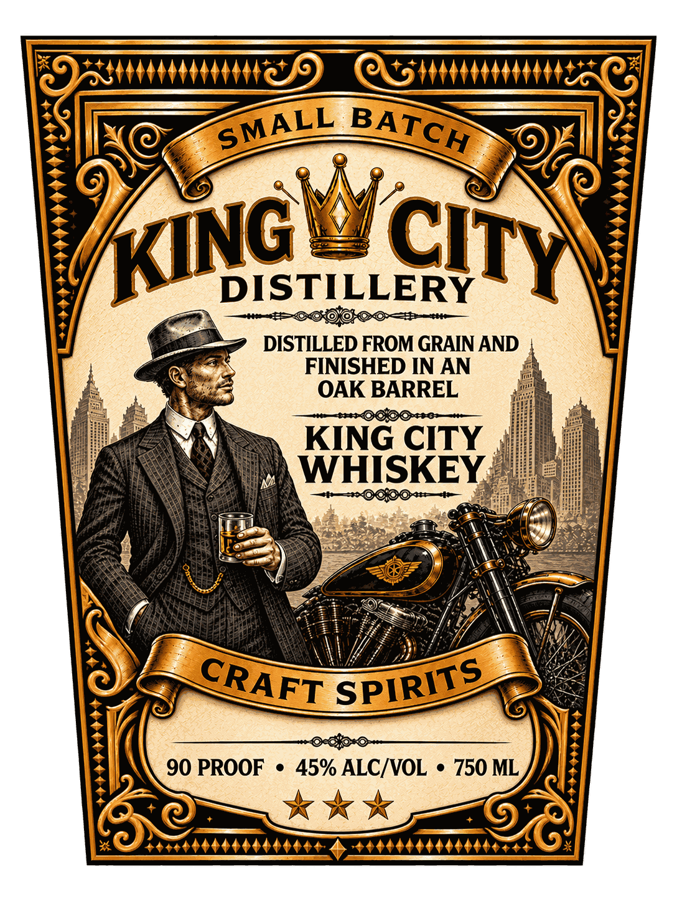

# TTB COLA Label Images - TTBID 26252001000041

**Brand Name:** KING CITY DISTILLERY

**Fanciful Name:** KING CITY WHISKEY

**Issue Date:** 09/23/2026

**Origin Code:** 43

**Product Class/Type:** 140

**Source:** [TTB Public COLA Registry](https://ttbonline.gov/colasonline/viewColaDetails.do?action=publicFormDisplay&ttbid=26252001000041)

## Label Images

### Back Label

### Front Label

## Extracted Label Text

*Text extracted via OCR - may contain errors*

**Detected Proof:** 90

### Back Label

DISTILLED AND
BY
CITY
COMMERCE ST;
100
KINGSPORT; TN 37660
CITY
GOVERNMENT WARNING: (1) ACCORDING TO THE SURGEON
GENERAL, WOMEN SHOULD NOT DRINK ALCOHOLIC BEVERAGES
DURING PREGNANCY BECAUSE OF THE RISK OF BIRTH DEFECTS
(2) CONSUMPTION OF ALCOHOLIC BEVERAGES IMPAIRS YOUR
ABILITy TO DRIVE A CAR OR OPERATE MACHINERY; AND MAy
CAUSE HEALTH PROBLEMS.
67461
63752
EST:
2021
BOTTLED
PROUDLY
DISTILLERY
KING
SUITE
215
WHISKEY
KING

### Front Label

DISTILLERY
DISTILLED FROM GRAIN AND
FINISHED IN AN
OAK BARREL
F8
KING CITY
WHISKEY
90 PROOF
459 ALCIVOL
750 ML
SMALL
BATCH
KING
CITY
CRAFT
SPIRITS
