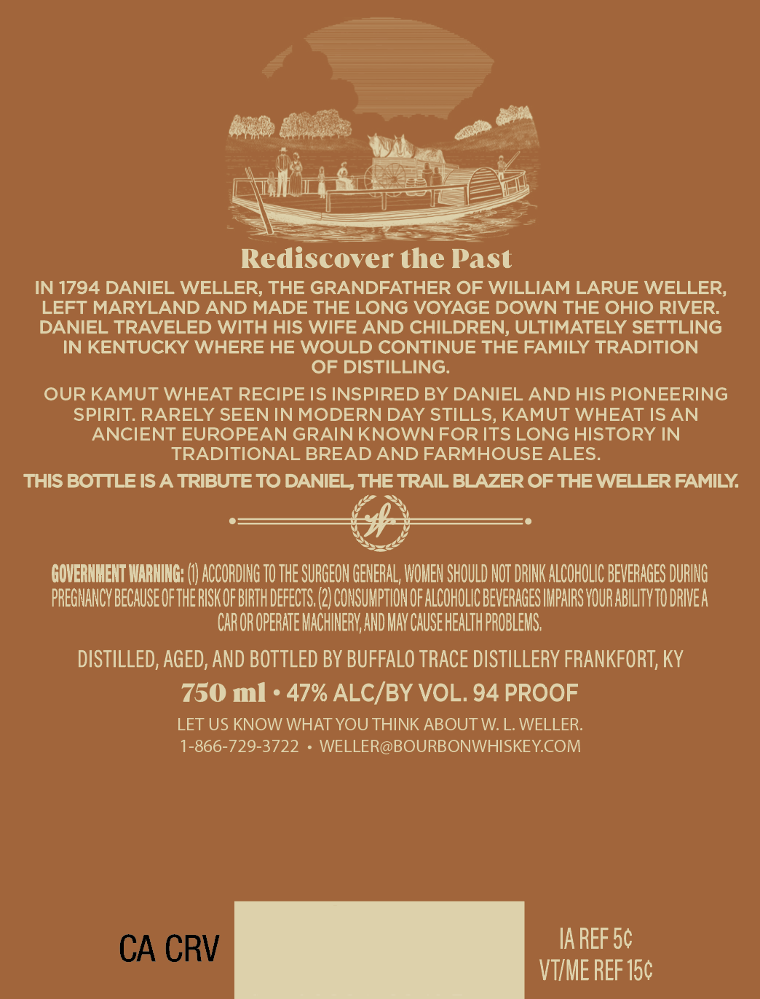

# TTB COLA Label Images - TTBID 26252001000070

**Brand Name:** DANIEL WELLER

**Issue Date:** 09/15/2026

**Origin Code:** 22

**Product Class/Type:** 101

**Source:** [TTB Public COLA Registry](https://ttbonline.gov/colasonline/viewColaDetails.do?action=publicFormDisplay&ttbid=26252001000070)

## Label Images

### Back Label

### Front Label

## Extracted Label Text

*Text extracted via OCR - may contain errors*

**Detected Proof:** 94

### Back Label

Rediscover the Past
IN 1794 DANIEL WELLER, THE GRANDFATHER OF WILLIAM LARUE WELLER,
LEFT MARYLAND AND MADE THE LONG VOYAGE DOWN THE OHIO RIVER:
DANIEL TRAVELED WITH HIS WIFE AND CHILDREN; ULTIMATELY SETTLING
IN KENTUCKY WHERE HE WOULD CONTINUE THE FAMILY TRADITION
OF DISTILLING:
OUR KAMUT WHEAT RECIPE IS INSPIRED BY DANIEL AND HIS PIONEERING
SPIRIT. RARELY SEEN IN MODERN DAY STILLS, KAMUT WHEAT IS AN
ANCIENT EUROPEAN GRAIN KNOWNFOR ITS LONG HISTORY IN
TRADITIONAL BREAD AND FARMHOUSE ALES.
THIS BOTTLE IS A TRIBUTE TO DANIEL, THE TRAIL BLAZER OF THE WELLER FAMILY
GOVERNHEHT IARNING;
ACCORDING TO THE SURGEON GENERAL, WOMEN SHOULD NOT DRINK ALCOHOLIC BEVERAGES DURING
PREGNANCY BECAUSE OFTHERISKOF BIRTH DEfects (2) CONSUMPTHON OF ALCOHOLIC BEVERAGES IMPAIRS VOUR ABILITV TO DRIEA
CAR OR OPERATE MACHINERV AND MAV CAUSE HEALTH PROBLEMS;
DISTILLED, AGED, AND BOTTLED BY BUFFALO TRACE DISTILLERY FRANKFORT, KY
750 ml
47% ALC/BY VOL. 94 PROOF
LET US KNOW WHAT YOU THINK ABOUT W. L. WELLER:
1-866-729-3722
WELLER@BOURBONWHISKEYCOM
CA CRV
IA REF 5c
VTIME REF 15c

### Front Label

SZ

€

ye

Noe

Weg

ff!

DANIEL

ie

lop

Kamut Wheat Recipe

LZ,

47% ALC BY VOL

L, th

94 PROO!

KENTUCKY STRAIGHT

BOURBON WHISKEY
