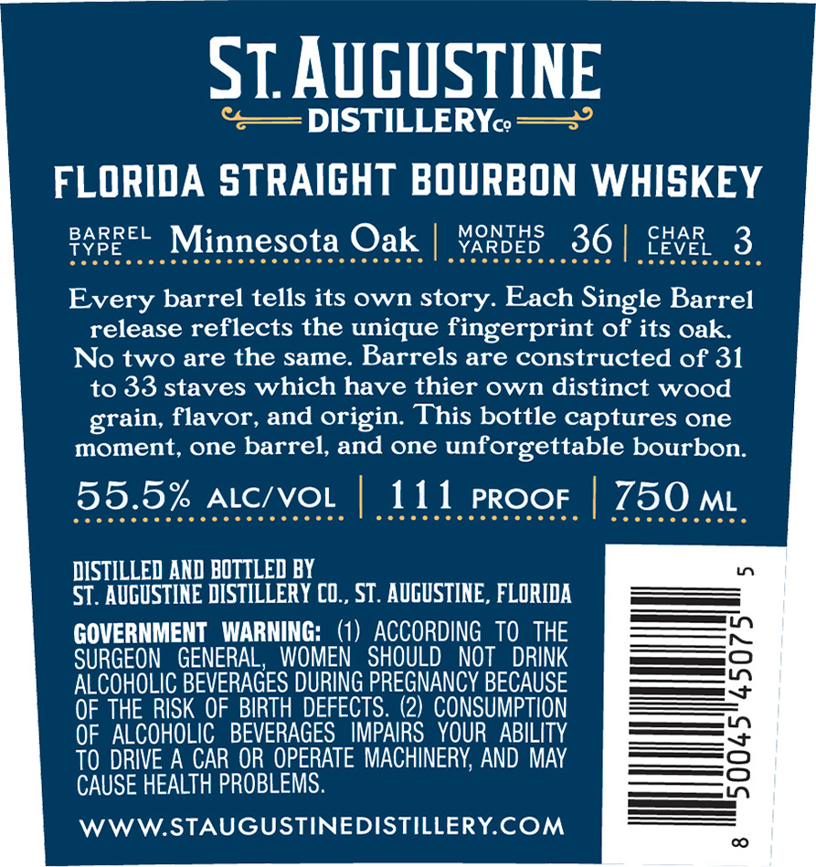
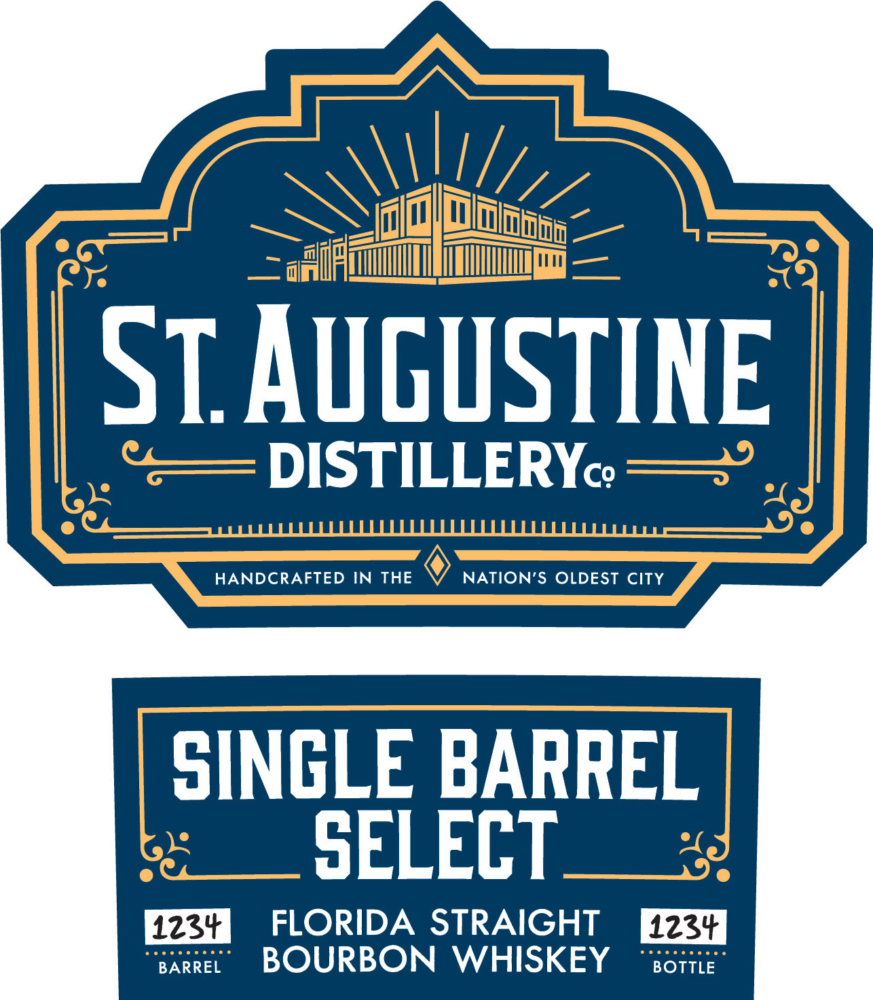
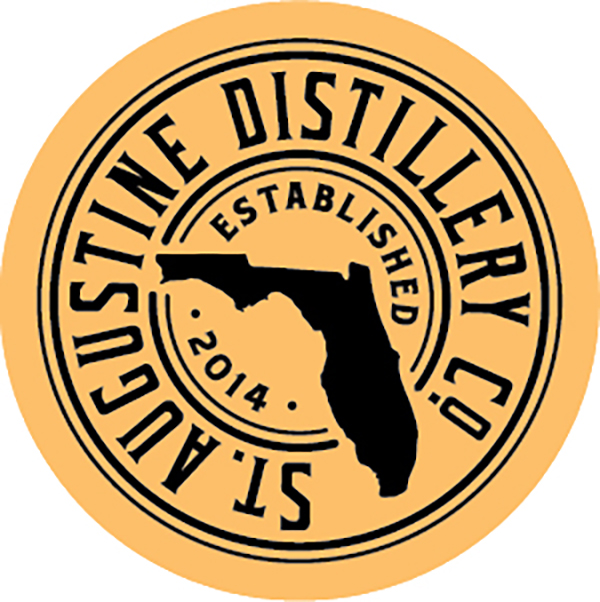

# TTB COLA Label Images - TTBID 26252001000094

**Brand Name:** ST. AUGUSTINE DISTILLERY

**Fanciful Name:** SINGLE BARREL SELECT

**Issue Date:** 09/18/2026

**Origin Code:** 16

**Product Class/Type:** 101

**Source:** [TTB Public COLA Registry](https://ttbonline.gov/colasonline/viewColaDetails.do?action=publicFormDisplay&ttbid=26252001000094)

## Label Images

### Back Label

### Front Label

### Label 3

### Label 4

## Extracted Label Text

*Text extracted via OCR - may contain errors*

*2 image(s) excluded: text did not meet readability threshold*

**Detected Proof:** 111

### Back Label

ST. AUGUSTINE

“<— DISTILLERYo —=°

FLORIDA STRAIGHT BOURBON WHISKEY

BARREL

TYPE

Minnesota Oak | Yaroes 36| SK. 3

Bah irssnenrinr nr

eeececcccoce

Every barrel tells its own story. Each Single Barrel

release reflects the unique fingerprint of its oak.

No two are the same. Barrels are constructed of 31

to 33 staves which have thier own distinct wood

grain, flavor, and origin. This bottle captures one

moment, one barrel, and one unforgettable bourbon.

55.5% ALC/VOL

ee cccccecccccccccs

111 proor | 750 mt

CO enn

DISTILLED AND BOTTLED B'

ST. AUGUSTINE DISTILLERY CO., ST. AUGUSTINE, FLORIDA

GOVERNMENT WARNING: (1) ACCORDING TO THE

SURGEON GENERAL, WOMEN SHOULD NOT DRINK

ALCOHOLIC BEVERAGES DURING PREGNANCY BECAUSE

EES

OF THE RISK OF BIRTH DEFECTS. (2) CONSUMPTION

eee

OF ALCOHOLIC BEVERAGES IMPAIRS YOUR ABILITY

————

=——

TO DRIVE A CAR OR OPERATE MACHINERY, AND MAY

=

CAUSE HEALTH PROBLEMS.

ee LT

WWW.STAUGUSTINEDISTILLERY.COM

### Front Label

SIAvguSTINE
DISTILLERYc?
HANDCRAFTED IN
THE
NATION'S OLDEST CITY
SINGLE BARREL
SELECT
1234
FLORIDA STRAIGHT
1234
BARREL
BOURBON
WHISKEY
BOTTLE
