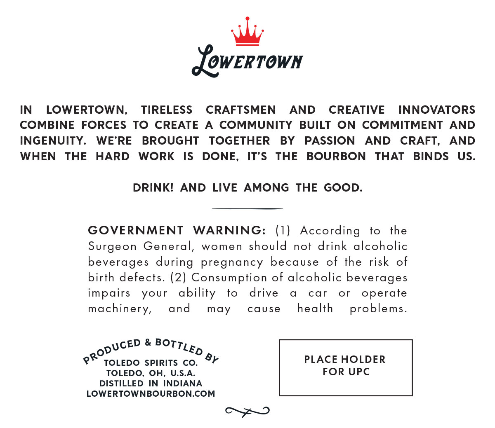
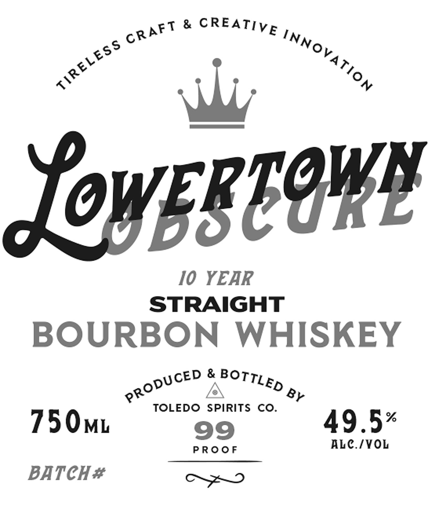

# TTB COLA Label Images - TTBID 26252001000142

**Brand Name:** LOWERTOWN

**Fanciful Name:** OBSCURE

**Issue Date:** 09/15/2026

**Origin Code:** 09

**Product Class/Type:** 101

**Source:** [TTB Public COLA Registry](https://ttbonline.gov/colasonline/viewColaDetails.do?action=publicFormDisplay&ttbid=26252001000142)

## Label Images

### Back Label

### Front Label

## Extracted Label Text

*Text extracted via OCR - may contain errors*

**Detected Proof:** 99

### Back Label

JowERtown
IN
LOWERTOWN,
TIRELESS
CRAFTSMEN
AND
CREATIVE
INNOVATORS
COMBINE
FORCES
To
CREATE
A
COMMUNITY
BUILT
ON
COMMITMENT AND
INGENUITY.
WE'RE
BROUGHT
TOGETHER
BY
PASSION
AND
CRAFT,
AND
WHEN
THE
HARD
WORK
IS
DONE,
IT'S
THE
BOURBON
THAT
BINDS
US.
DRINKI
AND LIVE
AMONG
THE GOOD.
GOVERNMENT
WARNING:
(1)
According
to
the
Surgeon
General,
women
should
nof drink alcoholic
beverages during
pregnancy
because
of the
risk
of
birth defects. (2) Consumption of alcoholic beverages
impairs
your
ability
to
drive
car
or
operate
machinery,
and
may
cause
health
problems_
&
TOLEDO SPIRITS
Co_
By
PLACE HOLDER
TOLEDO, OH,
U.S.A:
FOR UPC
DISTILLED
IN
INDIANA
LOWERTOWNBOURBONCOM
PRODUCED
BOTTLED

### Front Label

&
JoverCowl
I0 YEAR
STRAIGHT
BOURBON
WHISKEY
&
TOLEDO
SPIRITS
Co.
750ML
99
49.5%
ALc /YOL
P Ro0 F
BATCH #
CREATIVE
CRAFT
INNOVATION
TIRELESS
BOTTLED
PRODUCED
BY
