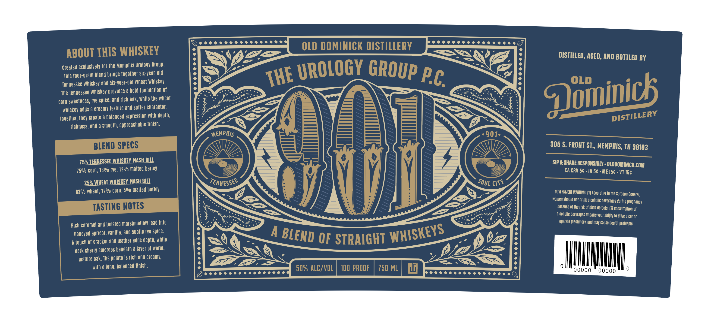
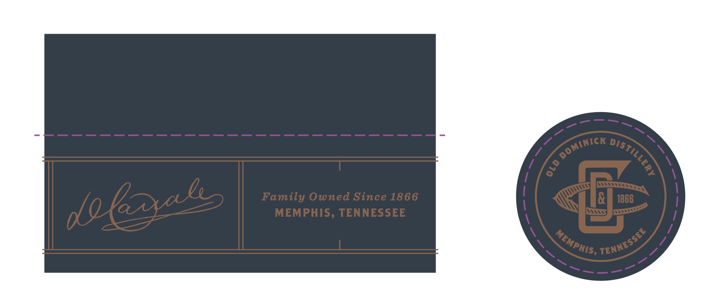

# TTB COLA Label Images - TTBID 26252001000165

**Brand Name:** OLD DOMINICK

**Fanciful Name:** MEMPHIS UROLOGY GROUP

**Issue Date:** 09/15/2026

**Origin Code:** 43

**Product Class/Type:** 120

**Source:** [TTB Public COLA Registry](https://ttbonline.gov/colasonline/viewColaDetails.do?action=publicFormDisplay&ttbid=26252001000165)

## Label Images

### Front Label

### Label 2

## Extracted Label Text

*Text extracted via OCR - may contain errors*

**Detected Proof:** 100

### Front Label

ABOUT THIS WHISKEY
OLD DOMINICK DISTILLERY
DISTILLED, AGED, AND BOTTLED BY
Created exclusively for the Memphis Urology Group,
this four-
blend brings together six-year-old
uroLOGY
Pc
Tennessee Whiskey and six-year-old Wheat Whiskey:
The Tennessee Whiskey provides a bold foundation of
COrn sweetness; rye spice; and rich oak, While the Wheat
whiskey adds a creamy texture
softer character.
Together;, they create a balanced expression with depth,
tichness; and a smooth, apbroachable Tinish.
MEMPAIS
901-
BLEND SPECS
305 $. FRONT ST , MEMPHIS, TN 38103
7526 TEVNESSEE WHISKEY MASH BILL
SIP & SHARE RESPONSIBLY - OLDDOMINICKC
COM
750/0 corn; 13%/ rye, 12%/ malted barley
M
CA CRV 5c
IA 5c
ME 15c
VT 15c
25% WHEAT WHISKEY MASH BILL
TEKNESSEF
MM
83%/ Wheat, 12%/ corn; 5%/ malted barley
BOVERNMEHT WARNING: [0) According to the Surgeon L
General;
women should not drink alcoholic beverages during pregnancy
TASTING NOTES
because of the risk of birth defects: (2} Consumption Of
alcoholic beverages impairs your ability to drive a Car Or
Rich caramel and toasted marshmallow Iead into
operate machinery; and may Cause health problems
honeyed apricot, vanilla, and subtle rye spice.
A
touch of cracker and leather adds depth; While
OF STRAIGHT
dark cherry emerges beneath a layer of warm;
mature oak. The palate is rich and creamy;
with a long, balanced finish.
50% ALC/VOL
100 PROOF
750 ML
ug|
0000
00000
0
GROUP
THE
~grain
Qominicb
and
DISTILLERY
SOUL '
CITY
WHISKEYS
BLEND

### Label 2

Family Owned Since 1866
1866
MEMPHIS, TENNESSEE
DOMINICK
DISTILLERY
8
dolvks
TENNESSEE
MEMPHIS;
