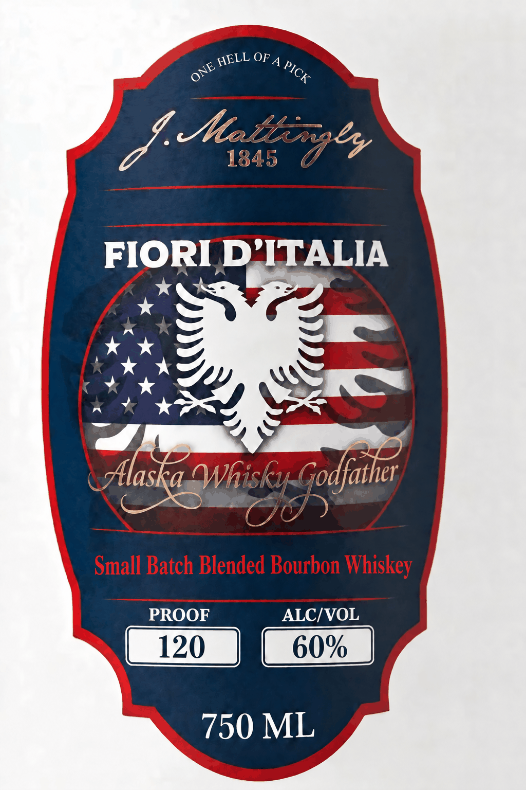

# TTB COLA Label Images - TTBID 26252001000185

**Brand Name:** J. MATTINGLY 1845

**Fanciful Name:** FIORI D' ITALIA SMALL BATCH BLENDED BOURBON

**Issue Date:** 09/17/2026

**Origin Code:** 22

**Product Class/Type:** 131

**Source:** [TTB Public COLA Registry](https://ttbonline.gov/colasonline/viewColaDetails.do?action=publicFormDisplay&ttbid=26252001000185)

## Label Images

### Back Label

### Label 1

## Extracted Label Text

*Text extracted via OCR - may contain errors*

*1 image(s) excluded: text did not meet readability threshold*

**Detected Proof:** 120

### Label 1

OF A
3 asts 4e
1845
FIORI D'ITALIA
WWhisky
Small Batch Blended Bourbon Whiskey
PROOF
ALC/VOL
120
60%
750 ML
HELL
PICK
ONE
'Godfather
Alaska
