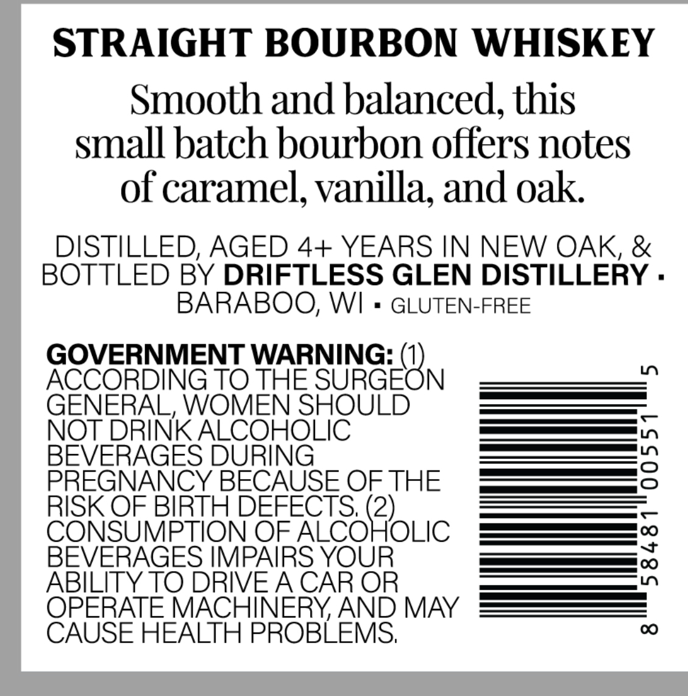
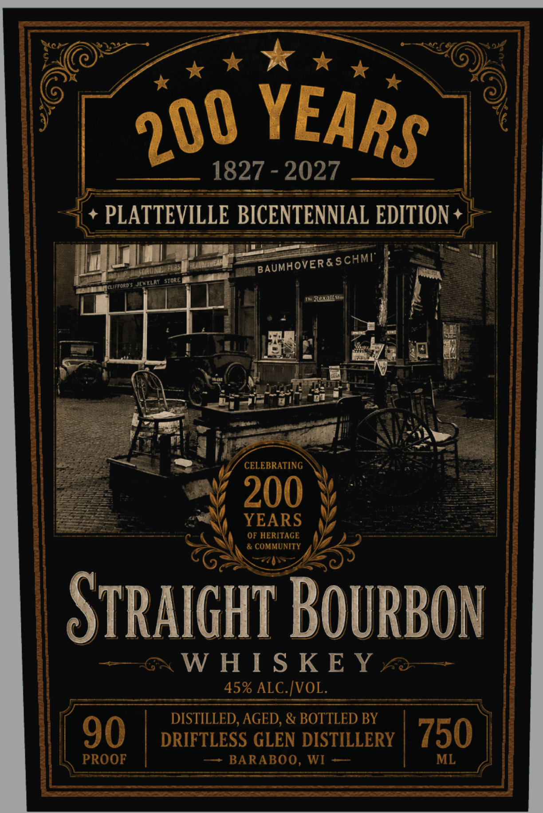

# TTB COLA Label Images - TTBID 26252001000210

**Brand Name:** 200 YEARS

**Issue Date:** 09/16/2026

**Origin Code:** 48

**Product Class/Type:** 101

**Source:** [TTB Public COLA Registry](https://ttbonline.gov/colasonline/viewColaDetails.do?action=publicFormDisplay&ttbid=26252001000210)

## Label Images

### Back Label

### Front Label

## Extracted Label Text

*Text extracted via OCR - may contain errors*

**Detected Proof:** 90

### Back Label

STRAIGHT BOURBON WHISKEY
Smooth and balanced, this
small batch bourbon offers notes
of caramel; vanilla; and oak
DISTILLED, AGED 4+ YEARS IN NEW OAK, &
BOTTLED BY DRIFTLESS GLEN DISTILLERY .
BARABOO; WI
GLUTEN-FREE
GOVERNMENT WARNING:
ACCORDING TO THE
SUKGEON
1
GENERAL, WOMEN SHOULD
NOT DRINK ALCOHOLIC
BEVERAGES DURING
3
PREGNANCY BECAUSE OF THE
RISK OF BIRTH DEFECTS; (2)
CONSUMPTION OF ALCOHOLIC
BEVERAGES IMPAIRS YOUR
1
ABILITY TO DRIVEA CAR OR
OPERATE MACHINERYAND MAY
CAUSE HEALTH PROBLEMS;
00

### Front Label

~~

wey

@

x x

Wey

(E~

>

A *

“y

¢

0 YEA

| w

a

1827 - 2027

+ PLATTEVILLE BICENTENNIAL EDITION+|

dis

Set F|

—

cut

YY

in

wail

|

"

hai

r

aap

ae

Ue

(asl

ay

1 re ies

eg

fois a!

an ere |

=>

aii

CELEBRATING

= cava

200

Vs

os

———

X YEARS

OF nea

ees

STRAIGHT BOURBON

—6x WHISKEY ~2—

45% ALC. [VOL.

DISTILLED, AGED, & BOTTLED BY

90

PROOF ©

DRIFTLESS GLEN DISTILLERY

—~ BARABOO, WI —

J

E

=|750)
