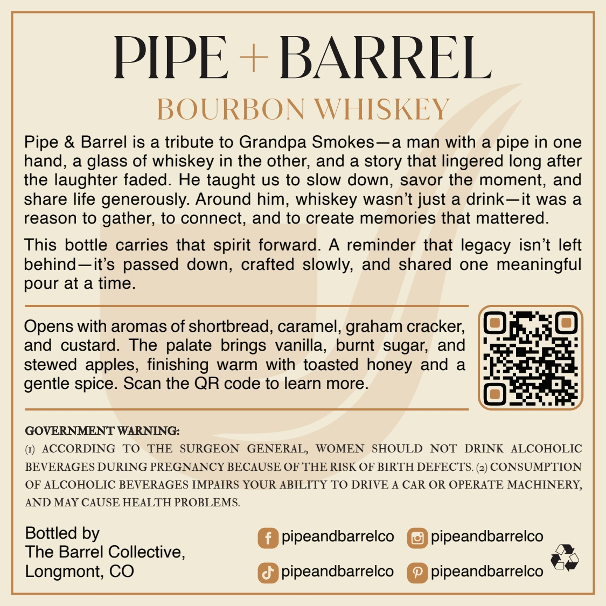
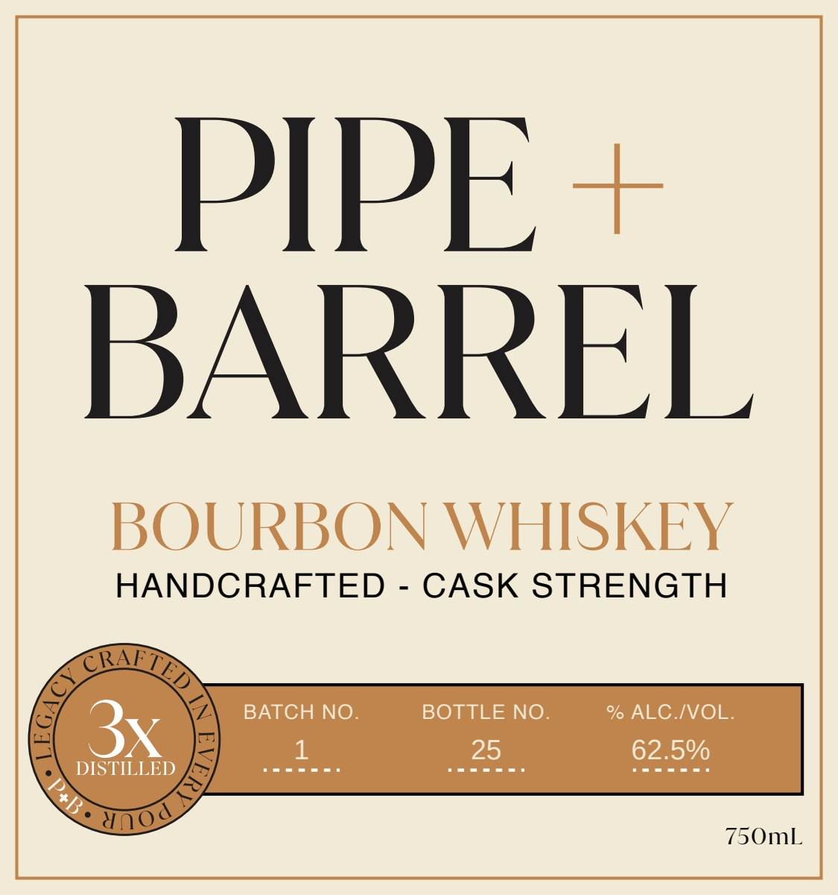

# TTB COLA Label Images - TTBID 26252001000256

**Brand Name:** PIPE & BARREL

**Issue Date:** 09/16/2026

**Origin Code:** 13

**Product Class/Type:** 141

**Source:** [TTB Public COLA Registry](https://ttbonline.gov/colasonline/viewColaDetails.do?action=publicFormDisplay&ttbid=26252001000256)

## Label Images

### Back Label

### Front Label

## Extracted Label Text

*Text extracted via OCR - may contain errors*

**Detected Proof:** 125

### Back Label

PIPE
BARREL
BOURBON WHISKEY
Pipe & Barrel is a tribute to Grandpa Smokes-a man with a pipe in one
hand,
a
glass of whiskey in the other; and a story that lingered long after
the laughter faded: He taught us to slow down; savor the moment; and
share life generously: Around him; whiskey wasn't just a drink-it was a
reason to gather; to connect, and to create memories that mattered:
This bottle carries that
forward.
A reminder that legacy isn't left
behind-it's passed down, crafted slowly; and shared
one meaningful
pour at a time.
Opens with aromas of shortbread, caramel, graham cracker;
and custard.
The palate brings vanilla,
burnt sugar; and
stewed apples, finishing warm
with toasted honey and
a
gentle spice. Scan the QR code to learn more.
GOVERNMENT WARNING:
ACCORDING
TO
THE
SURGEON
GENERAL,
WOMEN
SHOULD
NOT
DRINK
ALCOHOLIC
BEVERAGES DURING PREGNANCY BECAUSE OF THE RISK OF BIRTH DEFECTS. (2) CONSUMPTION
OF ALCOHOLIC BEVERAGES IMPAIRS YOUR ABILITY TO DRIVE A CAR OR OPERATE MACHINERY,
AND MAY CAUSE HEALTH PROBLEMS
Bottled by
pipeandbarrelco
pipeandbarrelco
The Barrel Collective,
Longmont; CO
pipeandbarrelco
pipeandbarrelco
spirit

### Front Label

PIPE +

BARREL

BOURBON WHISKEY

HANDCRAFTED - CASK STRENGTH

BATCH NO.

BOTTLE NO.

% ALC./VOL.

ome

ome

25

62.5%

omens

750mL
