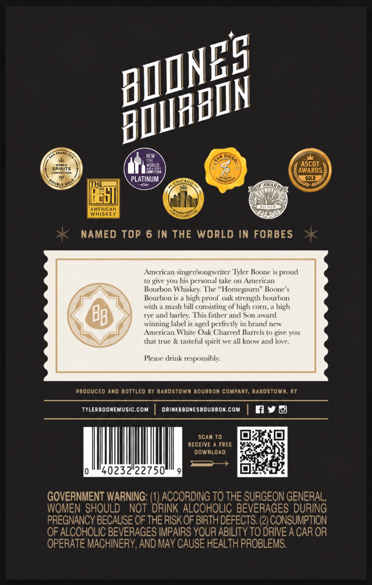
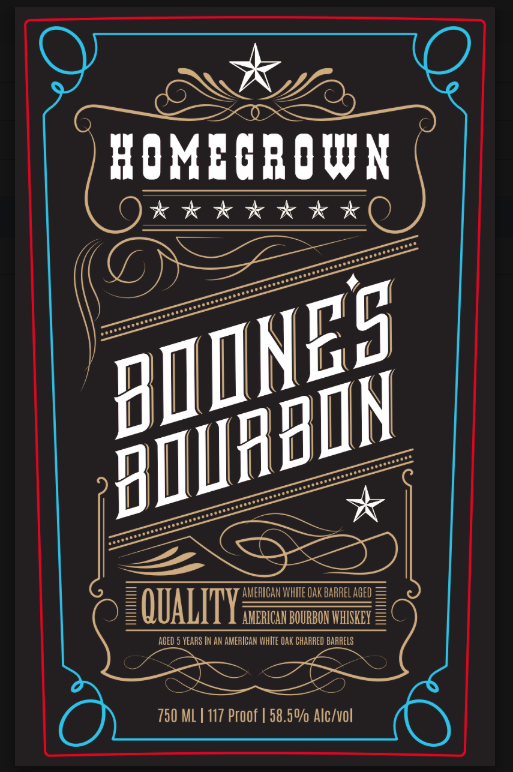

# TTB COLA Label Images - TTBID 26252001000311

**Brand Name:** BOONE'S BOURBON

**Issue Date:** 09/17/2026

**Origin Code:** 22

**Product Class/Type:** 141

**Source:** [TTB Public COLA Registry](https://ttbonline.gov/colasonline/viewColaDetails.do?action=publicFormDisplay&ttbid=26252001000311)

## Label Images

### Back Label

### Label 1

## Extracted Label Text

*Text extracted via OCR - may contain errors*

**Detected Proof:** 117

### Back Label

WEW
SPiRits
Woald
ANSCQDs]
PLATINUM
2
GoLld
THE
ChicaGo _
Ebl
AmeRicaR
WhISkEY
NAMED TOP 6 In THE WORLD IN FORBES
American singer/songwriter Tyler Boone is proud
t0 give you his personal take on American
Bourbon Whiskey: The "Homesourn" Boone $
Bourbon is
high proof' oak strength bourbon
With
mash bill consisting of high corn;
high
Ba
rye and barley: This father and Son award
winning label
aged perlectly in brand ncw
American White Oak Charred Barrels to give you
that true & tasteful spirit we all know and love
Please drink responsibly:
Produced And bottled by bardstown bourbon compant, Bardstown: Ky
Tylerboonemusic com
drinedbonesbourbon com
Scan To
RECEIVE
FREE
downloAd
40232 22750
GOVERNMENT WARNING: (1) ACCORDING TO THE SURGEON GENERAL,
WOMEN SHOULD
NOT DRINK ALCOHOLIC BEVERAGES DURING
PREGNANCY BECAUSE OF THE RISK OF BIRTH DEFECTS: (2) CONSUMPTION
OF ALCOHOLIC BEVERAGES IMPAIRS YOUR ABILITY TO DRIVE A CAR OR
OPERATE MACHINERY, AND MAY CAUSE HEALTH PROBLEMS:
BMINES
bmuabIN
Pounte
WWARDS

### Label 1

HOMBGROWN
0*******
AMFHICAN 'YHME Oak DaRREL AGED
QUALITY
AMERICAH BOURBON WHISKEX
aged 5 YEXRS |N AN AMERICAN MhIte Ca ChaRRED) Bae RELS
750 ML | 117 Proof | 58.50/ Alc/vol
BIINES
bmmabMN
