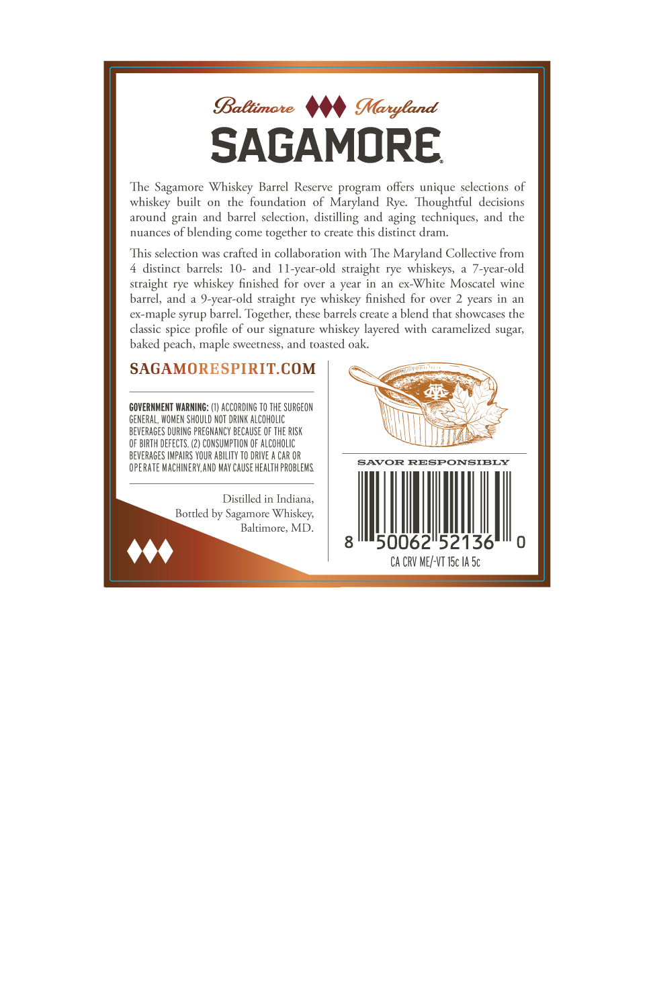
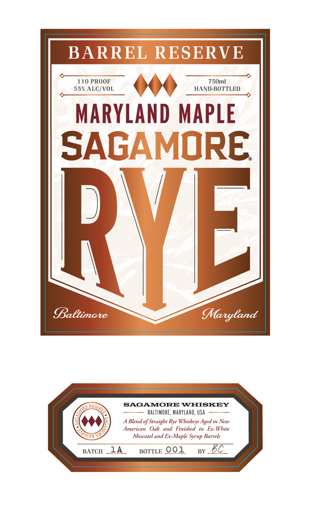

# TTB COLA Label Images - TTBID 26252001000321

**Brand Name:** SAGAMORE

**Fanciful Name:** MARYLAND MAPLE

**Issue Date:** 10/01/2026

**Origin Code:** 25

**Product Class/Type:** 122

**Source:** [TTB Public COLA Registry](https://ttbonline.gov/colasonline/viewColaDetails.do?action=publicFormDisplay&ttbid=26252001000321)

## Label Images

### Back Label

### Front Label

## Extracted Label Text

*Text extracted via OCR - may contain errors*

**Detected Proof:** 110
**Detected Age:** 2 Years

### Back Label

Baltimate
MMaryland
SAGAMORE
The Sagamore Whiskey.
Barrel  Reserve program offers unique selections of
whiskey
built
On
the
foundation
of Maryland Rye:   Thoughtful
decisions
around grain and
barrel  selection,
distilling and aging techniques, and the
nuances of
'blending
come
together to create this distinct dram:
This selection
was crafted in collaboration with The Maryland Collective from
4 distinct  barrels: 10-
and Il-year-old straight rye  whiskeys,
7-year-old
straight rye whiskey finished for over
year in
an
ex-Whire
Moscarel wine
barrel, and
9-year-old straight rye whiskey finished for over 2 years in
a
ex-
-maple syrup barrel. Together; these barrels create
blend that showcases the
classic spice
profile of our signature whiskey layered with caramelized sugar;
baked peach, maple sweerness, and toasted oak:
SAGAMORESPIRITCOM
GOVERNMENT WARNING:
ACCORDING TO ThE SURGEON
GENERAL, WOMEN ShOuLD NOT DRINK ALCOHOLIC
BEVERAGES DURING PREGNANCY BECAUSE OF THE RUSK
OF BIRTH DEFecTS: (2) CONSUMPTION OF alCOhOLIC
BEVERAGES |MPAIRS YOUR ABILITY TO DRIVE
CAR OR
SAVOR RESPONSIBLY
OPERATE MACHINERY,AND MAY CauSe HEALTH PROBLEMS
Distilled in Indiana,
Borrled by Sagamore Whiskey;
Baltitnore, MD.
8
50062"52136
Ca CRV ME/-VT I5c IA Sc

### Front Label

BARREL RESERVE
110 PROOF
750ml
55% ALC/VOL
HAND-BOTTLED
MARYLAnd MAPLe
SAGAMORE
RVEL
Baltimare
MMaryCand
SAGAMORE WHISKEY
BALTIMORE, MARYLand, USA
Blend of Straight Rye Whiskeys Aged in New
American
Oak
and
Finished
Ex-White
Moscatel and
Ex-Maple Syrup Barrels
BATCH
14
BOTTLE 001
BY
RSPRVA
ORE ,
T4ol
S"
