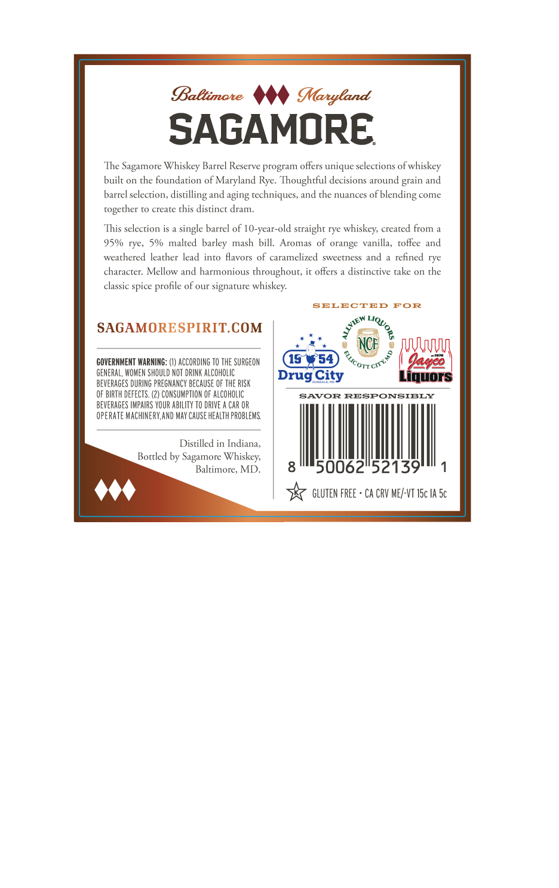
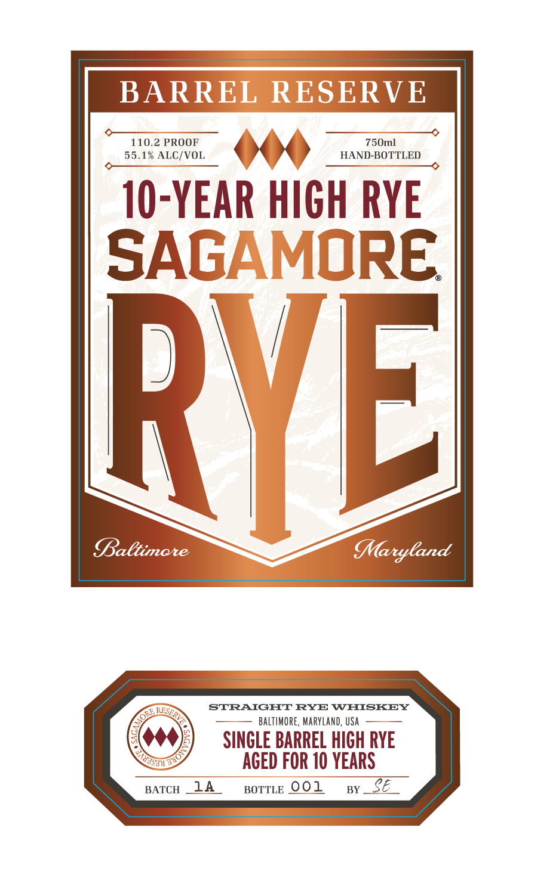

# TTB COLA Label Images - TTBID 26252001000341

**Brand Name:** SAGAMORE

**Fanciful Name:** 10 YEAR HIGH RYE

**Issue Date:** 09/18/2026

**Origin Code:** 25

**Product Class/Type:** 102

**Source:** [TTB Public COLA Registry](https://ttbonline.gov/colasonline/viewColaDetails.do?action=publicFormDisplay&ttbid=26252001000341)

## Label Images

### Back Label

### Front Label

## Extracted Label Text

*Text extracted via OCR - may contain errors*

**Detected Proof:** 95
**Detected Age:** 10 Years

### Back Label

BaBtimate
MMaryland
SAGAMORE
The
Sagamore Whiskey Barrel Reserve program offers unique selecrions of whiskey
built on the foundarion of Maryland Rye: Thoughrful decisions around
and
barrel selection,
disrilling and aging techniques, and rhe nuances of
blending
come
togerher
ro create this disrinct dram.
This selection is
single barrel of 10-year-old straight rye
created
95%
rye,
5% malted barley  mash bill.
Aromas of orange vanilla,
roffee and
weathered learher lead
into Havors of caramelized
sweetness
refined
rye
character: Mellow
harmonious throughout; ir offers
distinctive take on che
classic spice
of our signarure
SELECTED
FOR
SAGAMORESPIRITCOM
NCF
[VUu
COVERNMENT WARNING: (1) ACCORDING TO THE SURGEON
15
54
1z
GENERAL, WOMEN ShOULD NOT DRINK ALCOHOLIC
DrugCity
Liquors
BEVERAGES DURING PREGNANCY BECHUSE OF THE RISK
OF BIRTH dEfECTS
CONSUMPTION F AlcoholIC
SAVOR RESPONSIBLY
BEVERAGES IMPAIRS YOUR ABILITY TO DRIVE
CAR OR
opeRATE MaChINERY,AND MaY CAUSE health probleMS
Distilled in Indiana;
Botrled by Sagamore Whiskey;
Baltimore, MD
50062"52139
GLUTEN FREE + CA CRV ME/-VT ISc IA 5c
grain
whiskey;
from
and
and
profile
whiskey:
JQVORs
ALVIEW
'Licort`
'cntymo

### Front Label

BARREL RESERVE
110.2 PROOF
750ml
55.1% ALC/VOL
HAND-BOTTLED
10-YEAR HiCH RYE
SAGAMORE
RVEL
Baltimare
MMaryCand
STRAIGHT RYE WHISKEY
BALTIMORE, MARYLand, USA
SINCLE BARREL HIGH RYE
AGED FOR 10 YEARS
BATCH
14
BOTTLE 001
BY
E
RSERV
ORE ,
T4ol
S"
