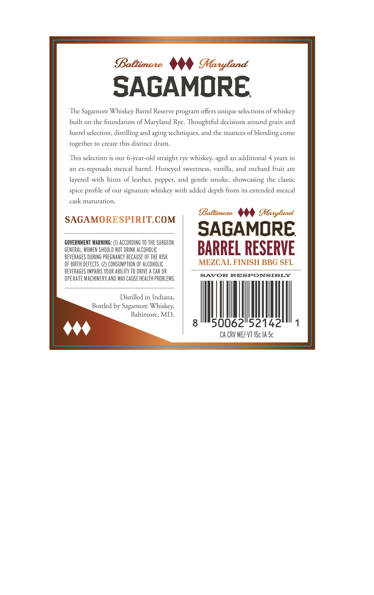
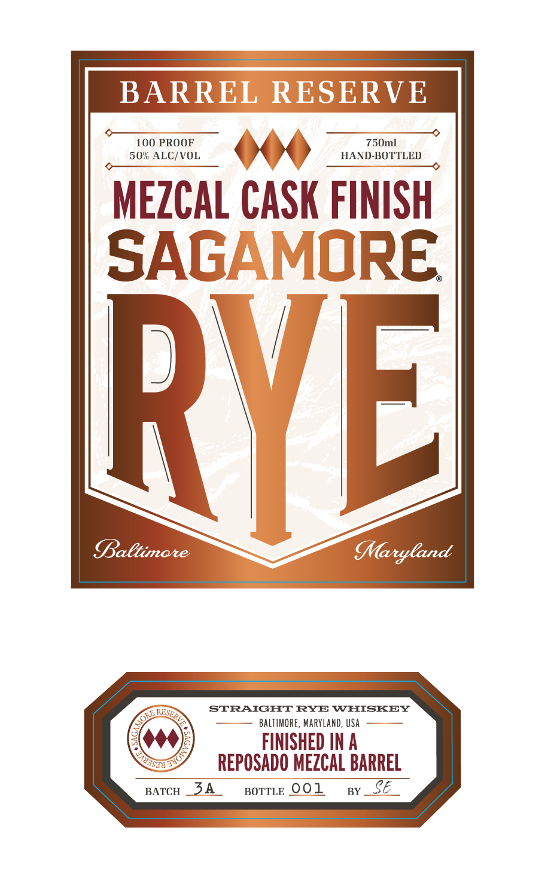

# TTB COLA Label Images - TTBID 26252001000360

**Brand Name:** SAGAMORE

**Fanciful Name:** BARREL RESERVE MEZCAL CASK FINISH

**Issue Date:** 09/16/2026

**Origin Code:** 25

**Product Class/Type:** 102

**Source:** [TTB Public COLA Registry](https://ttbonline.gov/colasonline/viewColaDetails.do?action=publicFormDisplay&ttbid=26252001000360)

## Label Images

### Back Label

### Front Label

## Extracted Label Text

*Text extracted via OCR - may contain errors*

**Detected Proof:** 100
**Detected Age:** 4 Years

### Back Label

BaBtimate
MMaryland
SAGAMORE
The
Sagamore Whiskey Barrel Reserve program offers unique selecrions of whiskey
built on the foundarion of Maryland Rye.
Thoughrful decisions around
and
barrel selection,
disrilling and aging techniques, and rhe nuances
ofblending
come
rO create
this disrinct dram.
This selection is our 6-year-old straighr rye
additional 4 years in
ex-reposado mezcal barrel. Honeyed sweetness, vanilla, and orchard fruic are
layered with hints of leather; pepper; and
smoke,
showcasing the classic
spice
of our signarure whiskey wirh added depth from its extended mezcal
marurarion.
Baetimate
Maryland
SAGAMORESPIRITCOM
SAGAMORE
GOVERNMEMT WARNING: (1) ACCORDING TO THE SURGEON
GENERAL, WOMEN ShOULD NOT DRINK ALCOHOLIC
BARREL RESERVE
BEVERAGES DURING PREGNANCY BECHUSE OF THE RISK
OF BIRTH dEfECTS
CONSUMPTION F AlcohlIC
MEZCAL FINISH BBG SFL
BEVERAGES IMPAIRS YOUR ABILITY TO DRIVE
CAR OR
opeRATE MaChNERY,AND MaY CAUSE health probleMS
SAVOR RESPONSIBLY
Distilled in Indiana;
Botrled by Sagamore Whiskey;
Baltimore, MD
50062152142
Ca CRV ME/-VT ISc IA Sc
grain
together
whiskey;
nged
gentle
profile-
cask

### Front Label

BARREL RESERVE
100 PROOF
750ml
50% ALC/VOL
HAND-BOTTLED
MEZCAL CASK FINISH
SAGAMORE
RVEL
Baltimare
MMaryland
STRAIGHT RYE WHISKEY
BALTIMORE, MARYLaNd, USA
FINISHED AN A
REPOSADO MEZCAL BARREL
BATCH
34
BOTTLE 001
BY
E
RFSERV
ORE ,
T4O)
S"
