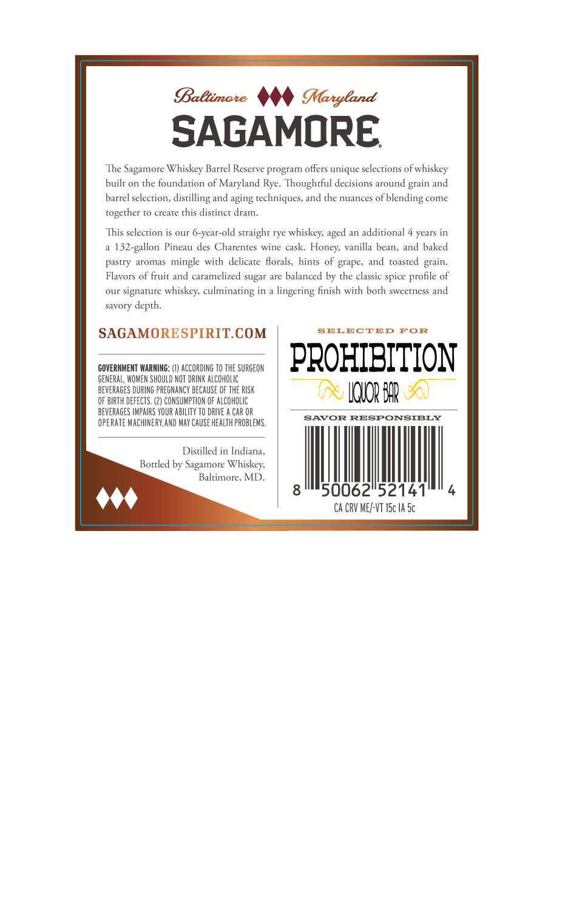
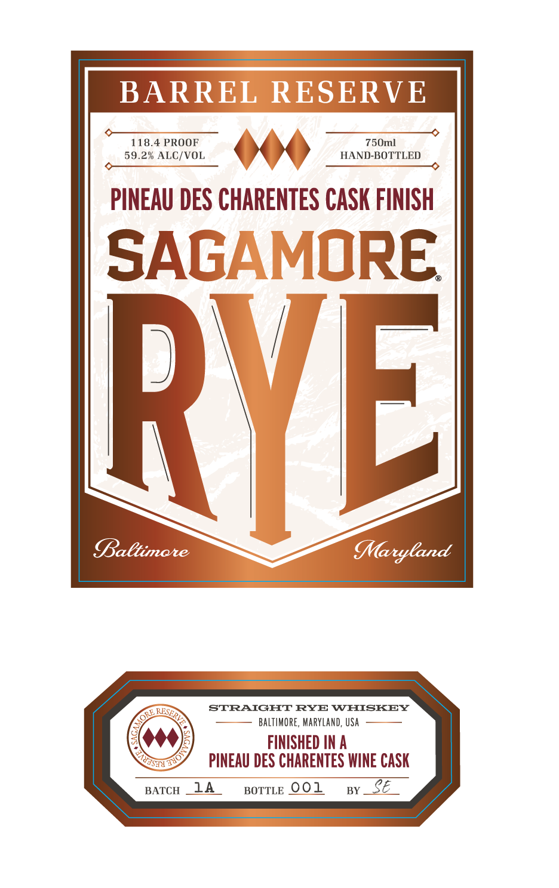

# TTB COLA Label Images - TTBID 26252001000375

**Brand Name:** SAGAMORE

**Fanciful Name:** BARREL RESERVE PINEAU DES CHARENTES CASK FINISH

**Issue Date:** 09/19/2026

**Origin Code:** 25

**Product Class/Type:** 102

**Source:** [TTB Public COLA Registry](https://ttbonline.gov/colasonline/viewColaDetails.do?action=publicFormDisplay&ttbid=26252001000375)

## Label Images

### Back Label

### Front Label

## Extracted Label Text

*Text extracted via OCR - may contain errors*

**Detected Proof:** 118.4
**Detected Age:** 4 Years

### Back Label

BaBtimate
MMaryland
SAGAMORE
The
Sagamore Whiskey Barrel Reserve program offers unique selecrions of whiskey
built on the foundarion of Maryland Rye: Thoughrful decisions around
and
barrel selection,
distilling and aging techniques, and rhe nuances
ofblending
come
togerher
ro create this disrinct dram.
This selection is our 6-year-old srraighr rye whiskeys
additional 4 years in
132-gallon Pineau des Charentes wine
vanilla
and baked
pastry
aromas
mingle
with
delicare  Horals;
hints of grape;
toasted  grain.
Flavors of fruir
caramelized sugar are balanced by the classic spice
our signarure
culminating
lingering finish wirh borh sweerness
savory deprh:
SAGAMORESPIRITCOM
SELECTED
FOR
COVERNMENT WARNING: (1) ACCORDING TO THE SURGEON
PROHIBITION
GENERAL, WOMEN ShOULD NOT DRINK ALCOHOLIC
BEVERAGES DURING PREGNANCY BECHUSE OF THE RISK
IQOR BIr
OF BIRTH dEfECTS
CONSUMPTION F AlcoholIC
BEVERAGES IMPAIRS YOUR ABILITY TO DRIVE
CAR OR
opeRATE MaChINERY,AND MaY CAUSE health probleMS
SAVOR RESPONSIBLY
Distilled in Indiana;
Botrled by Sagamore Whiskey;
Baltimore, MD
50062"52141
Ca CRV ME/-VT ISc IA Sc
grain
aged
Cask;
Honey.
bean,
and
profile
and
whiskey;
and

### Front Label

BARREL RESERVE
118.4 PROOF
750ml
59.2% ALC/VOL
HAND-BOTTLED
PINEAU DES CHARENTES CASK FINISH
SAGAMORE
RVEL
Baltimare
MMaryCand
STRAIGHT RYE WHISKEY
BALTIMORE, MARYLand, USA
FINISHED IN A
PINEAU DES CHARENTES WINE CASK
BATCH
14
BOTTLE 001
BY
E
RFSERV
ORE ,
T4ol
Husnt
