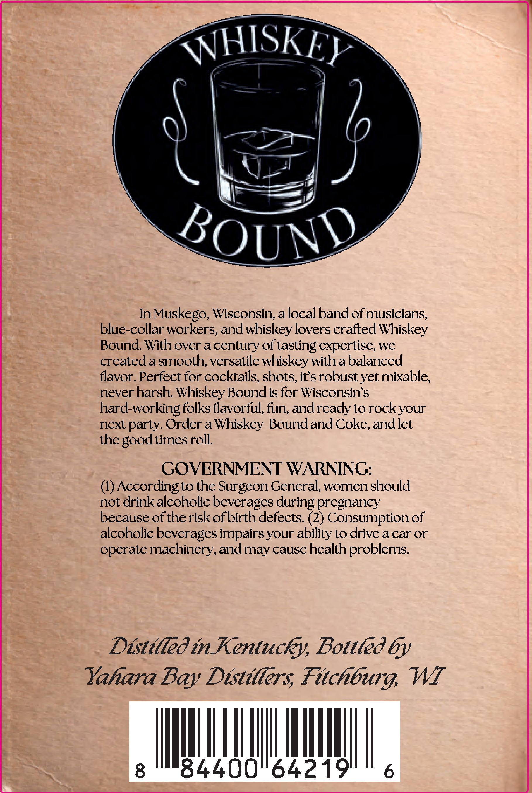
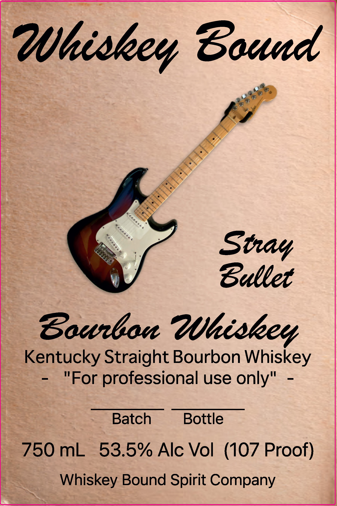

# TTB COLA Label Images - TTBID 26252001000378

**Brand Name:** WHISKEY BOUND

**Issue Date:** 09/15/2026

**Origin Code:** 48

**Product Class/Type:** 101

**Source:** [TTB Public COLA Registry](https://ttbonline.gov/colasonline/viewColaDetails.do?action=publicFormDisplay&ttbid=26252001000378)

## Label Images

### Back Label

### Front Label

## Extracted Label Text

*Text extracted via OCR - may contain errors*

**Detected Proof:** 107

### Back Label

WHISKEY
0
BOUND
In
Muskego, Wisconsin; alocal band of musicians,
blue-collar workers, and whiskey lovers crafted Whiskey
Bound With over a century of tasting expertise, we
created a smooth; versatile whiskey with a balanced
flavor. Perfect for cocktails, shots, its robust yet mixable,
never harsh; Whiskey Boundis for Wisconsins
hard-working folks flavorful, fun, andready to rockyour
next party. Order a Whiskey Bound and Coke, andiet
the good times roll
GOVERNMENT WARNING:
(4) According to the Surgeon General, women should
not drink alcoholic beverages during pregnancy
because of the risk ofbirth defects: (2) Consumption of
alcoholic beverages impairs your ability to drive a car or
operate machinery,andmay cause health problems
Distilled inKentucky, Bottled 6y
Yahara
Distillers Fitchburg,
WII
8
"84400"64219
6
Bay

### Front Label

?hiskey Bound
Stay
Dullet
Bourban ?hiseey
Kentucky Straight Bourbon Whiskey
"For professional use only"
Batch
Bottle
750 mL
53.5% Alc Vol (107 Proof)
Whiskey Bound Spirit Company
