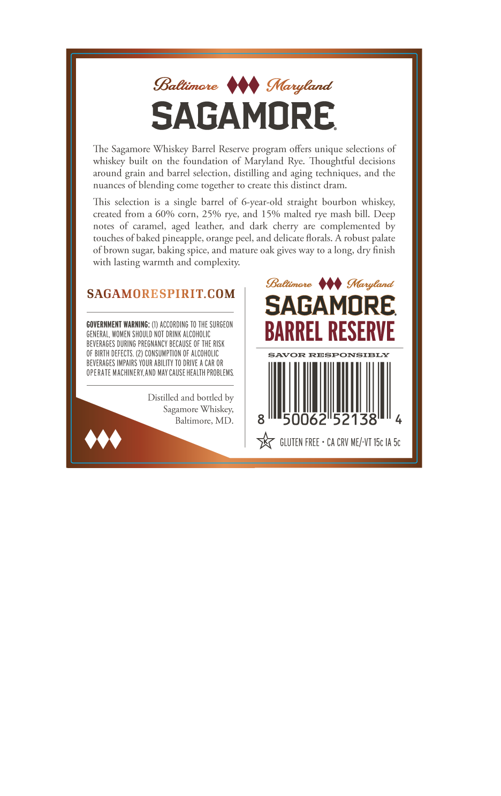
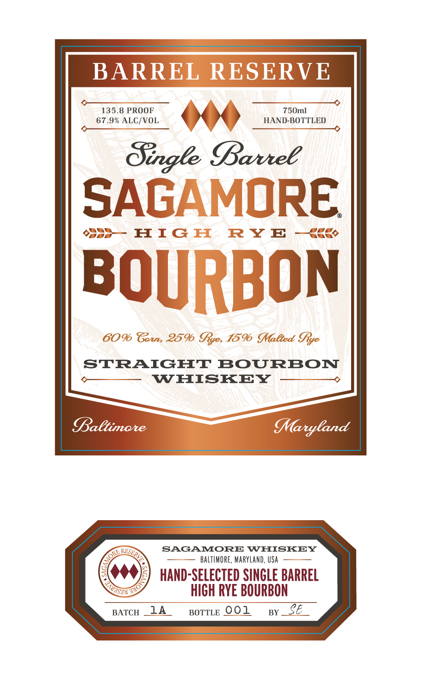

# TTB COLA Label Images - TTBID 26252001000382

**Brand Name:** SAGAMORE

**Fanciful Name:** BARREL RESERVE SINGLE BARREL BOURBON

**Issue Date:** 09/16/2026

**Origin Code:** 25

**Product Class/Type:** 101

**Source:** [TTB Public COLA Registry](https://ttbonline.gov/colasonline/viewColaDetails.do?action=publicFormDisplay&ttbid=26252001000382)

## Label Images

### Back Label

### Front Label

## Extracted Label Text

*Text extracted via OCR - may contain errors*

**Detected Proof:** 135.8

### Back Label

BaBtimate
MMaryland
SAGAMORE
The Sagamore Whiskey Barrel Reserve program offers unique selections of
whiskey built
On
the foundation of Maryland Rye: Thoughtful decisions
around grain and barrel selecrion, distilling and aging techniques, and the
nuances of
"blending
come
together to create this distinct dram
This selection
single barrel of 6-year-old straight bourbon whiskey;
created from a 60% cOrn, 25% rye; and 15% malted rye mash bill.
notes
of caramel,
leather; and  dark
are
complemented by
touches of baked pineapple; orange peel, and delicate florals.
A robust
palate
ofbrown sugar;
and mature oak gives way t0 a
dry finish
with
lasting warmth and complexity:
BaBtimate
Maryland
SAGAMORESPIRITCOM
SAGAMORE
COVERNMENT WARNING: (1) ACCORDING TO THE SURGEON
GENERAL, WOMEN ShOULD NOT DRINK ALCOHOLIC
BARREL RESERVE
BEVERAGES DURING PREGNANCY BECHUSE OF THE RISK
OF BIRTH dEfECTS
CONSUMPTION F AlcohlIC
SAVOR
RESPONSIBLY
BEVERAGES IMPAIRS YOUR ABILITY TO DRIVE
CAR OR
OpERATE MACHINERY,AND MAY CAUSE HEAlth PROBLEMS
Distilled and bottled by
Sagamore Whiskey;
Baltimore, MD
8
50062152138'
GLUTEN FREE + CA CRV ME/-VT ISc IA 5c
Deep
aged
cherry
baking-
spice;
long;

### Front Label

BARREL RESERVE
135.8 PROOF
750ml
67.9% ALC/VOL
HAND-BOTTLED
Single Barree
SAGAMORE
H IG II
RY E
BOURBON
6096 Gores 2596 Iye, 1596 MMalted Iye
STRAIGHT
BOURBON
WHISKEY
altimote
MMaryland
SAGAMORE WHISKEY
BALTIMORE, MARYLand, USA
HAND-SELECTED SINGLE BARREL
HICH RYE BOURBON
BATCH
14
BOTTLE 001
BY
E
FSERVE
ORE;
Tol
S"
