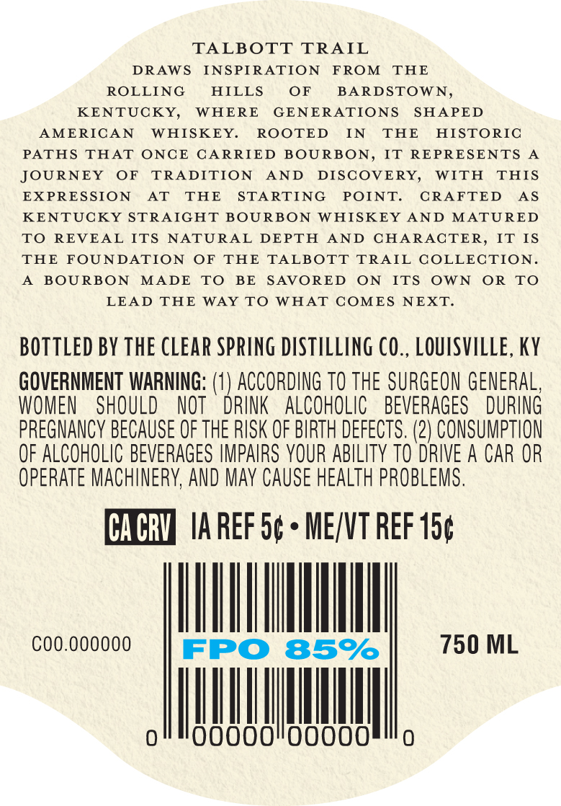
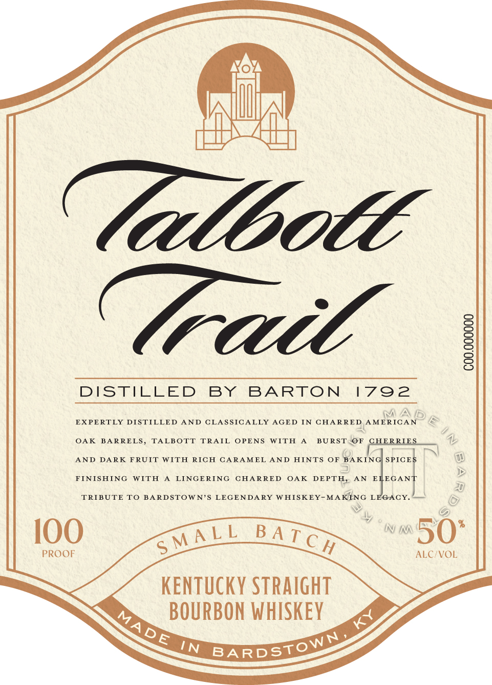

# TTB COLA Label Images - TTBID 26252001000470

**Brand Name:** TALBOTT TRAIL

**Issue Date:** 09/15/2026

**Origin Code:** 22

**Product Class/Type:** 101

**Source:** [TTB Public COLA Registry](https://ttbonline.gov/colasonline/viewColaDetails.do?action=publicFormDisplay&ttbid=26252001000470)

## Label Images

### Back Label

### Label 1

### Label 3

## Extracted Label Text

*Text extracted via OCR - may contain errors*

*1 image(s) excluded: text did not meet readability threshold*

**Detected Proof:** 85

### Back Label

TALBOTT
TRAIL
DRAWS
INS PIRATION
FROM
THE
ROLLING
HILLS
OF
BARDSTOWN,
KENTUCKY,
WHERE
GENERATIONS
SHAPED
AMERICAN
WHISKEY.
ROOTED
IN
THE
HISTORIC
PATHS
THAT
ONCE
CARRIED BOURBON,
IT REPRESENTS
JOURNEY
OF
TRADITION
AND
DISCOVERY,
WITH
THIS
EXPRES SION
AT
THE
STA RTING
POINT:
CRAFTED
As
KENTUCKY STRAIGHT BOURBON
WHISKEY
AND
MATURED
TO
REVEAL ITS
NATURAL
DEPTH
AND CHARACTER,
IT IS
THE
FOUNDATION
OF
TAE
TALBOTT
TRAIL COLLECTION
BOURBON
MADE
TO
BE
SAVORED
ON
ITS
OWN
OR
TO
LEAD THE
WAY TO
WHAT COMES
NEXT.
BOTTLED BY THE CLEAR SPRING DISTILLING CO_, LOUISVILLE, KY
GOVERNMENT WARNING:
ACCORDING TO The SURGEON GENERAL,
WOMEN
SHOULD
NOT
DRINK
ALCOHOLIC
BEVERAGES
DURING
PREGNANCV because OF thE RISK OF BIRTH defects. (2) CONSUMPTHON
OF ALCOHOLIC BEVERAGES IMPAIRS VOUR ABILITY TO dRIVE A CAR OR
OpeRATe MAChINERY, AND May CAUSE HEALTH PROBLEMS.
CA CRV
IA REF 5c
MEJNT REF 150
Coo.000000
FPO
85%
750 ML

### Label 1

TaUboee
Trail
]
DISTILLED
BY
BARTON
1792
M
EXPERTLY DISTILLED
AND
CLASSICALLY
AGED
IN
CHARRED
AMERICAN
OAK
BARRELS,
TALBOTT
TRAIL
OPENS
WITH
BU RST
OF
CHERRIES
AND
DARK
FRUIT
WITH
RICH
CARAMEL
AND
HINTS
OF BAKINC SPICES
FINISHING
WITH
LINGERING
CHARRED
OAK
DEPTH,
AN
ELEGANT
20
TRIBUTE
TO BARDSTOWN'S
LEGENDARY
W HISKEY-MAKING
LEGACY_
IOO
N I
50*
PROOF
ALC/VOL
KENTuCKY STRAIGhT
BOURBON WHISKEY
IN
APe
S MAL L
B A T C H
MADE
BARDSTOWN
