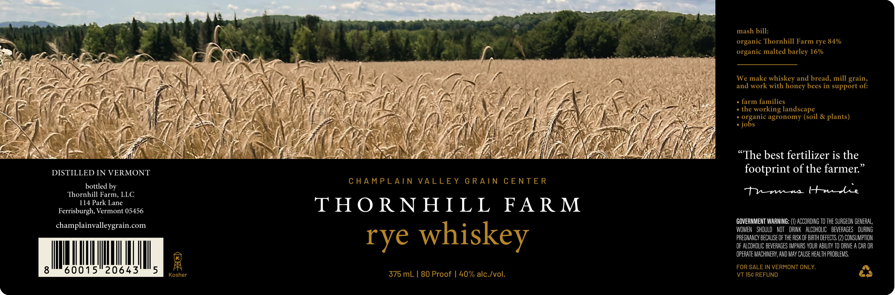

# TTB COLA Label Images - TTBID 26252001000516

**Brand Name:** THORNHILL FARM

**Issue Date:** 09/22/2026

**Origin Code:** 46

**Product Class/Type:** 142

**Source:** [TTB Public COLA Registry](https://ttbonline.gov/colasonline/viewColaDetails.do?action=publicFormDisplay&ttbid=26252001000516)

## Label Images

### Label 1

## Extracted Label Text

*Text extracted via OCR - may contain errors*

**Detected Proof:** 80

### Label 1

aa Ar . A. aN " organic Thornhill Farm rye 84%
< 3 Gg * —— & os : : \ _ pS organic malted barley 16%
ey Se Te cf 2 ™ KS a a : aie j ’ i, p> a - .
S Sal ‘S7} + y [m= a / Dt) l\ Cad ae * 4
AAS Sgr hee (ISS / lee Zi SN INS } ; pay Oa ve
ff. (4; INGE Ae Mb Ning VIN, hy GR S(O: ak LN 7 I Vf aS (6 AEE ee F fo Bas ay ew We make whiskey and bread, mill grain,
Me =) Lh ete ef fees ben: ae Sa ANS: ae [OE (ENE Lien Py air, oe Ws Me BN Vie CANIS and work with honey bees in support of:
pale TN MAA anne Nil fe SN NAA Re Noe PEERS CWopae tcemitiey — -
& A reas JEN aA ON ain Li ON EI ee LAS Re ae ce AL ES RANE het CE ARE Ne eas poe tamet
arth Gee AN SPAY A A oR EE TA 1 Ns PG Oy Pd Le VI OO Oh venting landscape
SS (BT NG EN a Fee SRT SF ae if UNA eee 7 EMG ULM ee LON TA CMR] Ges ee + organic agronomy (soil & plants)
TAN Won aaNAs ; 4 We pe FSA as MG ZS CL il I Ke SE IRON A LR RARE + jobs
{3 <p A Neg YZ ye ati a Np hs Hi Sees } AG ers my, iS ekee, _
ee ‘s . f pk | 5 Gi OE hae et eZ t Fe RN DS Aa: AE : Las ee frie DEA ACMA, Who fie fe oh DREN LS
RA NE IIE VG VES IITA AOA Ne PUT TNE VAAN
sl RE \ y | EVAL Cea PS: i EE Ae Pn oF EAS ) SPS i$ oa ANG JEP THT (2° Sy) Ce VEN AZ RY fred ai ‘
CREAR EPH eT fa SN SLAP RY RIER | ES ALS ans Le De APs AE NOS GOLAN ME “The best fertilizer is the
. ”
DISTILLED IN VERMONT footprint of the farmer.
jrntedibg CHAMPLAIN VALLEY GRAIN CENTER ‘
Thornhill Farm, LLC Pras t
114 Park Lane
Ferrisurgh, Vermont 05456 THORNHILL FARM
, , ee GOVERNMENT WARNING: (I) ACCORDING TO THE SURGEON GENERAL,
champlainvalleygrain.com | eee |e WOMEN SHOULO NOT ORINK ALCOHOLIC BEVERAGES DURING
VEC VY SKE V PREGNANCY BECAUSE OF THE RISK OF BIRTH DEFECTS. (2) CONSUMPTION
= of Se Se OF ALCOHOLIC BEVERAGES IMPAIRS YOUR ABILITY TO DRIVE A CAR OR
= . OPERATE MACHINERY, AND MAY CAUSE HEALTH PROBLEMS,
ys
BR FOR SALE IN VERMONT ONLY. a
860015 20643 5 Keane 375 mL | 80 Proof | 40% alc./vol. \VT 156 REFUND KY
.
