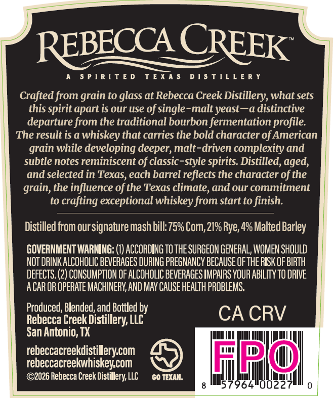
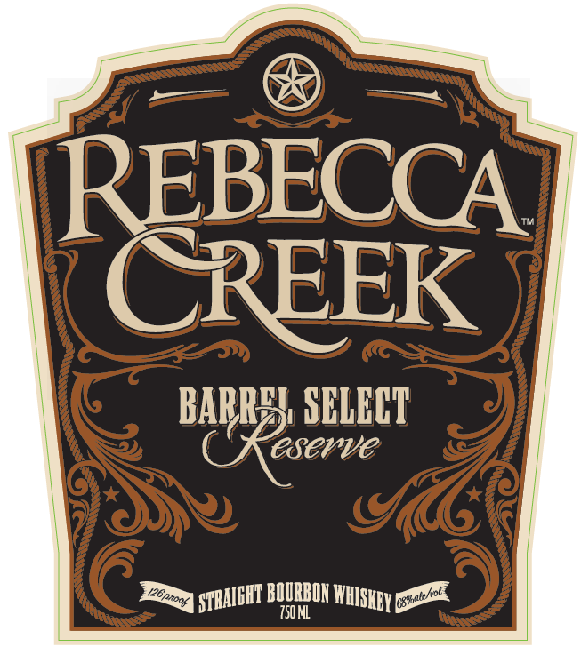

# TTB COLA Label Images - TTBID 26252001000542

**Brand Name:** REBECCA CREEK BARREL SELECT RESERVE

**Issue Date:** 09/17/2026

**Origin Code:** 44

**Product Class/Type:** 101

**Source:** [TTB Public COLA Registry](https://ttbonline.gov/colasonline/viewColaDetails.do?action=publicFormDisplay&ttbid=26252001000542)

## Label Images

### Back Label

### Front Label

## Extracted Label Text

*Text extracted via OCR - may contain errors*

### Back Label

REBECCA CREEK

A SPIRITED TEXAS DISTILLERY

Crafted from grain to glass at Rebecca Creek Distillery, what sets

this spirit apart is our use of single-malt yeast—a distinctive

departure from the traditional bourbon fermentation profile.

The result is a whiskey that carries the bold character of American

grain while developing deeper, malt-driven complexity and

subtle notes reminiscent of classic-style spirits. Distilled, aged,

and selected in Texas, each barrel reflects the character of the

grain, the influence of the Texas climate, and our commitment

to crafting exceptional whiskey from start to finish.

Distilled from our signature mash bill: 75% Com, 21% Rye, 4% Malted Barley

GOVERNMENT WARNING: (1) ACCORDING T0 THE SURGEON GENERAL, WOMEN SHOULD

NOT DRINK ALCOHOLIC BEVERAGES DURING PREGNANCY BECAUSE OF THE RISK OF BIRTH

DEFECTS. (2) CONSUMPTION OF ALCOHOLIC BEVERAGES IMPAIRS YOUR ABILITY T0 DRIVE

ACAR OR OPERATE MACHINERY, AND MAY CAUSE HEALTH PROBLEMS.

Produced, Blended, and Bottled by

Rebecca Creek Distillery, LLC

CA CRV

San Antonio, TX

at

emt

rebeccacreekdistillery.com

rebeccacreekwhiskey.com

©2026 Rebecca Creek Distillery,

GO TEXAN.

PC

fae

iat

ull

### Front Label

REBECCA
CREEK
BAPRRR SHERHT
BOURBOH
750 ML
ISTRAICHT E
WIISKEY E
6%akAol i
Vtts/
126eto04
