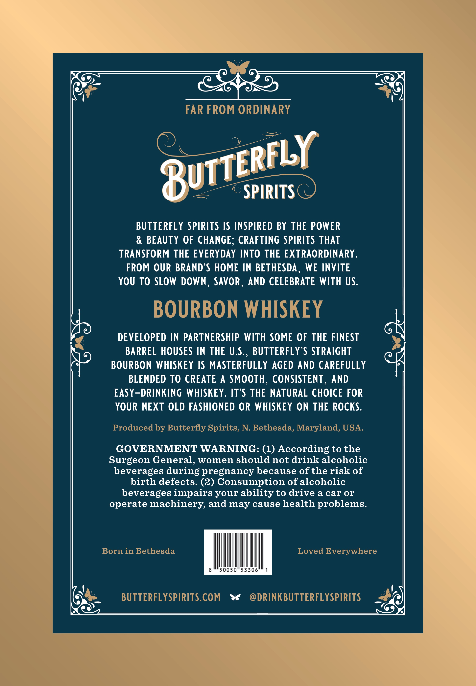

# TTB COLA Label Images - TTBID 26252001000676

**Brand Name:** BUTTERFLY SPIRITS

**Issue Date:** 09/15/2026

**Origin Code:** 24

**Product Class/Type:** 141

**Source:** [TTB Public COLA Registry](https://ttbonline.gov/colasonline/viewColaDetails.do?action=publicFormDisplay&ttbid=26252001000676)

## Label Images

### Front Label

## Extracted Label Text

*Text extracted via OCR - may contain errors*

### Front Label

FAR FROM ORDINARY
SPIRITS
BUTTERFLY SPIRITS IS INSPIRED BY THE POWER
BEAUTY OF CHANGE; CRAFTING SPIRITS THAT
TRANSFORM THE EVERYDAY INTO THE EXTRAORDINARY_
FROM OUR BRAND'S HOME IN BETHESDA ,
WE INVITE
YOU To SLOW DOWN
SAVOR , AND CELEBRATE WITH US.
BOURBON WHISKEY
DEVELOPED IN PARTNERSHIP WITH SOME OF THE FINEST
BARREL HOUSES IN THE U.S:,
BUTTERFLY S STRAIGHT
BOURBON WHISKEY IS MASTERFULLY AGED AND CAREFULLY
BLENDED TO CREATE
A SMOOTH , CONSISTENT ,
AND
EASY-DRINKING WHISKEY. ITS THE NATURAL CHOICE FOR
YOUR NEXT OLD FASHIONED OR WHISKEY ON THE ROCKS.
Produced by Butterfly Spirits, N: Bethesda, Maryland, USA.
GOVERNMENT WARNING: (1) According to the
Surgeon General, women should not drink alcoholic
beverages during pregnancy because of the risk of
birth defects. (2) Consumption of alcoholic
beverages impairs your ability to drive a car or
operate machinery and may cause health problems.
Born in Bethesda
Loved Everywhere
50050"53306
BUTTERFL YSPIRITS.COM
DRINKBUTTERFL YSPIRITS
BUTTCRFLY
