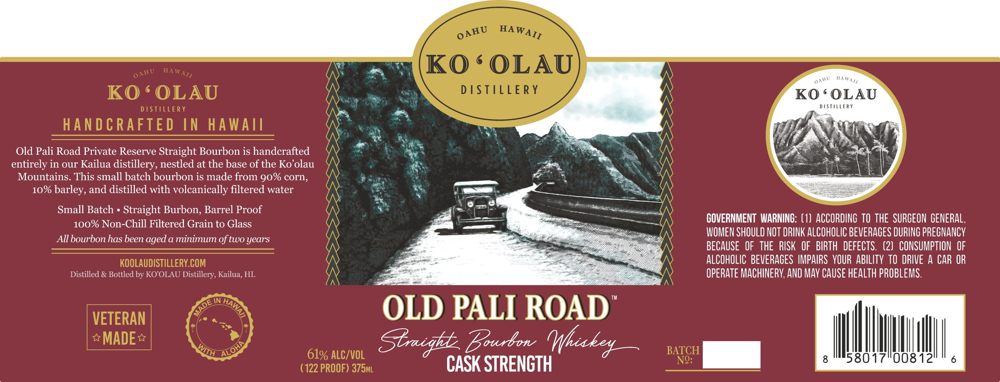

# TTB COLA Label Images - TTBID 26252001000683

**Brand Name:** OLD PALI ROAD PRIVATE CASK STRENGTH

**Issue Date:** 09/23/2026

**Origin Code:** 17

**Product Class/Type:** 101

**Source:** [TTB Public COLA Registry](https://ttbonline.gov/colasonline/viewColaDetails.do?action=publicFormDisplay&ttbid=26252001000683)

## Label Images

### Label 1

## Extracted Label Text

*Text extracted via OCR - may contain errors*

**Detected Proof:** 100

### Label 1

0
Ko ' OLAU
KO ' OLAU
DISTILERY
Ko ' OLAU
DSTILLERY
D |STiLERY
HANDCRAFTED IN
HAwAnl
Old Pali Road Private Reserve Straight Bourbon is handcrafted
entirely in our Kailua distillery, nestled at the base of the Ko'olau
Mountains. This small batch bourbon is made from 90% corn,
10% barley, and distilled with volcanically filtered water
Small Batch
Straight Burbon, Barrel Proof
100% Non-Chill Filtered Grain to Glass
COVERNMENT WARNING: (1}  ACCORDING TO THE SURGEON  GENERAL,
WOMEN SHOULD NOT DRINK ALCOHOLIC BEVERAGES DURING PREGNANCY
All bourbon has been aged a minimum of two
BECAUSE   OF   THE   RISK  OF  BIRTH   DEFECTS   (2)  CONSUMPTION  OF
KOOLAUDISTILLERY.COM
ALCOHOLIC BEVERAGES IMPAIRS  VOUR ABILITY TO DRIVE A CAR OR
Distilled & Bottled by KO'OLAU Distillery, Kailua, HI
OPERATE MACHINERV; AND MAV CAUSE HEALTH PROBLEMS.
IN
VETERAN
OLD PALI ROAD
MADE
Sbrigkd_Eourbo_Mhukey
BATCH
61% ALC/VOL
NQ:
8
58017"008 12'
(122 PROOF) 375ML
CASK STRENCTH
HAWAII
AHU
OAHU
HAWATI
HAWAI/
OAH U
years
HAWAIT
ALOHP
