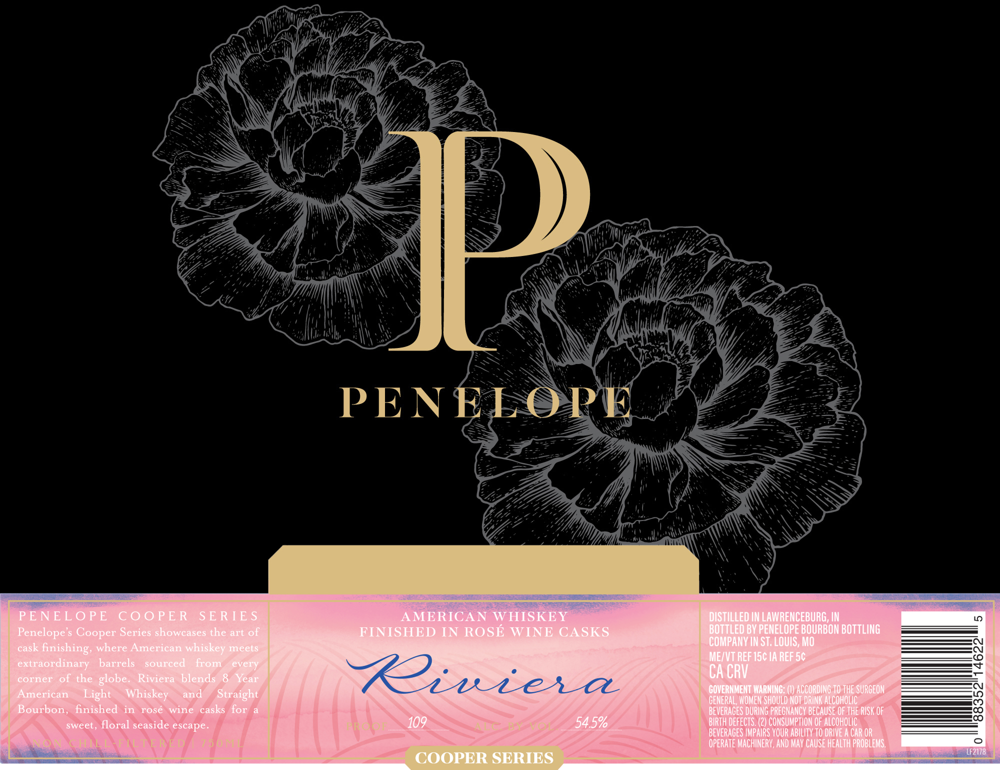
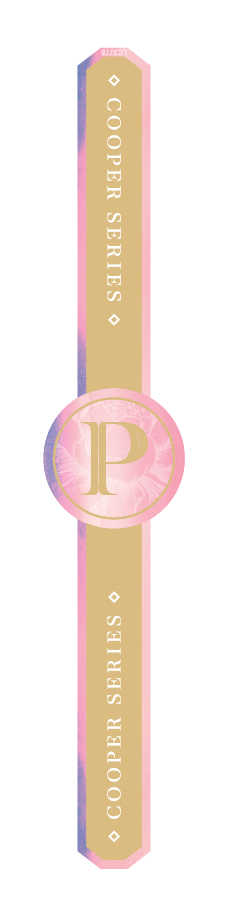

# TTB COLA Label Images - TTBID 26253001000069

**Brand Name:** PENELOPE

**Issue Date:** 09/16/2026

**Origin Code:** 29

**Product Class/Type:** 140

**Source:** [TTB Public COLA Registry](https://ttbonline.gov/colasonline/viewColaDetails.do?action=publicFormDisplay&ttbid=26253001000069)

## Label Images

### Label 1

### Label 2

## Extracted Label Text

*Text extracted via OCR - may contain errors*

*1 image(s) excluded: text did not meet readability threshold*

### Label 1

PENELOPT
PE NELO PE
CooPE R
S E R TE $
AMERICAN WHISKEY
DiStILLED IN LAWRENCEBURG; IN
Penelope s Cooper Series showcases the art of
FINISHED IN ROSE WINE CASKS
BOTTLED BV PENELOPE BOURBON BOTTLING
COMPANV IN ST; LOuIS; MO
cask
finishing, where American whiskey meets
extraordinary
barrels
sourced
From
MEXVT REF156 IA REF 56
corner of the globe
Riviera blends
Year
Riuiec
Ca CRV
American
Light
Whiskey
and
Straight
GOVERNMENT MARNING; (U) ACCORDINg TO ThE SURGEON:
GENERAL; WOMEN SHOULD NOT DRUNK AlcOhOLIC
Bourbon,
finished
in
rose
Wine
casks for
beveRAGES DurING PREONANCY Because OF ThE RUSk OF
sweet, floral seaside escape.
R
109

54 5%
BIRTH DEFECTS  (2) CONSUMPTLON OF AlCohOlIc
BEVERAGES IMPAIRS VOUR ABILITV TO DRIVE A CAR OR
Fd
OpeRATe MACHINERV, AND MAY CAUSE HEaLTh probleMS
LF2178
COOPER SERIES
eve
