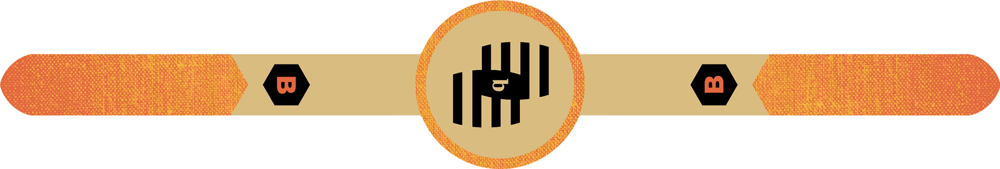
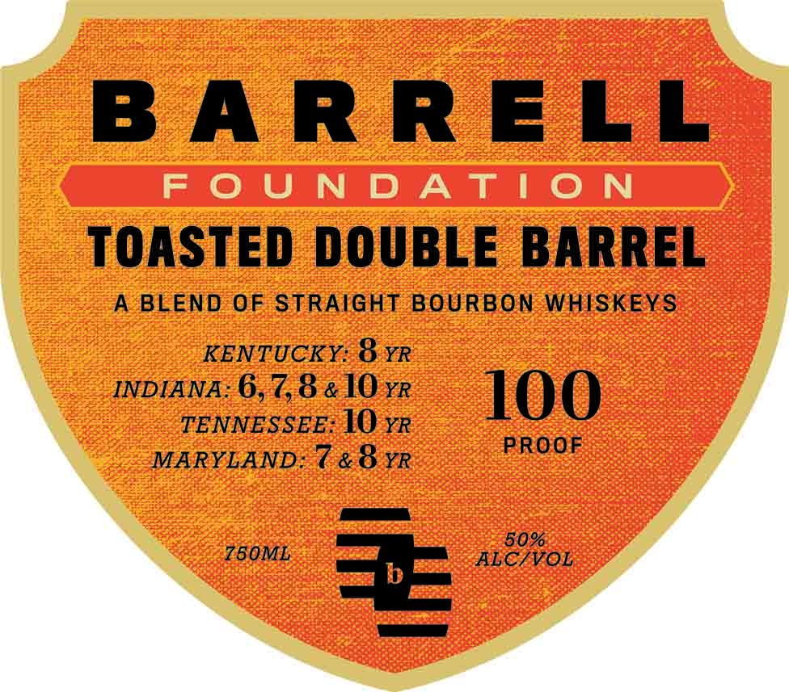

# TTB COLA Label Images - TTBID 26253001000073

**Brand Name:** BARRELL

**Issue Date:** 09/16/2026

**Origin Code:** 22

**Product Class/Type:** 121

**Source:** [TTB Public COLA Registry](https://ttbonline.gov/colasonline/viewColaDetails.do?action=publicFormDisplay&ttbid=26253001000073)

## Label Images

### Back Label

### Front Label

## Extracted Label Text

*Text extracted via OCR - may contain errors*

*1 image(s) excluded: text did not meet readability threshold*

### Front Label

BARRELL

FOUNDATION

TOASTED DOUBLE BARREL

A BLEND OF STRAIGHT BOURBON WHISKEYS

KENTUCKY: O YR

INDIANA: 6,78 &10-rR

100

TENNESSEE: 1O yr

PROOF

MARYLAND: C&O YR

—-

750ML = ALC/VOL
