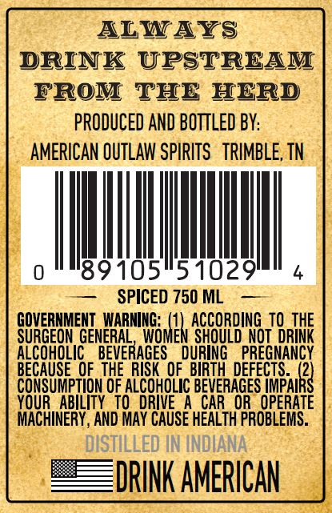
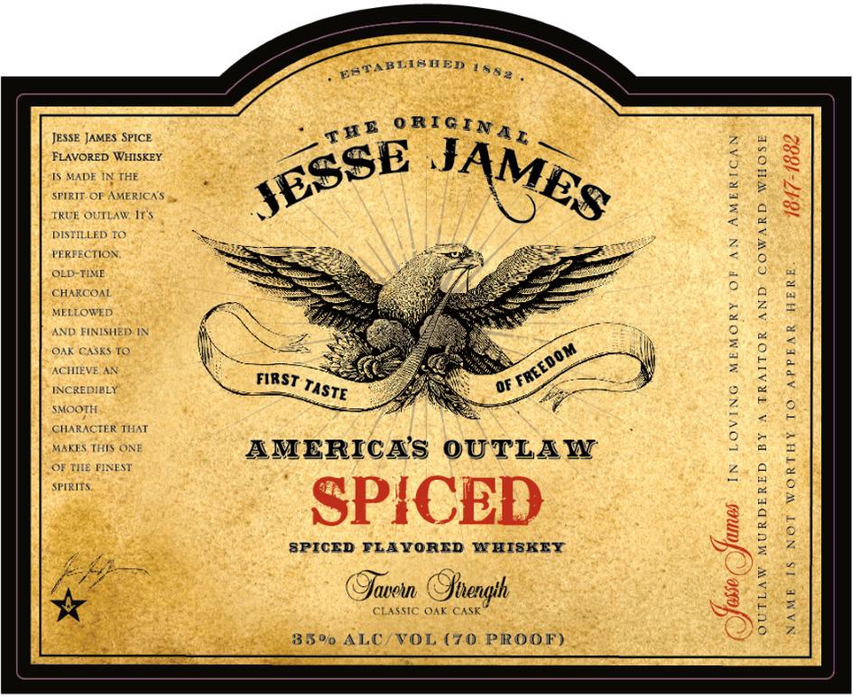

# TTB COLA Label Images - TTBID 26253001000141

**Brand Name:** JESSE JAMES

**Fanciful Name:** SPICED

**Issue Date:** 09/15/2026

**Origin Code:** 43

**Product Class/Type:** 149

**Source:** [TTB Public COLA Registry](https://ttbonline.gov/colasonline/viewColaDetails.do?action=publicFormDisplay&ttbid=26253001000141)

## Label Images

### Back Label

### Front Label

### Label 2

## Extracted Label Text

*Text extracted via OCR - may contain errors*

*1 image(s) excluded: text did not meet readability threshold*

**Detected Proof:** 70

### Back Label

DRINK UPSTREAM
FROM THE HERD
PRODUCED AND BOTTLED BY:
AMERICAN OUTLAW SPIRITS TRIMBLE, TN
AN
— SPICED 750ML —
GOVERNMENT ttetetal ACCORDING TO THE
SURGEON GENERAL, WOMEN SHOULD NOT DRINK
ALCOHOLIC BEVERAGES DURING PREGNANCY
BECAUSE OF THE RISK OF BIRTH DEFECTS. fl

CONSUMPTION OF ALCOHOLIC BEVERAGES IMPAII
YOUR ABILITY TO DRIVE A CAR OR OPERATE
MACHINERY, AND MAY CAUSE HEALTH PROBLEMS.

### Front Label

JESSE JAMES SPICE
FLAVORED WHISKEY
Is MADE IN THE

SPIRIT OP AMERICAS 5,

TRUE OUTLAW, IT's
DISTILLED TO
PERFECTION
OLD-TIME
CHARCOAL
MELLOWED

AND FINISHED: IN
OAK CASKS 1.
ACHIEVE AN
INCREDIBLY
sMoorH
CHARACTER THAT
MAKES THIS ONE
OF THE FINEST

suits

paTABTIBUED 16,

AMERICAS OUTLAW

SPICED

SPICED FLAVORED WHISKEY

lave Shrengih

CLASSIC OAK CASK

re

35% ALC/VOL (70 PROOF)

AMERICAN

AN

AND COWARD WHOSE

A TRAITOR

JRDERED BY

1847-1882

Y

1§ NOT WORT

NAME
