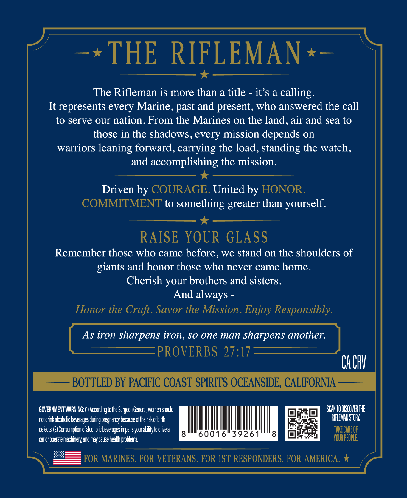

# TTB COLA Label Images - TTBID 26253001000294

**Brand Name:** TACTICAL SPIRITS

**Issue Date:** 09/23/2026

**Origin Code:** 01

**Product Class/Type:** 101

**Source:** [TTB Public COLA Registry](https://ttbonline.gov/colasonline/viewColaDetails.do?action=publicFormDisplay&ttbid=26253001000294)

## Label Images

### Front Label

## Extracted Label Text

*Text extracted via OCR - may contain errors*

### Front Label

THE
RIFLEMAN
The Rifleman is more than a title
its a calling:
It represents every Marine, past and present, who answered the call
to serve our nation. From the Marines on the land, air and sea to
those in the shadows, every mission depends on
warriors leaning forward, carrying the load, standing the watch,
and
accomplishing the mission.
Driven by COURAGE. United by HONOR.
COMMITMENT to something greater than yourself:
RAISE YOUR GLASS
Remember those who came before , we stand on the shoulders of
giants and honor those who never came home.
Cherish your brothers and sisters.
And always
Honor the Craft. Savor the Mission. Enjoy Responsibly
As iron sharpens iron, S0 one man sharpens another:
PROVERBS 27:17
CACRV
BOTTLED BY PACIFIC COAST SPIRITS OCEANSIDE, CALIFORNIA
GOVERNMENT WARNING: |
According to the Surgeon General,women should
SCATO DLSCQVER THE
notdrinkalcoholicbeverages during pregnancy because ofthe riskof birth
RIFLEMAH STORY
defects
Consumpton ofalcoholic beverages impairs your abilityto drive a
TAKE CAREOF
60016"39261
8
car or operate machinery and may cause health problems;
VOUR PEOPLE;
FOR MARINES. FOR VETERANS. FOR IST RESPONDERS. FOR AMERICA.
