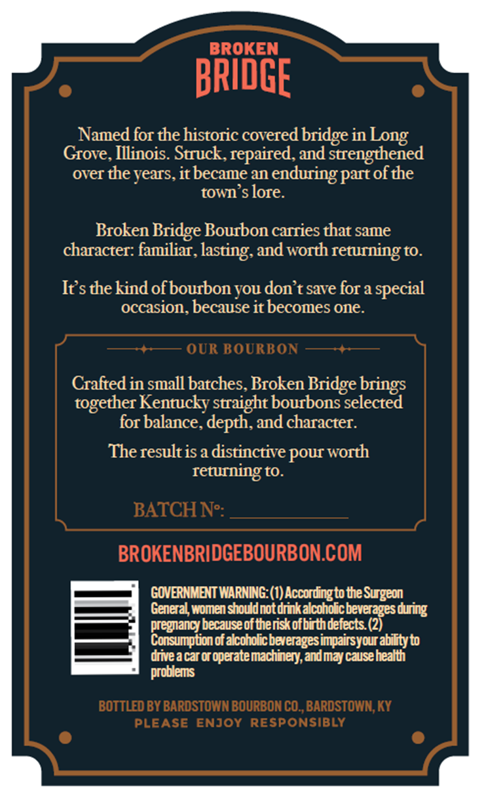
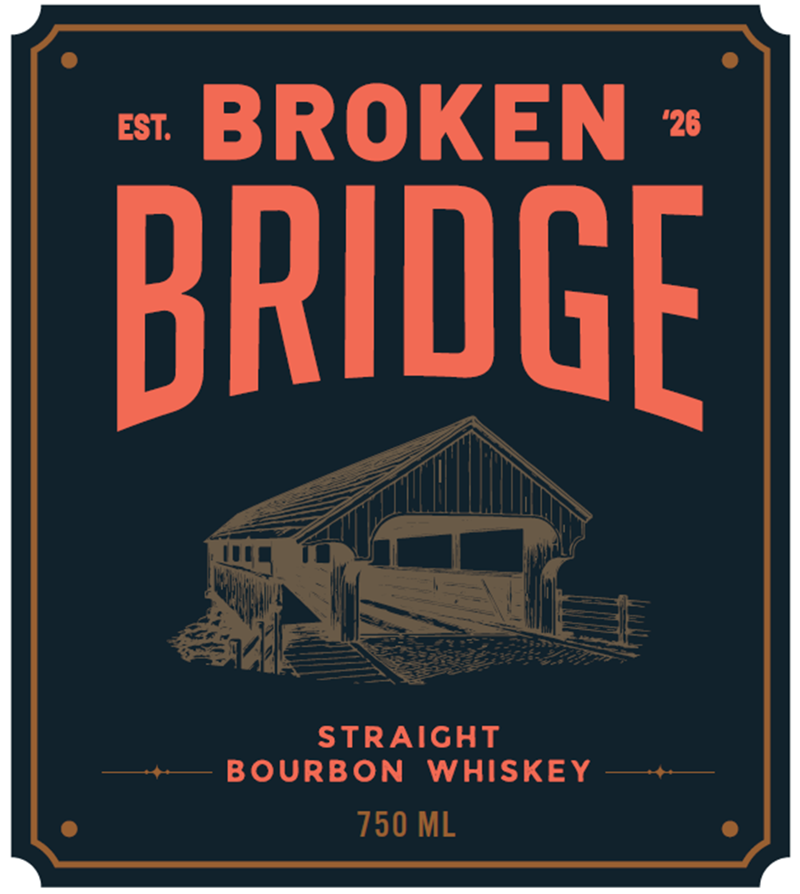
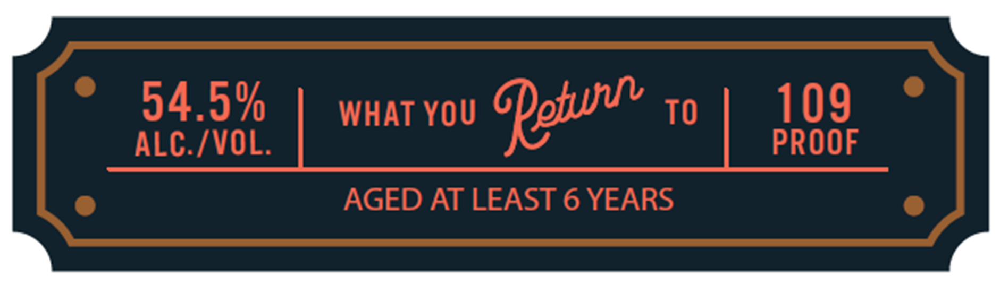

# TTB COLA Label Images - TTBID 26253001000301

**Brand Name:** BROKEN BRIDGE

**Issue Date:** 09/16/2026

**Origin Code:** 22

**Product Class/Type:** 101

**Source:** [TTB Public COLA Registry](https://ttbonline.gov/colasonline/viewColaDetails.do?action=publicFormDisplay&ttbid=26253001000301)

## Label Images

### Back Label

### Front Label

### Label 2

## Extracted Label Text

*Text extracted via OCR - may contain errors*

**Detected Proof:** 109
**Detected Age:** 6 Years

### Back Label

BROKEN
BRIDGE
Named for the historic covered bridge in
Grove Illinois Struck, repaired, and strengthened
over the years, it became an
enduring part ofthe
town s lore.
Broken Bridge Bourbon carries that same
character: familiar, lasting, and worth returning to.
Irsthekind ofbourbon you don t save for a special
occasion, because it becomes one.
OUR BOURBON
Crafted in small batches Broken Bridge
together Kentucky straight bourbons selected
for balance, depth, and character.
The result is a distinctive pouT
returning to
BATCH Ne:
BROKENBRIDGEBOURBON.COM
GOVERNMENT WARNING: (1) Accordingto the Surgeon
General women shouldnotdrnkalcoholcbeveragesduring
pregnancy becauseof theriskofbirthdefects (2)
Consumption of alcoholicbeveragesimpairsyour ability to
drivea car oroperatemachinery,andmaycausehealth
problems
BOTTLED BY BARDSTOWN BOURBON CO_,BARDSTOWN, KY
PLEASE
ENJOY RESPONSIBLY
Long
brings
worth

### Front Label

EST:
BROKEN
'26
BRIDGE
STRAIGHT
BOURBON
WHISKEY
750 ML

### Label 2

54.5%
WHAT YOU
Qetu
TO
109
ALC /VOL.
PROOF
AGED AT LEAST 6 YEARS
