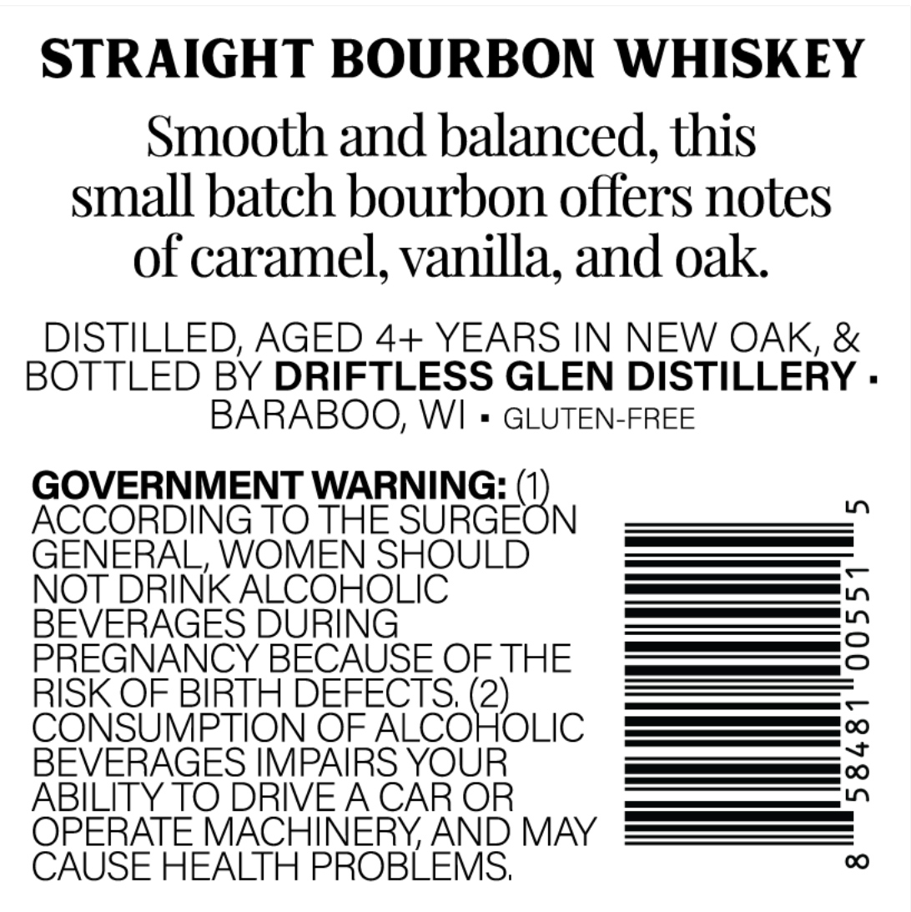
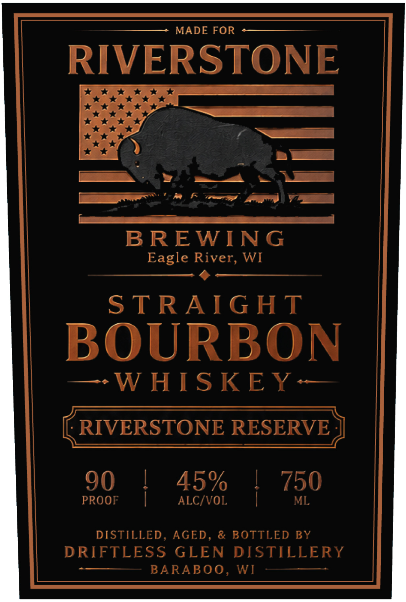

# TTB COLA Label Images - TTBID 26253001000394

**Brand Name:** RIVERSTONE BREWING

**Issue Date:** 09/16/2026

**Origin Code:** 48

**Product Class/Type:** 101

**Source:** [TTB Public COLA Registry](https://ttbonline.gov/colasonline/viewColaDetails.do?action=publicFormDisplay&ttbid=26253001000394)

## Label Images

### Back Label

### Front Label

## Extracted Label Text

*Text extracted via OCR - may contain errors*

**Detected Proof:** 90

### Back Label

STRAIGHT BOURBON WHISKEY
Smooth and balanced,this
small batch bourbon offers notes
of caramel; vanilla; and oak
DISTILLED, AGED 4+ YEARS IN NEW OAK, &
BOTTLED BY DRIFTLESS GLEN DISTILLERY .
BARABOO; WI
GLUTEN-FREE
GOVERNMENT WARNING:
ACCORDING TO THE
SUGEON
0
GENERAL, WOMEN SHOULD
NOT DRINK ALCOHOLIC
BEVERAGES DURING
3
PREGNANCY BECAUSE OFTHE
RISK OF BIRTH DEFECTS; (2)_
CONSUMPTION OF ALCOHOLIC
BEVERAGES IMPAIRS YOUR
1
ABILITY TO DRIVEA CAR OR
OPERATE MACHINERYAND MAY
CAUSE HEALTH PROBLEMS;
00

### Front Label

MADE FOR
RIVERSTONE
=
BREWIN G
Eagle River, WI
STRAIG HT
BOURBON
W HISKEY
RIVERSTONE RESERVE
90
45%
750
PROOF
ALCIVOL
ML
DISTILLED , AGED
& BOTTLED BY
DRIFTLESS
GLEN
DISTILLERY
BARABOO,
WI
