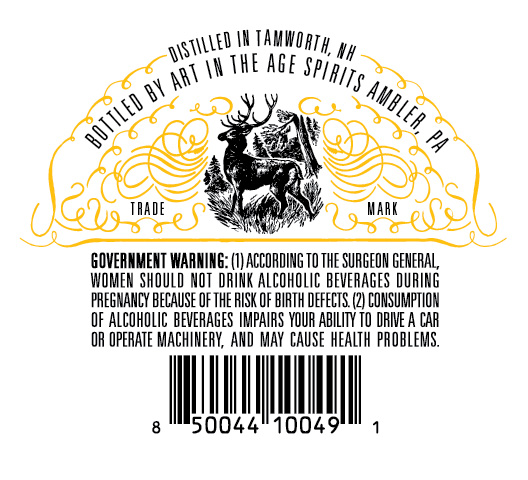

# TTB COLA Label Images - TTBID 26253001000413

**Brand Name:** THE DEERSLAYER

**Issue Date:** 09/16/2026

**Origin Code:** 39

**Product Class/Type:** 149

**Source:** [TTB Public COLA Registry](https://ttbonline.gov/colasonline/viewColaDetails.do?action=publicFormDisplay&ttbid=26253001000413)

## Label Images

### Back Label

## Extracted Label Text

*Text extracted via OCR - may contain errors*

### Back Label

Nh
IH The Age
AAT
BY
2
ThADe
Kark
GOVERNMENT WAANINE: (IV ACCORDING TO THE SURGFON GENERAL,
WOMEM  SHOULD NOT  DRINK ALCOHOLIC beveRAGeS DURING
PHEGNAHCY BECAUSE OF the RISK OF BIRTH DEFECTS (2| CONSUMPTLOH
OF ALCOhOLIC BEVERAGES IMPAIRS YOUR AbiLITy TO DRIE A CAR
OR OPERATE MACHIMERY; AND May CAUSE health PROBLEMS,
50044"10049
Tamwoath,
~dStILLed
spiRITS _
Ambler,
bOTTLED
