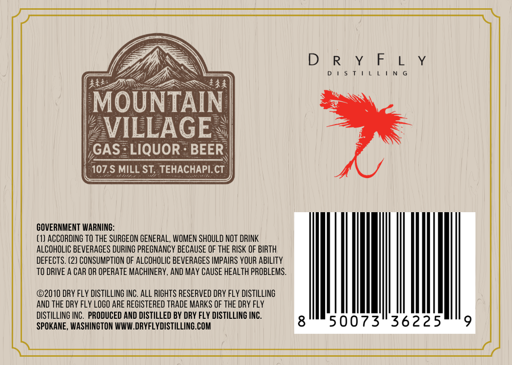
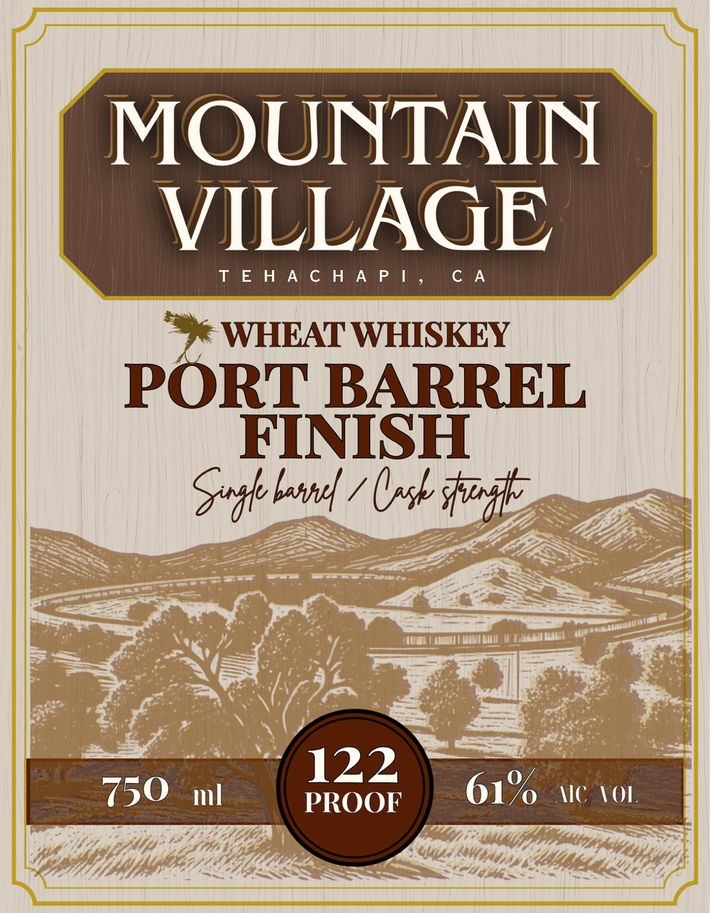

# TTB COLA Label Images - TTBID 26253001000444

**Brand Name:** MOUNTAIN VILLAGE

**Issue Date:** 09/18/2026

**Origin Code:** 07

**Product Class/Type:** 140

**Source:** [TTB Public COLA Registry](https://ttbonline.gov/colasonline/viewColaDetails.do?action=publicFormDisplay&ttbid=26253001000444)

## Label Images

### Back Label

### Front Label

## Extracted Label Text

*Text extracted via OCR - may contain errors*

**Detected Proof:** 122

### Back Label

D
R
MOUNTAIN
VILLAGE
GAS
LIQUOR
BEER
107.$ MILL ST; TEHACHAPI. CT
GOVERNMENT WARNING:
(1) ACCORDING TO thE SURGEON GENERAL, WOMEN SHOULD NOT DRINK
ALCOHOLIC BEVERAGES DURING PREGNANCY BECAuSe OF tHE RISK OF BIRTH
DEFECTS. (2) CONSUMPTION OF ALCOHOLIC BEVERAGES IMPAIRS YOUR ABILITY
TO DRIVE A CAR OR OpeRATe MACHINERY, AND May CauSe heAlTH PROBLEMS.
02010 DRY FLY DISTILLING INC. ALL RIGHTS RESERVED DRY FlY DISTILLING
AND THE DRY FlY LOGO ARE REGISTERED TRADE MARKS OF THE DRY FlY
diSTILLING INC
PRODUCED AND DISTILLED BY DRY FLY DISTILLING INC.
SPOKANE , WASHINGTON WWW DRYFLYDISTILLING.COM
50073
36225
9

### Front Label

MOUNTAIN

VILLAGE

© WHEAT WHISKEY

PORT BARREL
FINISH

Spghe beara / nah ifitep

122 z
7350 wl PROOF 61% lc VOL
