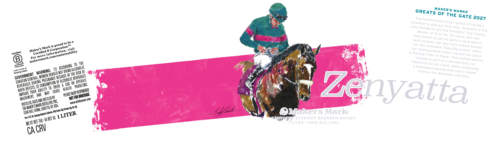
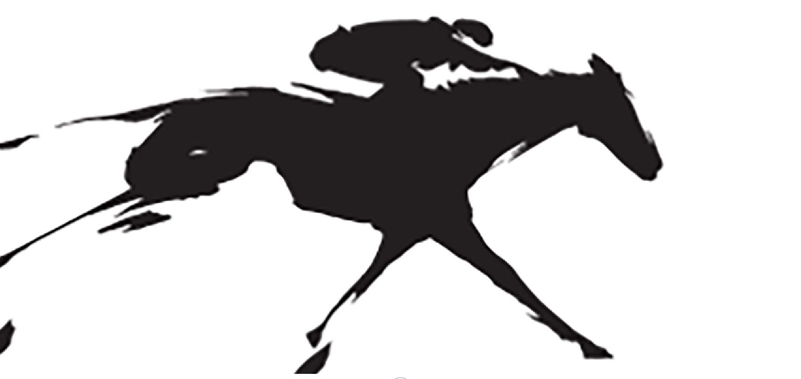

# TTB COLA Label Images - TTBID 26253001000523

**Brand Name:** MAKER'S MARK

**Issue Date:** 09/18/2026

**Origin Code:** 22

**Product Class/Type:** 101

**Source:** [TTB Public COLA Registry](https://ttbonline.gov/colasonline/viewColaDetails.do?action=publicFormDisplay&ttbid=26253001000523)

## Label Images

### Label 1

### Label 2

## Extracted Label Text

*Text extracted via OCR - may contain errors*

*1 image(s) excluded: text did not meet readability threshold*

**Detected Proof:** 90

### Label 1

OF
The fourth
greatest is also
in our
0f
only
our
"first
racing'$
'female to win the
Zenyatta is the
0f 19 of her 20
also
to put
she was
each contest;
on quite a
to be
her
Her pre-race
is
TM
the
prance earned
her
B
Queen" while
in
S
earned her
0f
Fame. This
place
B
is part of a
limited-e
tO THE
best,
run
while
Learn more
M)
NOT
OF
for
that'$
OF THE
'charities.
OF
CAR OA
4"
EIOY"
Zenyatta
BY
NO FORE
AGED AH E
PBC;
8
KY USA
#EM
FArM
:I09;
OMakers Marke
REF 5c
ENtuCI
STRAIGHT BOURBON WHISKY
HEF
LITER
45% ALC /VoL:
CA CRV
MAKER'S
GREATS
MARKO
THE
GATE
2027
horse
series
Fily.
Breeders"
Winner
Cup
Classic.
races,
known
show
before
proud-
nickname
Mark
Corporation"
'Dancing
Maker's
visit
distinguished
Certified >
information,
com/sustainability
Certified
career
Racing"
Hall
more
For
makersmark:
release
edition
decade-long
featuring
racing"
ACCORDING
Corporatlon
Keeneland
DRINK ALCOhOLIC
continuing
partnership
WARNING:
com
millions
RISK
raised
bcorp-
ShQULD
Kentucky
GOVERNMENT
WOMEN =
BECAUSE
BEVERAGES
GENERAL;
pREGMANCY
ALCOhOLIC [
SURGEON
OpERATe
DURING
CONSUMPTLON
beVERAGES
PROBLEMS.
DRIVE
DEFECTS.
heALTH
abillty
bIRTH
{ RESPOHSIBL
CAuSe
YOUR
IMPAIRS
PLEASEE
{UNDERAGE
MAChINEbY,
BOTTLED E
~wwwdrinksmartcom
 MArK DISTHLLERK L
DISTHLLED;
MAKER"S
;Carbc: O Proteic Oe Fat: Og
; LORETTO,
hiLl
:Caluries: |
1LITER
ahudlysic C
Areng
Per USFL 6e
15c+IA [
MEVT E
