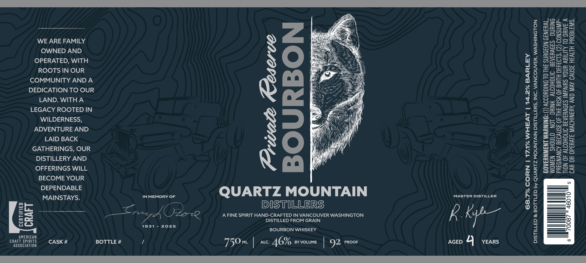

# TTB COLA Label Images - TTBID 26253001000699

**Brand Name:** QUARTZ MOUNTAIN DISTILLERS

**Fanciful Name:** PRIVATE RESERVE BOURBON

**Issue Date:** 09/18/2026

**Origin Code:** 07

**Product Class/Type:** 141

**Source:** [TTB Public COLA Registry](https://ttbonline.gov/colasonline/viewColaDetails.do?action=publicFormDisplay&ttbid=26253001000699)

## Label Images

### Label 1

### Label 2

## Extracted Label Text

*Text extracted via OCR - may contain errors*

*1 image(s) excluded: text did not meet readability threshold*

### Label 1

WE ARE FAMILY
OWNED AND
OPERATED, WITH
ROOTS IN OUR
COMMUNITY AND A
DEDICATION TO OUR
LAND. WITHA
LEGACY ROOTED IN
WILDERNESS,
ADVENTURE AND
LAID BACK
GATHERINGS, OUR
DISTILLERY AND
OFFERINGS WILL
BECOME YOUR

SAAS.) IN MEMORY OF Q UARTZ M oe) U NTAI N MASTER DISTILLER
DISTILLERS
fm AOE A FINE SPIRIT HAND-CRAFTED IN VANCOUVER WASHINGTON Kk é Kyp—

WOMEN SHOULD NOT DRINK ALCOHOLIC BEVERAGES DURING

PREGNANCY BECAUSE OF THE RISK OF BIRTH DEFECTS. (2) CONSUMP-
TION OF ALCOHOLIC BEVERAGES IMPAIRS YOUR ABILITY TO DRIVE A
CAR OR OPERATE MACHINERY, AND MAY CAUSE HEALTH PROBLEMS.

a9
<=
oe
a
=
wa
oO
=
Oo
pra
S
Ge
=>
Ze)
uu
se
=
Oo
=
o
2
a
ce
=
So
=
<x
=
=
cS
=
=
a
=
—
=
wi
=
=
oc
wi
>
i—}
os

Prwate Reserve
BOURBON

Zz
fe)
=
oO
Zz
ae
<
AE
oe
ig
z 3
<8
a2
eS
Wy
1G
Sy
Eo
as
it &
a
3 z
<
RE
yD
Re
a
Ze
xs
00
O =
xa
re]
00
a
C.)
a
Ww
=a
a
=
2)
a

DISTILLED FROM GRAIN

CRAFT

1931 - 2025
BOURBON WHISKEY

AMERICAN

9 4
CRAFT SPIRITS
ART SPIRITS. CASK # BOTTLE # / 750m | Lc. 4G % By VOLUME | Q)2 Proor AGED YEARS
